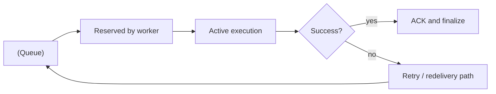

[← Назад к индексу части](index.md)
[↑ К глобальному плану](../../mastery_plan.md)

## 28.1 `celery worker`

### Цель раздела

Понять, как корректно запускать worker в разных режимах, выбирать флаги под тип нагрузки и избегать распространенных ошибок старта и деградации.

### В этом разделе главное

- `worker` — главный процесс исполнения задач;
- ключевые флаги влияют не на «красоту запуска», а на надежность и throughput;
- ошибки импорта и app path — одна из самых частых причин «worker жив, но задач нет».

### Термины

| Термин | Определение |
|---|---|
| **`-A/--app`** | путь к Celery application объекту |
| **`--concurrency`** | число одновременных worker slot/процессов |
| **`-P`** | тип пула: `prefork`, `threads`, `gevent`, `eventlet`, `solo` |
| **`-Q`** | ограничение worker-а на конкретные очереди |
| **`--autoscale`** | диапазон динамического числа процессов |
| **`--max-tasks-per-child`** | перезапуск child после N задач (утечки/фрагментация памяти) |
| **`--max-memory-per-child`** | перезапуск child при превышении памяти |

### Теория и правила

#### 1) Базовый каркас запуска

```bash
celery -A app.celery_app worker -l INFO
```

- `-A` должен указывать на импортируемый модуль и корректный объект Celery;
- уровень лога (`-l`) задавайте явно, чтобы не получить «тихую» деградацию;
- в production имя worker-а (`-n`) лучше фиксировать шаблоном.

#### 2) Критичные флаги из плана

```bash
celery -A app.celery_app worker \
  --concurrency=8 \
  -P prefork \
  -Q critical,default \
  -O fair \
  --without-gossip \
  --without-mingle \
  --without-heartbeat
```

- `--concurrency`: больше не всегда лучше; упирается в CPU, I/O, broker и external APIs;
- `-P`:  
  - `prefork` — стандарт для CPU/изолированного исполнения;
  - `threads` — чаще для I/O, но учитывать GIL и thread safety;
  - `gevent/eventlet` — кооперативная конкуренция, требует совместимого кода;
- `-Q`: разделение workload по очередям;
- `-O fair`: смягчает starvation, но тестируйте под вашим профилем задач;
- `--without-*`: уменьшает служебный трафик, но ограничивает часть remote-функций/наблюдаемости.

Разбор `-O` простыми словами:

- `-O` (optimization profile) влияет на поведение worker-а как «преднастроенный режим»;
- чаще всего обсуждают `fair` как режим более справедливой раздачи задач между child-процессами;
- это не «ускоритель по кнопке»: на части профилей нагрузок может снизить голодание длинных/коротких задач, а на части — не дать выгоды;
- применять после измерений: время старта задачи из очереди, p95/p99 latency, размер `reserved`.

#### 2.1) Hostname и `--detach`: когда и как использовать

```bash
celery -A app.celery_app worker -n worker-critical@%h -l INFO
```

- `-n/--hostname` нужен для адресного управления (`-d worker-critical@host`) через `inspect/control`;
- фиксированная схема имен помогает в runbook и алертах: например `role@hostname`;
- в контейнерных средах hostname может быть эфемерным, поэтому лучше заранее согласовать naming policy.

Про `--detach`:

- исторически флаг удобен для daemon-подобного запуска из shell;
- в современных production-подходах чаще предпочтительны systemd/Kubernetes/Supervisor, где lifecycle управляется платформой;
- если используете `--detach`, отдельно контролируйте pid/log files, ротацию и права доступа, иначе отладка сильно усложняется.

#### 3) Логирование и изоляция логов

- `-l INFO|WARNING|DEBUG` — задавайте от окружения;
- разделяйте логи приложения и Celery worker-а, чтобы triage был быстрее;
- проверяйте, что correlation id попадает в оба потока (если внедрено).

Мини-практика по формату логов:

```bash
celery -A app.celery_app worker -l INFO --logfile=/var/log/celery/worker-default.log
```

- лучше иметь единый формат событий (timestamp, level, worker, task_name, task_id, correlation_id);
- если в стеке принят JSON-лог, добейтесь одинакового формата у веб-приложения и worker, иначе кросс-сервисный поиск инцидента становится медленным;
- при использовании process manager лучше отдавать stdout/stderr в централизованный лог-агент, чем писать в случайные локальные файлы без ротации.

#### 4) Autoscale и ограничения child-процессов

```bash
celery -A app.celery_app worker \
  --autoscale=32,4 \
  --max-tasks-per-child=1000 \
  --max-memory-per-child=500000
```

- autoscale полезен при «волнах» нагрузки;
- `max-tasks-per-child` помогает при утечках Python-памяти;
- `max-memory-per-child` спасает от OOM-деградации ноды.

#### 5) Prefetch и QoS

Важно: часть параметров и поведение зависят от версии Celery и транспорта (RabbitMQ/Redis/SQS).  
Правило: не переносите QoS-настройки из статьи «в лоб» — сначала сверяйте версию, transport semantics и результат нагрузочного теста.

Мини-шпаргалка для ментальной модели:

| Транспорт | Что особенно важно про QoS/prefetch |
|---|---|
| RabbitMQ (AMQP) | предсказуемая модель consumer-prefetch, удобно управлять fairness и backpressure |
| Redis transport | семантика ближе к list/visibility-механике транспорта; при падениях и рестартах поведение нужно тестировать особенно тщательно |
| SQS transport | ключевым фактором становится `visibility timeout`; QoS и повторная доставка сильно связаны с параметрами очереди в AWS |

Смысл таблицы: одинаковый флаг Celery может иметь разную практическую цену на разных брокерах.

Связка QoS с надежностью:

```text
Большой prefetch
  -> worker резервирует много задач заранее
  -> при падении worker часть задач вернется в очередь повторно
  -> без идемпотентности получаем дубли side effects
```

Практическое правило:

1. Сначала выбрать целевую delivery-семантику (at-least-once и стратегия обработки дублей).
2. Потом подобрать prefetch/QoS под класс задач.
3. Отдельно прогнать сценарий "worker crash in-flight" и зафиксировать наблюдаемое поведение в runbook.

Техническая фиксация prefetch на практике (пример):

```python
# celeryconfig.py
worker_prefetch_multiplier = 1
task_acks_late = True
```

Идея: `worker_prefetch_multiplier=1` часто используют для более честного распределения задач между worker-ами при чувствительности к дублям и длинным задачам. Но это не универсальный рецепт: для некоторых профилей throughput может упасть, поэтому параметр подтверждают нагрузочным тестом.

#### Проверь себя: подпункты 28.1

1. Почему корректный `-A` важнее «подкрутки» `--concurrency` на старте диагностики?

<details><summary>Ответ</summary>

Если app target неверный, worker не видит/не импортирует задачи, и любые настройки производительности становятся бессмысленными.

</details>

2. В чем практическая разница между `-Q` и `--concurrency` при деградации?

<details><summary>Ответ</summary>

`-Q` управляет изоляцией классов задач, а `--concurrency` — числом одновременных исполнителей. Часто сначала нужно разделить workload по очередям, и только потом увеличивать конкуренцию.

</details>

3. Когда `--detach` уместен, а когда лучше process manager?

<details><summary>Ответ</summary>

`--detach` уместен в простых или legacy-сценариях. Для production-предсказуемости обычно лучше systemd/Kubernetes/Supervisor с контролем restart policy, логов и прав.

</details>

### Пошагово: безопасный запуск worker

1. Убедиться, что `-A` импортируется локально (простой `python -c "import ..."`) .
2. Запустить worker с минимальным набором флагов и `-l INFO`.
3. Проверить подключение к broker и наличие зарегистрированных задач.
4. Добавить `-Q`, `--concurrency`, `-P` под целевой профиль задач.
5. Под нагрузкой оценить throughput/latency/retry-rate.
6. Добавить `--max-tasks-per-child`/`--max-memory-per-child`.
7. Зафиксировать параметры в инфраструктурном коде (systemd/Helm/compose), а не в «ручной истории терминала».

### Простыми словами

`worker` — это «цех», где работают исполнители.  
`concurrency` — сколько исполнителей в смене.  
`-Q` — в какие ворота приезжают заказы.  
`max-tasks-per-child` — как часто вы отправляете сотрудника на перерыв, чтобы он не «перегрелся».

### Картинка в голове

```text
Queues ---> [ Worker Main Process ]
               |--> Child #1 (task loop)
               |--> Child #2 (task loop)
               |--> Child #N (task loop)

control/inspect --> main process --> child pool behavior
```



### Как запомнить

**Формула:** `-A` (что запускать) + `-Q` (что слушать) + `-P/--concurrency` (как исполнять) + child limits (как не деградировать).

### Примеры

#### Пример 1. CPU-heavy worker

```bash
celery -A app.celery_app worker \
  -n cpu@%h \
  -Q cpu_tasks \
  -P prefork \
  --concurrency=4 \
  --max-tasks-per-child=200 \
  -l INFO
```

#### Пример 2. I/O-heavy worker

```bash
celery -A app.celery_app worker \
  -n io@%h \
  -Q io_tasks \
  -P threads \
  --concurrency=32 \
  --max-tasks-per-child=2000 \
  -l INFO
```

#### Пример 3. Адресный worker + отключение части служебных каналов

```bash
celery -A app.celery_app worker \
  -n bulk@%h \
  -Q bulk_tasks \
  -P prefork \
  --concurrency=12 \
  --without-gossip \
  --without-mingle \
  -l INFO
```

Используйте только если точно понимаете, какие инструменты наблюдаемости/control для вас останутся доступны.

#### Пример 4. Запуск под process manager вместо `--detach`

```bash
# Пример команды, которую выполняет process manager (systemd/supervisor/k8s entrypoint)
celery -A app.celery_app worker -n default@%h -Q default -P prefork --concurrency=8 -l INFO
```

Смысл: lifecycle, restart policy и логирование контролирует платформа, а не shell-сессия инженера.

### Практика / реальные сценарии

- разделение worker-пулов по очередям (`critical`, `bulk`, `external_api`);
- отдельный worker для «длинных» задач, чтобы не блокировать короткие;
- rollout новой версии только на одной worker-группе (canary).

### Типичные ошибки

- неверный `-A` путь (worker стартует с ошибками импорта);
- «слушаем все очереди» одним пулом — начинаются взаимные блокировки классов задач;
- слишком высокий `concurrency` без контроля ресурсов;
- запуск с `DEBUG` в проде на постоянной основе (шум и overhead).

### Что будет если...

- **...поставить огромный prefetch без идемпотентности?**  
  При падении worker возрастает риск пачки повторных доставок и дублирования побочных эффектов.

- **...использовать `terminate` как нормальную операцию?**  
  Задачи будут чаще оставлять систему в частично выполненном состоянии.

### Проверь себя

1. Почему `-Q` — это не «косметика», а архитектурное решение?

<details><summary>Ответ</summary>

Потому что он определяет изоляцию потоков задач. Разные классы нагрузки перестают мешать друг другу, что напрямую влияет на latency и надежность.

</details>

2. Зачем нужны `--max-tasks-per-child` и `--max-memory-per-child` одновременно?

<details><summary>Ответ</summary>

Первый контролирует «долгоживучесть» child по количеству задач, второй — по фактическому потреблению памяти. Вместе они уменьшают риск деградации от утечек и фрагментации.

</details>

3. Когда стоит аккуратно использовать `--without-heartbeat`?

<details><summary>Ответ</summary>

Когда вы осознанно снижаете служебный трафик и готовы к ограничению части telemetry/control-инструментов. Это не дефолтная настройка «на всякий случай».

</details>

### Запомните

- worker-флаги — это управляемая модель надежности, а не набор «настроек по вкусу»;
- каждое изменение параметров worker должно проходить через нагрузочный и инцидентный сценарий;
- ручные параметры без фиксации в IaC быстро приводят к «дрейфу окружений».

---
