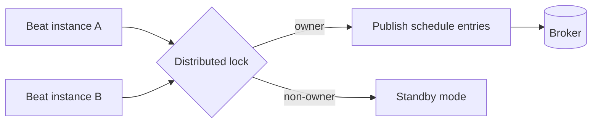

[← Назад к индексу части](index.md)
[↑ К глобальному плану](../mastery_plan.md)

## 28.2 `celery beat`

### Цель раздела

Научиться управлять планировщиком так, чтобы периодические задачи запускались предсказуемо, без дублей и без «тихого молчания».

### В этом разделе главное

- `beat` публикует задачи, но не исполняет их;
- обычно нужен ровно один активный scheduler-instance;
- state file и его права доступа — частая точка проблем.

### Термины

| Термин | Определение |
|---|---|
| **Schedule entry** | описание периодической задачи (interval/crontab/solar и т.д.) |
| **State file** | файл состояния scheduler-а, где хранится прогресс расписаний |
| **DB scheduler** | планировщик, берущий расписание из базы данных |
| **Overlap** | наложение запусков, когда предыдущая итерация задачи еще идет |

### Теория и правила

#### 1) Базовый запуск

```bash
celery -A app.celery_app beat -l INFO
```

CLI-вариант с явным scheduler-классом:

```bash
celery -A app.celery_app beat \
  --scheduler django_celery_beat.schedulers:DatabaseScheduler \
  -l INFO
```

#### 2) Один beat-инстанс

Если запустить два независимых beat с одной и той же конфигурацией без защитного паттерна, получите дубли периодических публикаций.

#### 3) State file и доступ

- явно задавайте путь к state file при необходимости;
- следите за правами доступа пользователя процесса;
- поврежденный файл может приводить к странному поведению расписания (пропуски/скачки).

Мини-правило по выбору storage:

- **schedule file**: проще для одиночного инстанса и базовых контуров;
- **DB scheduler**: лучше для управляемых расписаний и командной работы, но требует контроля миграций/прав/целостности.

Практика восстановления поврежденного state file:

1. Остановить beat, чтобы не усугублять состояние.
2. Снять копию поврежденного файла для пост-мортема.
3. Удалить/переименовать файл состояния.
4. Перезапустить beat и проверить первые публикации по метрикам.
5. Убедиться, что не возникла волна дублей (проверить lock/idempotency на задачах).

#### 4) HA-паттерны

- лидер-элекция scheduler-а;
- внешний scheduler с блокировкой;
- DB scheduler с гарантиями уникального активного экземпляра.

Визуально о single-active beat:



Интуиция: HA для beat — это не «два активных планировщика», а «два кандидата, но публикует только владелец блокировки».

#### Проверь себя: подпункты 28.2

1. Почему «два beat для надежности» без координации опаснее, чем один beat?

<details><summary>Ответ</summary>

Оба инстанса начинают публиковать одни и те же schedule entries, что приводит к дублям задач и возможным гонкам в бизнес-операциях.

</details>

2. Как выбрать между state file и DB scheduler в практике?

<details><summary>Ответ</summary>

State file проще для одиночного контура. DB scheduler удобнее для командной работы и динамических изменений расписаний, но требует дисциплины по доступам, миграциям и целостности.

</details>

3. Зачем после восстановления поврежденного state file проверять дубли, а не только «что beat запустился»?

<details><summary>Ответ</summary>

Потому что scheduler мог потерять часть состояния и повторно опубликовать задачи; формальный запуск beat не гарантирует корректности потока расписаний.

</details>

### Пошагово: стабильная конфигурация beat

1. Определить источник расписания (код/БД).
2. Зафиксировать single-active-instance стратегию.
3. Настроить путь и права state file.
4. Добавить метрики и алерты: «должна была выйти задача, но не вышла».
5. Реализовать защиту от overlap на уровне самой задачи (lock/idempotency).

### Простыми словами

Beat — это «секретарь», который по расписанию кладет поручения в очередь.  
Если секретарей два и они не координируются, поручения будут дублироваться.

### Картинка в голове

```text
[Beat Scheduler] --publishes--> [Broker Queue] --consumed by--> [Workers]
        |
        +-- reads schedule state (file/db)
```

### Как запомнить

**Формула:** один источник расписаний + один активный планировщик + защита от overlap.

### Примеры

#### Пример 1. Beat с явным state file

```bash
celery -A app.celery_app beat \
  --schedule=/var/lib/celery/beat-schedule \
  -l INFO
```

#### Пример 2. Проверка периода при long-running задаче

Если задача запускается каждые 60 секунд, а исполняется 5 минут, без защиты получите накапливающиеся параллельные инстансы.

#### Пример 3. DB scheduler как источник расписания

```python
# Псевдоконфигурация: использовать DB scheduler
app.conf.beat_scheduler = "django_celery_beat.schedulers:DatabaseScheduler"
```

Подход полезен, когда расписания нужно менять без деплоя, но требует дисциплины доступа и мониторинга целостности данных scheduler-а.

### Практика / реальные сценарии

- nightly jobs: расчет отчетов ночью;
- каждые 5 минут: синхронизация внешнего API;
- ежеминутные housekeeping-задачи с TTL-lock для защиты от дублей.

### Типичные ошибки

- два beat в кластере без leader election;
- schedule file в read-only файловой системе;
- пропуск мониторинга «плановая задача не запустилась N интервалов».

### Что будет если...

- **...не контролировать overlap?**  
  Появятся дубли операций, гонки записи и рост нагрузки на внешние сервисы.

- **...восстановить систему с поврежденным schedule file без проверки?**  
  Возможны пропуски или внезапная лавина «догоняющих» запусков.

### Проверь себя

1. Почему «beat работает» не означает, что периодические задачи надежны?

<details><summary>Ответ</summary>

Потому что надежность зависит от single-instance стратегии, корректного state storage и защиты от overlap/дубликатов на уровне задач.

</details>

2. В чем логика требования «один активный beat»?

<details><summary>Ответ</summary>

Чтобы один и тот же schedule entry не публиковался параллельно несколькими источниками.

</details>

3. Зачем мониторить именно отсутствие публикаций?

<details><summary>Ответ</summary>

Потому что «тишина» в планировщике часто не проявляется явной ошибкой, но ломает бизнес-процессы незаметно.

</details>

### Запомните

- beat — это источник публикаций, а не исполнитель;
- для HA важны координация и блокировки, а не просто «еще один pod»;
- защищать нужно и scheduler-контур, и сами периодические задачи.

---
