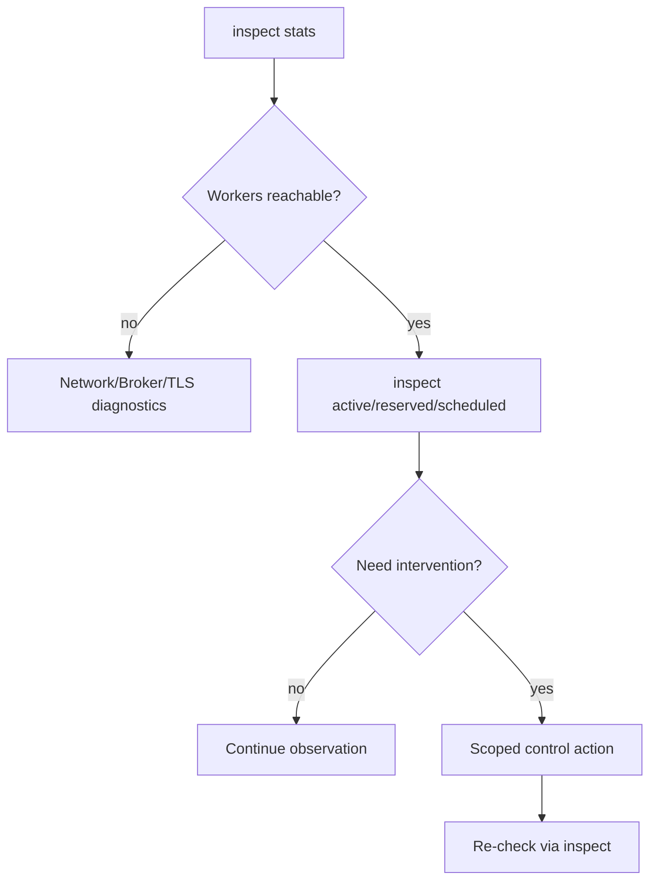
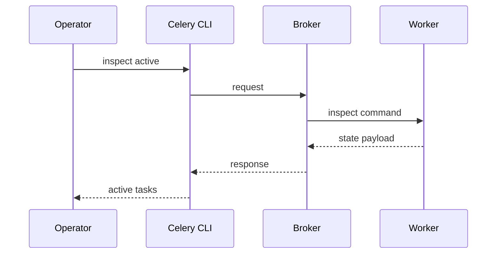

[← Назад к индексу части](index.md)
[↑ К глобальному плану](../celery_mastery_plan.md)

## 28.3 `inspect` / `control` / `events`

### Цель раздела

Освоить read-only диагностику и удаленное управление worker-ами через CLI так, чтобы сокращать время triage без лишнего риска.

### В этом разделе главное

- сначала `inspect` (наблюдаем), потом `control` (вмешиваемся);
- `events` помогает видеть поток событий и интегрируется с Flower/мониторингом;
- network/security ограничения критичны для remote control.

### Термины

| Термин | Определение |
|---|---|
| **active** | задачи, которые сейчас выполняются |
| **reserved** | задачи, уже зарезервированные worker-ом, но не стартовавшие |
| **scheduled** | задачи, запланированные к будущему исполнению у worker-а |
| **stats** | агрегированная статистика worker-а |
| **registered** | список зарегистрированных задач |
| **pool_restart** | перезапуск пула исполнителей без полного завершения процесса worker-а |

### Теория и правила

#### 1) Базовые inspect-команды

```bash
celery -A app.celery_app inspect active
celery -A app.celery_app inspect reserved
celery -A app.celery_app inspect scheduled
celery -A app.celery_app inspect stats
celery -A app.celery_app inspect registered
```

Принцип: `inspect` не меняет состояние. Это безопасная первая линия диагностики.

#### 2) Control-команды

```bash
celery -A app.celery_app control shutdown
celery -A app.celery_app control pool_restart
celery -A app.celery_app control rate_limit tasks.send_email 20/m
```

Принцип: применять только по runbook. Особенно в production.

#### 3) Events/mon

```bash
celery -A app.celery_app events
```

Используется для наблюдения за event stream и как основание для dashboard/tooling.

Практический смысл `events/mon`:

- быстро увидеть lifecycle задач (`received -> started -> succeeded/failed`);
- понять, есть ли heartbeat и живы ли worker-ы;
- подтвердить, что проблема в доставке/исполнении, а не в UI-инструменте.

Связь с Flower: Flower потребляет те же события, поэтому если event-поток не приходит, проблема часто ниже уровня Flower (сеть, broker, event config).

Примечание по `mon`: в разных версиях/средах встречаются разные способы «живого» просмотра событий; если в вашей версии нет отдельной команды `mon`, используйте режимы `events` (например `--dump`) как функциональный эквивалент для оперативной диагностики.

Мини-алгоритм чтения event-потока:

1. Есть `task-received`, но нет `task-started` -> проверять worker pool/concurrency и блокировки.
2. Есть `task-started`, но нет `task-succeeded/failed` -> проверять зависание внутри задачи, внешние API, таймауты.
3. Вообще нет событий по конкретному task id -> проверять маршрутизацию, публикацию и broker.

#### 4) Сеть и безопасность

- многие control-операции используют broadcast-модель;
- firewall/TLS/сегментация сети могут блокировать доставку control-сообщений;
- неуспешный control часто выглядит как «тишина», поэтому нужна проверка каналов.

### Пошагово: triage через inspect/control

1. Проверить `inspect stats` и доступность worker-ов.
2. Проверить `active/reserved/scheduled` для понимания очереди выполнения.
3. Проверить `registered`, чтобы исключить проблему с импортами задач.
4. Если нужно вмешательство, применить минимальный `control` по runbook.
5. Подтвердить результат через повторный `inspect`.



#### Проверь себя: подпункты 28.3

1. Почему `inspect registered` — ключ к отделению проблем маршрутизации от проблем импорта?

<details><summary>Ответ</summary>

Если задача не зарегистрирована у worker-а, проблема обычно в импорте/инициализации, а не в очереди или broker routing.

</details>

2. Как интерпретировать паттерн: есть `task-started`, но нет `task-succeeded/failed`?

<details><summary>Ответ</summary>

Часто это зависание внутри задачи, внешний зависший dependency (API/DB), некорректный timeout или блокировка. Нужно идти в runtime-диагностику исполнения.

</details>

3. Почему при неответе на `inspect` нужно проверять сеть/TLS, а не сразу перезапускать worker?

<details><summary>Ответ</summary>

Проблема может быть в канале управления, а не в процессе исполнения. Перезапуск без проверки может ничего не исправить и добавить нестабильность.

</details>

### Простыми словами

`inspect` — как диагностика автомобиля сканером: сначала смотрим параметры.  
`control` — как ручное изменение режимов двигателя: полезно, но делать нужно осознанно.

### Картинка в голове



### Как запомнить

**Правило 3 шагов:** Observe (`inspect`) -> Decide (runbook) -> Act (`control`) -> Verify (`inspect`).

### Примеры

#### Пример 1. Проверка перегрузки

```bash
celery -A app.celery_app inspect active
celery -A app.celery_app inspect reserved
```

Если `reserved` растет, а `active` стабильно «забит», ищите bottleneck в pool/concurrency/QoS/внешних зависимостях.

#### Пример 2. Мягкий останов worker-а

```bash
celery -A app.celery_app control shutdown -d worker1@host
```

Только после проверки, что есть capacity на других worker-ах.

#### Пример 3. Просмотр событий в live-режиме во время инцидента

```bash
celery -A app.celery_app events --dump
```

Полезно как «стетоскоп» системы: видно, идут ли события вообще и какие типы событий доминируют.

### Практика / реальные сценарии

- проверка «почему задача не стартует»;
- ограничение rate для шумной задачи во время инцидента;
- controlled pool restart после выката патча или утечки.

### Типичные ошибки

- использовать `control` без предварительного `inspect`;
- запускать массовые команды без таргетинга `-d`;
- считать отсутствие ответа на `inspect` «багом Celery», игнорируя сеть/доступ.

### Что будет если...

- **...дать всем инженерам unrestricted control?**  
  Получите высокий риск непредсказуемых ручных изменений и инцидентов из-за отсутствия процедур.

- **...полагаться только на Flower без CLI навыка?**  
  При деградации UI или частичной недоступности вы потеряете скорость реакции.

### Проверь себя

1. Почему `inspect registered` часто экономит часы диагностики?

<details><summary>Ответ</summary>

Он сразу показывает, зарегистрирована ли нужная задача у worker-а. Это быстро отделяет проблему маршрутизации от проблемы импорта/инициализации.

</details>

2. Зачем повторно запускать `inspect` после `control`?

<details><summary>Ответ</summary>

Чтобы подтвердить фактическое изменение состояния и не строить дальнейшие действия на предположении.

</details>

3. Почему в runbook важно задавать scope по `-d`?

<details><summary>Ответ</summary>

Чтобы ограничить действие команд конкретным worker-ом и не спровоцировать массовый побочный эффект по всему кластеру.

</details>

### Запомните

- `inspect` — обязательный первый шаг в диагностике;
- `control` — только по процедуре и с подтверждением результата;
- сеть и безопасность часто объясняют «немой» control лучше, чем «баги Celery».

---
