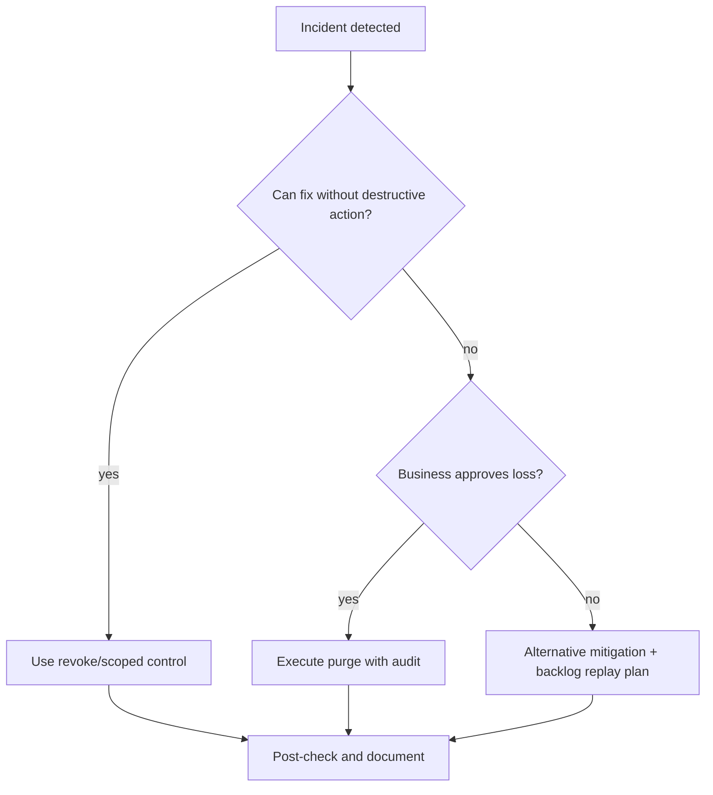

[← Назад к индексу части](index.md)
[↑ К глобальному плану](../../mastery_plan.md)

## 28.4 Утилиты обслуживания

### Цель раздела

Понять, как и когда применять аварийные операционные команды, чтобы спасать систему, а не ухудшать ситуацию.

### В этом разделе главное

- `purge` — инструмент последней линии, не «быстрая уборка»;
- `revoke`/`terminate` требуют понимания семантики задачи и побочных эффектов;
- `report` и `multi` полезны для стандартизации и дебага окружения.

### Термины

| Термин | Определение |
|---|---|
| **purge** | удаление ожидающих задач из очередей |
| **revoke** | пометка задачи как отмененной |
| **terminate** | принудительное прекращение уже исполняемой задачи |
| **celery multi** | утилита управления несколькими worker-процессами |
| **report** | диагностический отчет по версии/конфигурации Celery |

### Теория и правила

#### 1) `purge`

```bash
celery -A app.celery_app purge -f
```

- удаляет задачи до выполнения;
- использовать только при явном решении бизнеса/операций;
- всегда фиксировать инцидентный контекст и последствия.

#### 2) `revoke` / `terminate`

```bash
celery -A app.celery_app control revoke <task_id>
celery -A app.celery_app control revoke <task_id> --terminate
```

- revoke без terminate эффективен до старта исполнения;
- terminate прерывает running-задачу и повышает риск частичных side effects;
- после terminate часто нужен компенсационный workflow.

#### 3) `multi`

`celery multi` удобен в части легаси-сценариев и локальной оркестрации, но в современных системах чаще используют systemd, Supervisor, контейнерные оркестраторы.

Пример (legacy-style запуск нескольких worker-ов):

```bash
celery multi start w1 w2 \
  -A app.celery_app \
  -Q:w1 critical \
  -Q:w2 default \
  -l INFO
```

Важно: если выбрали `multi`, обязательно документируйте stop/restart-команды в runbook, чтобы дежурный инженер не восстанавливал это «по памяти».

Короткое сравнение:

| Подход | Когда уместен | Ограничения |
|---|---|---|
| `celery multi` | legacy VM/серверы, быстрый локальный стенд | слабее интеграция с современным service lifecycle |
| systemd | классические Linux-сервера | нужна аккуратная настройка unit/log/restart policy |
| Kubernetes | контейнерный production | выше операционная сложность, но лучше масштабирование и observability |

#### 4) `report`

```bash
celery -A app.celery_app report
```

Незаменим при разборе «непонятной среды»: показывает версии и ключевые параметры.

### Пошагово: аварийное действие без хаоса

1. Проверить масштаб проблемы через `inspect`.
2. Выбрать минимально разрушительный вариант (например, revoke до purge).
3. Выполнить команду на ограниченном scope.
4. Подтвердить эффект через `inspect/events`.
5. Запустить пост-инцидентный анализ: почему понадобилась аварийная команда.

Мини-runbook перед `purge`:

- подтверждено, что очередь содержит некорректный/неактуальный workload;
- согласован владелец бизнес-риска потери задач;
- зафиксирован период, очередь и оценка влияния;
- подготовлен план повторной постановки задач (если требуется).



#### Проверь себя: подпункты 28.4

1. Почему в аварийном контуре порядок `revoke -> terminate -> purge` обычно безопаснее обратного?

<details><summary>Ответ</summary>

Он идет от точечных и менее разрушительных действий к более разрушительным, уменьшая риск массовой потери задач и побочных эффектов.

</details>

2. Что обязательно уточнить до `purge`, кроме технического факта «очередь длинная»?

<details><summary>Ответ</summary>

Бизнес-допустимость потери задач, объем и период потерь, а также план replay/компенсации.

</details>

3. Зачем `report` при инциденте, если уже есть метрики и логи?

<details><summary>Ответ</summary>

`report` фиксирует фактическую версию/конфиг среды и помогает быстро найти рассинхрон окружений, который может быть неочевиден из метрик.

</details>

### Простыми словами

`purge` — «выбросить корзину заказов».  
`revoke` — «отменить конкретный заказ».  
`terminate` — «остановить выполняемую работу посреди процесса».  
Чем правее по списку, тем выше риск побочных эффектов.

### Картинка в голове

```text
Risk scale:
report  -> inspect -> revoke -> terminate -> purge
  low                                high
```

### Как запомнить

**Правило:** сначала точечность, потом разрушительность.  
Если можно решить точечно (`revoke`), не переходите к массовому удалению (`purge`).

### Примеры

#### Пример 1. Отмена ошибочно поставленной задачи

```bash
celery -A app.celery_app control revoke 5c8d...a9e2
```

#### Пример 2. Сбор техданных для диагностики

```bash
celery -A app.celery_app report
celery -A app.celery_app inspect stats
```

### Практика / реальные сценарии

- массово ошибочно опубликованы задачи с неправильным payload;
- runaway-задача заблокировала worker pool;
- после релиза «часть worker-ов работает на старой конфигурации».

### Типичные ошибки

- запуск `purge` без подтверждения, что задачи действительно «безопасно потерять»;
- `terminate` без понимания transactional boundaries задачи;
- игнорирование пост-факта: не обновляют runbook и попадают в тот же инцидент снова.

### Что будет если...

- **...использовать terminate как обычную практику контроля long-running задач?**  
  Со временем накопятся несогласованные состояния, дубли и «призрачные» ошибки в бизнес-данных.

- **...не вести аудит аварийных команд?**  
  Команда не сможет объяснить, почему произошла потеря задач или изменение поведения кластера.

### Проверь себя

1. Почему `revoke` обычно предпочтительнее `purge`?

<details><summary>Ответ</summary>

Потому что это точечная операция с ограниченным эффектом, тогда как purge массово удаляет ожидающие задачи.

</details>

2. Когда `terminate` допустим?

<details><summary>Ответ</summary>

Когда риск от продолжения задачи выше риска от прерывания, и есть понимание/план компенсации побочных эффектов.

</details>

3. Какую роль играет `report` при инцидентах совместимости?

<details><summary>Ответ</summary>

Он быстро фиксирует фактическую версию и конфигурацию среды, позволяя исключить «путаницу окружений».

</details>

### Запомните

- аварийные команды должны быть редкими и процедурными;
- «сначала собери факты, потом действуй» — ключевое правило;
- после каждого аварийного кейса обновляйте runbook.

---
