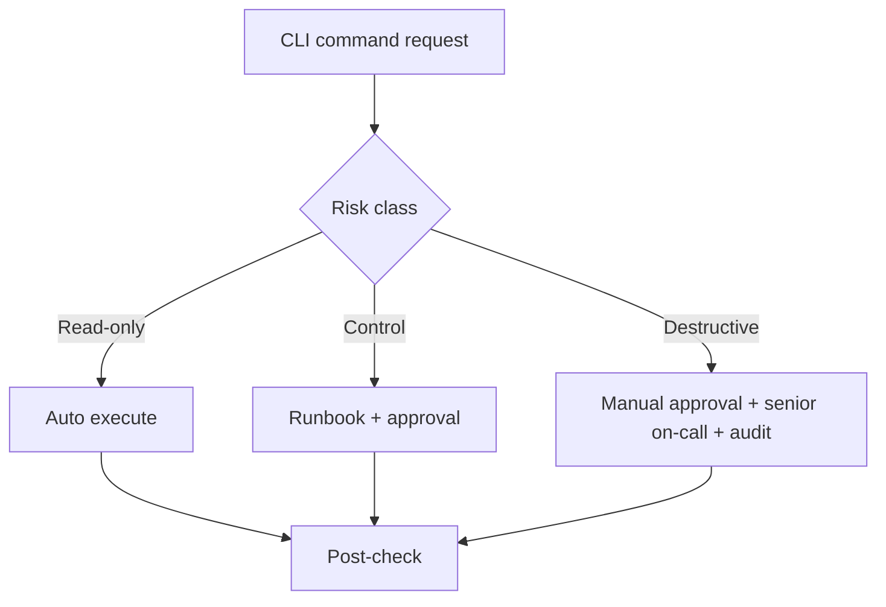
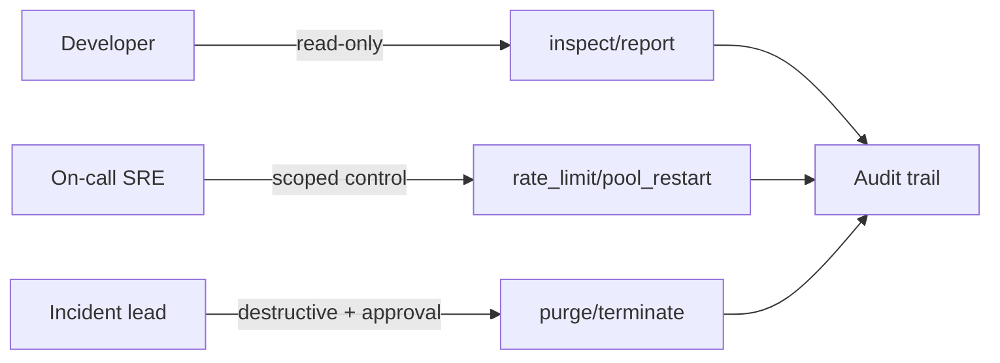

[← Назад к индексу части](index.md)
[↑ К глобальному плану](../celery_mastery_plan.md)

## 28.5 Безопасность CLI и автоматизация

### Цель раздела

Построить операционный контур, в котором CLI-команды Celery применяются безопасно, воспроизводимо и с проверяемой ответственностью.

### В этом разделе главное

- не все команды должны быть доступны всем ролям;
- pipeline должен запускать только безопасный класс команд;
- runbook и аудит важнее «героических ручных действий».

### Термины

| Термин | Определение |
|---|---|
| **RBAC** | разграничение прав по ролям |
| **Break-glass access** | временный повышенный доступ на случай аварии |
| **Guardrails** | технические ограничения, предотвращающие опасные действия |
| **Audit trail** | история, кто/когда/что сделал |

### Теория и правила

#### 1) Кто может выполнять control в production

- ограниченный круг ролей (SRE/on-call/platform lead);
- командный аккаунт или одобренный доступ через bastion;
- обязательный аудит действий и причина команды.

#### 2) Safe/unsafe команды для автоматизации

**Обычно safe в CI/CD:**

- `celery report` (сбор диагностики),
- `inspect` в режиме проверки состояния.

**Обычно unsafe без ручного approval:**

- `purge`,
- массовый `revoke --terminate`,
- широкие `control shutdown` без scope.

Рекомендуемая матрица допуска:

| Класс команды | CI (auto) | CD (gated) | Manual on-call |
|---|---|---|---|
| Read-only (`inspect/report`) | да | да | да |
| Scoped control (`rate_limit`, `pool_restart` на `-d`) | нет | да, с approval | да |
| Destructive (`purge`, массовый terminate) | нет | нет | да, только аварийный протокол |

#### 3) Runbook как контракт

Для каждой чувствительной команды нужно зафиксировать:

1. условия запуска;
2. pre-check список;
3. конкретную команду с параметрами;
4. post-check список;
5. rollback/compensation шаги.

### Пошагово: внедрение безопасного CLI-контура

1. Составить перечень всех используемых CLI-команд.
2. Разделить их на классы риска (`read`, `control`, `destructive`).
3. Назначить роли и уровни доступа.
4. Внедрить guardrails в automation (approval gates, allowlist команд).
5. Добавить журналирование и регулярный review операций.

Практический чек-лист зрелости (можно пройти как аудит):

- [ ] Есть список команд по средам (`dev`, `stage`, `prod`) с явными ограничениями;
- [ ] Для destructive-команд есть обязательный шаблон инцидентной записи;
- [ ] Есть минимум один read-only health check в CI и в on-call runbook;
- [ ] Ясно определено, кто и при каких условиях может выполнять `control`;
- [ ] После каждого инцидента runbook актуализируется и проверяется на практике.

### Простыми словами

Безопасность CLI — это не «запретить всё».  
Это «разрешить нужное, ограничить опасное, и всегда понимать, кто что сделал».

### Картинка в голове





#### Проверь себя: подпункты 28.5

1. Почему нельзя просто «запретить всё опасное» и считать вопрос закрытым?

<details><summary>Ответ</summary>

В инцидентах нужны управляемые действия. Полный запрет убивает скорость реакции. Нужен баланс: RBAC, scoped-команды, approval и аудит.

</details>

2. Почему read-only команды первыми идут в автоматизацию CI/CD?

<details><summary>Ответ</summary>

Они дают высокую диагностическую ценность при минимальном риске изменения состояния production-контура.

</details>

3. Что важнее для destructive-команд: права или процедура?

<details><summary>Ответ</summary>

Оба аспекта обязательны: права без процедуры приводят к ошибочным действиям, процедура без прав не исполнима безопасно и контролируемо.

</details>

### Как запомнить

**Формула:** команда + контекст + право + подтверждение результата = безопасная операция.

### Примеры

#### Пример 1. Read-only health check в pipeline

```bash
celery -A app.celery_app inspect stats
```

#### Пример 2. Контролируемая операция в runbook

```bash
# 1) pre-check
celery -A app.celery_app inspect active

# 2) targeted action
celery -A app.celery_app control rate_limit tasks.heavy_import 5/m -d worker-bulk@host

# 3) post-check
celery -A app.celery_app inspect active
```

### Практика / реальные сценарии

- on-call ограничивает шумную задачу вместо полного стопа кластера;
- ночной pipeline снимает диагностический snapshot через `report` и `inspect`;
- security review выявляет, что `purge` доступен слишком широкому кругу пользователей.

### Граничные случаи и ограничения

- при частичной сетевой деградации `inspect/control` может отвечать только от части worker-ов; это не всегда означает «половина умерла»;
- при интенсивном event-потоке `events --dump` может давать много шума, поэтому используйте его как временный инструмент triage;
- при ephemeral-инфраструктуре (частые рестарты pod-ов) особенно важно не завязывать runbook на нестабильные hostnames без шаблона.

### Типичные ошибки

- «общий root-доступ» к CLI для всей команды;
- отсутствие журналирования ручных команд;
- запуск destructive-команд из автоматизации без approval.

### Что будет если...

- **...не внедрять RBAC для CLI?**  
  Один ошибочный ввод может выключить критичный контур и будет трудно понять, кто и почему это сделал.

- **...запретить все control-команды без исключений?**  
  Команда потеряет управляемость в инцидентах и будет действовать медленнее.

### Проверь себя

1. Почему важна именно классификация команд по риску, а не «всем всё нельзя»?

<details><summary>Ответ</summary>

Потому что operations требуют действий разной срочности и опасности. Нужен баланс между безопасностью и оперативностью.

</details>

2. Какие команды чаще всего разумно автоматизировать первыми?

<details><summary>Ответ</summary>

Read-only команды диагностики (`report`, `inspect stats/active`), потому что они дают ценность и минимальный риск.

</details>

3. Что в runbook критичнее всего для destructive-операций?

<details><summary>Ответ</summary>

Явные pre-check и post-check шаги, а также условия, при которых операция допустима.

</details>

### Запомните

- безопасность CLI — это управляемость, а не только ограничения;
- destructive-команды должны быть исключением;
- automation должен помогать дисциплине, а не умножать риск.

---
