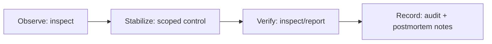

[← Назад к индексу части](index.md)
[↑ К глобальному плану](../../mastery_plan.md)

## Частые сценарии

### Сценарий 1. Worker поднялся, но «задач нет»

1. `inspect registered` — задача вообще зарегистрирована?
2. Проверить `-Q` и маршрутизацию.
3. Проверить `-A` путь и импорты.
4. Проверить broker connection и права.

**Ключевая мысль:** чаще это не «пропажа задач», а несоответствие конфигурации запуска и маршрутизации.

### Сценарий 1.1. `inspect` не отвечает, а процессы вроде живы

1. Проверить сетевой путь между операторским хостом, broker и worker.
2. Проверить TLS/сертификаты и срок действия.
3. Убедиться, что worker не запущен с ограничениями, отключающими нужный control/event-контур.
4. Сравнить ответ на адресный запрос `-d` и широковещательный запрос.

**Ключевая мысль:** «нет ответа на inspect» часто про сеть/канал управления, а не про код задач.

### Сценарий 2. Очередь растет быстрее, чем разгребается

1. `inspect active/reserved/stats`.
2. Проверить `concurrency`, тип пула, bottleneck внешних API/БД.
3. Временно ограничить тяжелые задачи через `rate_limit`.
4. Переразделить workload по очередям и worker-пулам.

**Ключевая мысль:** сначала стабилизация, потом архитектурное исправление.

### Сценарий 3. Периодические задачи дублируются

1. Убедиться, что активен один beat.
2. Проверить scheduler storage/state file.
3. Добавить lock/idempotency на стороне задачи.
4. Проверить деплой-процедуру, исключить запуск двух beat одновременно.

### Сценарий 4. Нужна экстренная отмена одной «плохой» задачи

1. Получить точный `task_id`.
2. Попробовать `revoke` без terminate.
3. Если уже выполняется и риск высокий — `revoke --terminate`.
4. После terminate выполнить компенсацию и анализ последствий.

### Сценарий 5. После релиза вырос `reserved`, а `active` почти не меняется

1. Сверить изменения пула (`-P`), `--concurrency` и маршрутизации `-Q`.
2. Проверить, не появился ли новый внешний bottleneck (БД/API/lock).
3. Проверить prefetch/QoS настройки и фактическую длину задач.
4. Временно ограничить проблемный тип задач через `rate_limit`.
5. Отделить длинные задачи в отдельный worker-пул.

**Ключевая мысль:** рост `reserved` без роста `active` обычно указывает на узкое место исполнения или неудачный профиль worker-конфигурации.

### Сценарий 6. `beat` публикует задачи не по ожидаемому расписанию

1. Проверить, какой scheduler реально используется (`state file` или `DB scheduler`).
2. Проверить timezone и clock drift на ноде, где работает beat.
3. Проверить целостность state file или данные scheduler-таблиц в БД.
4. Проверить, нет ли второго активного beat без блокировки/лидер-элекции.
5. Подтвердить фактическую публикацию через `events` и метрики.

**Ключевая мысль:** «сломанное расписание» чаще связано с источником расписаний и временем среды, а не с worker-исполнением.

#### Проверь себя: сценарные блоки

1. Что объединяет сценарии 1, 2 и 5 с точки зрения первого безопасного шага?

<details><summary>Ответ</summary>

Во всех случаях сначала нужна диагностика через `inspect` и проверка фактического состояния, а не мгновенное управляющее вмешательство.

</details>

2. Чем сценарий про `beat`-расписание принципиально отличается от сценариев перегрузки worker-а?

<details><summary>Ответ</summary>

В `beat`-сценарии проблема часто на уровне публикации и календарной логики (scheduler/time/storage), а не на уровне исполнения уже опубликованных задач worker-ами.

</details>

### Минимальный 15-минутный операционный плейбук

Ситуация: «есть инцидент, времени мало, нужен безопасный минимум действий».

### Шаг 0-5 минут: собрать картину без разрушительных действий

```bash
celery -A app.celery_app inspect stats
celery -A app.celery_app inspect active
celery -A app.celery_app inspect reserved
celery -A app.celery_app inspect scheduled
```

Цель: понять, это проблема доступности worker-ов, перегруза очереди или конкретного типа задач.

### Шаг 5-10 минут: точечная стабилизация

- если перегружен конкретный класс задач, использовать scoped `rate_limit`;
- если worker-пул деградировал, применить ограниченный `pool_restart` по runbook;
- destructive-команды (`terminate`, `purge`) пока не применять без явного обоснования.

### Шаг 10-15 минут: подтверждение и фиксация

```bash
celery -A app.celery_app inspect active
celery -A app.celery_app inspect reserved
celery -A app.celery_app report
```

- подтвердить, что симптомы снизились;
- сохранить диагностический снимок (что было до/после);
- зафиксировать, что делали и почему (audit trail + заготовка postmortem).



**Почему это важно:** в инциденте чаще ошибаются не в командах, а в порядке действий. Этот короткий цикл снижает риск «случайно ухудшить систему».

### Проверь себя

1. Почему в первые минуты инцидента нельзя начинать с `purge` или массового `terminate`?

<details><summary>Ответ</summary>

Потому что без первичной диагностики можно уничтожить важные задачи или усугубить состояние системы. Сначала нужно собрать факты через read-only команды.

</details>

2. Зачем в шаге 10-15 минут делать и `inspect`, и `report`?

<details><summary>Ответ</summary>

`inspect` показывает текущее состояние очередей и worker-ов, а `report` фиксирует контекст окружения/версий. Вместе они дают проверяемый снимок «после вмешательства».

</details>

3. Что дает обязательная фиксация действий в audit trail даже при «успешном» инциденте?

<details><summary>Ответ</summary>

Она делает действия воспроизводимыми и проверяемыми: команда понимает, что сработало, что рискованно, и как улучшить runbook до следующего инцидента.

</details>
