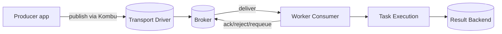
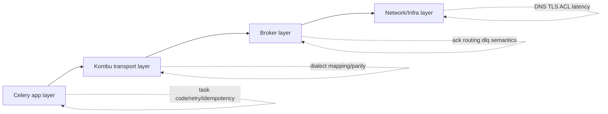

[← Назад к индексу части](index.md)
[↑ К глобальному плану](../../mastery_plan.md)

## Сквозная модель транспорта в Celery

### Визуальная схема границ ответственности (где искать корень проблемы)

Если сбой в `DNS/TLS/маршрутизации`, его не исправить только флагами Celery.  
Если проблема в semantics очереди, ее не исправить только «больше ретраев» в коде задачи.

**Интуиция.**  
Celery похож на «универсальный пульт», а transport — как «переходник под конкретную розетку». Пульт один, но электрические характеристики и ограничения розетки разные.

**Точная формулировка.**  
Kombu абстрагирует transport API, но не устраняет различия между брокерами. Поэтому корректный дизайн Celery-системы всегда включает явное проектирование транспорта, URL и transport options.

**Картинка в голове.**  
Представь логистику: у тебя одинаковые коробки (tasks), но часть едет самолетом (SQS), часть поездом (AMQP), часть грузовиком (Redis). Накладная похожа, но сроки, риски и правила передачи груза разные.

#### Проверь себя: сквозная модель

1. Где в схеме появляется риск «приняли в producer, но потеряли до устойчивой фиксации»?

Ответ

На пути публикации от producer через transport к брокеру, особенно при сетевых сбоях и неочевидной семантике подтверждения publish. Риск зависит от транспорта и настроек confirms/acks.

2. Почему нельзя обсуждать idempotency отдельно от транспорта?

Ответ

Потому что транспорт определяет частоту и условия повторной доставки. Idempotency нужна именно для компенсации реальных re-delivery сценариев конкретного брокера.

---
