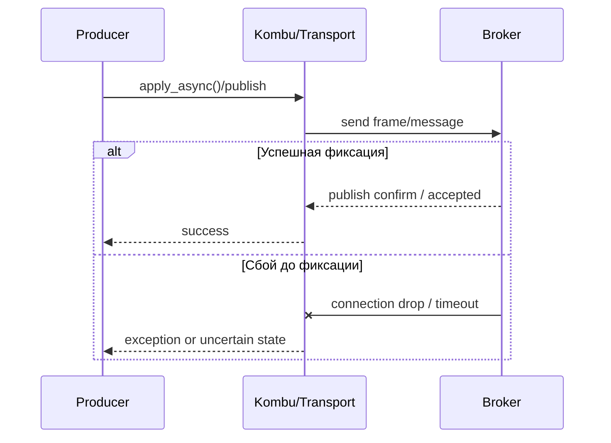
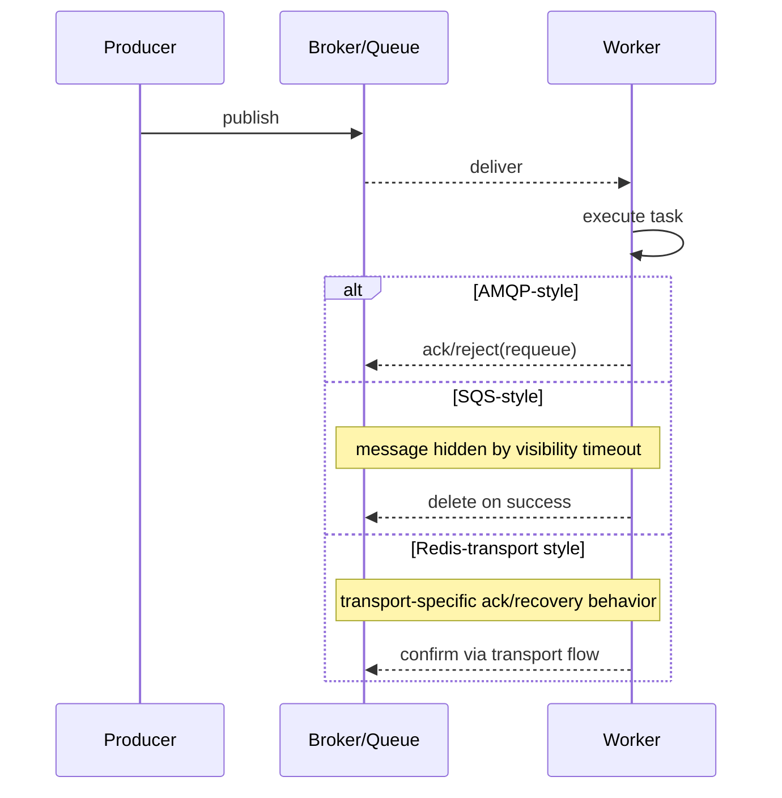

[← Назад к индексу части](index.md)
[↑ К глобальному плану](../celery_mastery_plan.md)

## 29.3 Семантика по транспортам

### Цель раздела

Понять, как различается доставка, подтверждение и повторная выдача задач в зависимости от транспорта, и как это влияет на retry, idempotency и эксплуатационные решения.

### В этом разделе главное

- повторная доставка — это нормальный механизм, а не «исключение из правил»;
- visibility timeout (SQS), requeue (AMQP), поведение Redis при сбоях требуют разных стратегий;
- возможности DLQ, priorities, broadcast и revoke могут иметь различный parity.

#### Проверь себя: главное в разделе 29.3

1. Почему re-delivery нельзя трактовать как «редкий баг»?

<details><summary>Ответ</summary>

Потому что в at-least-once модели повторная доставка ожидаема при ряде сбоев и таймаутов; это базовое свойство, а не исключение.

</details>

2. Что опаснее: отсутствие retries или retries без idempotency?

<details><summary>Ответ</summary>

Retries без idempotency часто опаснее: они масштабируют дубли и побочные эффекты, превращая временный сбой в бизнес-инцидент.

</details>

### Термины

| Термин | Определение |
|---|---|
| **At-least-once delivery** | Сообщение будет доставлено как минимум один раз, дубли возможны. |
| **Consumer cancel** | Ситуация, когда consumer теряет подписку/канал и перестает получать сообщения. |
| **Visibility timeout** | Период «невидимости» сообщения после получения (SQS). |
| **Late ack** | Подтверждение после выполнения задачи; увеличивает шанс re-delivery при падении worker. |
| **Publish confirm window** | Промежуток между отправкой producer и устойчивым подтверждением брокера. |

### Теория и правила

#### 1) Повторная доставка и ее природа

Celery обычно строится на at-least-once.  
Это означает:

- дубликаты возможны;
- idempotency не опция, а обязательство;
- мониторинг должен учитывать re-delivery, а не считать его всегда аномалией.

#### 2) SQS: visibility timeout

Если задача выполняется дольше `visibility_timeout`, сообщение может снова стать видимым и уйти другому worker-у.  
Следствие: длинные задачи + короткий visibility timeout = дубли и гонки побочных эффектов.

#### 3) Redis: специфика очередей и аварий

Redis transport удобен, но чувствителен к ряду аварийных режимов:

- рестарт/сбой broker-процесса;
- сетевые разрывы;
- конкуренция consumer-ов при высокой загрузке.

Практический вывод: всегда сочетать Redis с строгой idempotency и регулярной валидацией retry-модели.

#### 4) AMQP: ack, prefetch, requeue, consumer cancel

AMQP дает зрелую модель управления потреблением:

- `ack` подтверждает успешную обработку;
- `reject/requeue` возвращает сообщение;
- `prefetch` регулирует «сколько задач у consumer заранее»;
- cancel/channel-failure влияет на поток получения задач.

#### 5) «Producer принял задачу» vs «задача устойчива»

Самый опасный когнитивный баг: считать, что после `apply_async()` задача «точно в очереди».  
На практике между publish и устойчивой фиксацией могут быть сетевые и брокерные провалы.



Интуитивный вывод: «успех вызова в коде» и «устойчивая запись сообщения в broker» — не всегда одно и то же мгновение.

#### Проверь себя: подпункты 29.3.1-29.3.5

1. Почему `acks_late` повышает требования к идемпотентности?

<details><summary>Ответ</summary>

Потому что при падении worker до ack задача может быть выдана повторно, и side effects без защиты выполнятся дважды.

</details>

2. Как связаны `visibility_timeout` и p99 длительности задач?

<details><summary>Ответ</summary>

Timeout должен покрывать worst-case/p99 runtime с запасом, иначе появляется массовая повторная выдача еще выполняющихся задач.

</details>

3. Что методически правильно считать «успехом» публикации?

<details><summary>Ответ</summary>

Не только отсутствие ошибки в `apply_async`, а подтвержденный проход publish path до broker (в рамках выбранной transport-модели) и наблюдаемость этого факта.

</details>

#### Мини-матрица состояний публикации (что считать «успехом»)

| Состояние | Что видит приложение | Что реально гарантировано |
|---|---|---|
| `apply_async()` вернул без ошибки | Локальный publish flow не упал сразу | Сообщение может быть еще не зафиксировано устойчиво |
| Есть подтверждение от broker (transport-dependent) | Публикация принята broker-стороной | Гарантия выше, но не равна «задача уже выполнена» |
| Worker взял задачу | Сообщение доставлено consumer-у | При crash до ack возможна повторная доставка |
| Есть успешный result/state | Бизнес-логика завершилась (в пределах модели backend) | Все равно нужна идемпотентность для re-delivery окна |

### Пошагово: проверка delivery semantics в проекте

1. Зафиксируй целевой транспорт и его ограничения.
2. Смоделируй падение worker во время выполнения (`acks_late`/early ack сценарии).
3. Смоделируй обрыв сети producer <-> broker в момент публикации.
4. Для SQS проверь длительные задачи против visibility timeout.
5. Для AMQP проверь поведение при requeue и high prefetch.
6. Для Redis проверь аварийные рестарты и восстановление очередей.
7. Убедись, что бизнес-операции идемпотентны и имеют dedup guards.

### Простыми словами

Семантика доставки — это ответ на вопрос: «Что происходит с задачей, когда все идет не по плану?».  
В спокойном режиме кажется, что все брокеры одинаковы. В аварии различия становятся ключевыми.

### Картинка в голове

Представь выдачу посылок:

- AMQP: у тебя подписанный акт передачи;
- SQS: курьер забрал посылку, но если не подтвердил вовремя, система отправит еще одного курьера;
- Redis: выдача быстрая, но аварийные условия нужно моделировать особенно тщательно.

### Как запомнить

Формула: **Retry + Idempotency + Transport Semantics = Реальная надежность**.

#### Проверь себя: запоминание 29.3

1. Что произойдет, если из формулы убрать `Transport Semantics`?

<details><summary>Ответ</summary>

Retry и idempotency будут настраиваться «в вакууме», без учета реального поведения очереди, что приведет к ошибочным стратегиям и ложной уверенности.

</details>

2. Почему idempotency не заменяет observability?

<details><summary>Ответ</summary>

Idempotency защищает от дублей, но не объясняет, где и почему возникает деградация. Без наблюдаемости невозможно быстро диагностировать и исправлять причину.

</details>

### Примеры

#### Пример 1. Долгая задача и SQS visibility timeout

```python
@app.task(bind=True, autoretry_for=(Exception,), retry_backoff=True)
def generate_heavy_report(self, report_id: str) -> None:
    # Представим, что работа длится 45 минут.
    # Если visibility_timeout=30 минут, возможна повторная выдача сообщения.
    process_report(report_id)
```

Ключевой вывод: visibility timeout должен покрывать worst-case runtime или нужна стратегия heartbeat/progress + идемпотентность на уровне побочных эффектов.

#### Пример 2. Идемпотентная защита от дублей

```python
@app.task(bind=True, acks_late=True)
def charge_order(self, order_id: str) -> None:
    # Простая идея: проверка "уже обработано?" перед внешним side effect.
    if billing_repo.was_already_charged(order_id):
        return
    billing_gateway.charge(order_id)
    billing_repo.mark_charged(order_id)
```

#### Пример 3. ASCII-модель точек риска

```text
Producer --publish--> Broker --deliver--> Worker --execute--> Side Effect
   |                     |                  | 
   |<--net fail----------|                  |
                         |<--worker crash---|

Риски:
1) publish accepted app-side, но не зафиксирован broker-side
2) worker упал до ack -> re-delivery
3) side effect успел пройти, ack не успел -> дубль без idempotency
```

#### Пример 4. Таймлайн жизненного цикла сообщения по transport-ам



**Как читать диаграмму:**  
на уровне Celery шаги выглядят похожими, но «момент окончательного подтверждения» и сценарии повторной выдачи различаются по transport-диалекту.

#### Пример 5. Таблица «где ломается чаще всего»

| Этап | AMQP (RabbitMQ) | Redis transport | SQS transport |
|---|---|---|---|
| Publish -> broker | проблемы при сетевом сбое/confirm window | чувствительность к network/reset сценариям | endpoint/IAM/region и publish path |
| Delivery -> worker | prefetch/requeue-поведение | re-delivery в авариях/рестартах | visibility timeout при долгой задаче |
| Execute -> acknowledge | crash до ack = повторная доставка | transport-recovery нюансы | delete не успел = повторная выдача |

Практический смысл: если понимать «типичный момент поломки» для каждого transport-а, triage и mitigation идут быстрее и с меньшим числом ложных гипотез.

### Практика / реальные сценарии

- **Платежи:** задача списания должна быть идемпотентной, иначе re-delivery превращается в двойной charge.
- **Email-рассылки:** дубли терпимее, но нужен dedup-key чтобы не спамить клиента при массовых ретраях.
- **ETL pipeline:** при длинных задачах на SQS критично согласовать batch-time и visibility timeout.

### Сравнение возможностей по транспортам (важно для проектирования)

| Возможность | AMQP (RabbitMQ) | Redis transport | SQS transport |
|---|---|---|---|
| **DLQ** | Нативно и гибко через broker-policy | Обычно через дополнительные паттерны | Через встроенные механики SQS |
| **Priorities** | Хорошая поддержка | Ограниченно, зависит от реализации и паттернов | Ограниченно и сервис-специфично |
| **Broadcast/remote control parity** | Наиболее предсказуемо | Может быть неполным или отличаться | Ограниченный parity относительно AMQP-паттерна |
| **Revoke/terminate поведение** | Ближе к ожидаемой Celery-модели | Зависит от transport-реализации и состояния worker | Часть сценариев требует адаптации под SQS-модель |

**Как использовать таблицу:**  
перед внедрением каждой функции Celery (например, приоритеты или сложный control) проверяй не «есть ли API», а «как это работает именно на нашем transport».

#### Проверь себя: parity-возможности 29.3

1. Почему «feature есть в Celery API» недостаточно для проектного решения?

<details><summary>Ответ</summary>

Потому что фактическая реализация зависит от transport-а: parity может быть частичным или отличаться по semantics/операционным ограничениям.

</details>

2. Какой минимальный шаг перед включением приоритетов/DLQ в проде?

<details><summary>Ответ</summary>

Проверить поведение на вашем transport-е в интеграционном стенде и зафиксировать ожидаемую semantics в runbook/архитектурной документации.

</details>

### Типичные ошибки

- настраивать retries без идемпотентного контракта;
- использовать `acks_late` без понимания, что будет при падении воркера после side effect;
- считать DLQ «автоматическим спасением» без стратегии replay и классификации ошибок;
- переносить конфигурацию между транспортами один-в-один без проверки семантики.

### Что будет, если...

- **Если игнорировать re-delivery:** получите бизнес-дубли и трудно объяснимые «фантомные» эффекты.
- **Если visibility timeout слишком короткий:** одна длинная задача начнет жить как серия дублей.
- **Если prefetch завышен:** часть задач окажется «заперта» у медленных worker-ов, ухудшая fairness.

### Проверь себя

1. Почему при at-least-once delivery надежность нельзя «включить флагом», а нужно проектировать в задаче?

<details><summary>Ответ</summary>

Потому что транспорт допускает дубли и re-delivery. Только логика задачи (идемпотентность, дедупликация, аккуратные транзакционные границы) превращает это поведение в безопасное для бизнеса.

</details>

2. Чем логически отличается requeue в AMQP от visibility timeout-повторной выдачи в SQS?

<details><summary>Ответ</summary>

Requeue обычно явнее связан с ack/reject-моделью consumer-а в AMQP, а visibility timeout в SQS основан на временной «невидимости» сообщения. Механизмы разные, хотя итог (повторная доставка) похож.

</details>

3. Где чаще всего возникает ложное ощущение «задача уже точно зафиксирована»?

<details><summary>Ответ</summary>

Сразу после вызова `apply_async()` на стороне producer. Это локальный успех API-вызова, но не всегда гарантия устойчивого завершения всей publish-цепочки.

</details>

### Запомните

- Повторная доставка — ожидаемая часть распределенных очередей.
- Idempotency должна проектироваться вместе с транспортной семантикой.
- Переезд между транспортами требует ревизии retry/timeout/ack, а не только смены URL.

---
