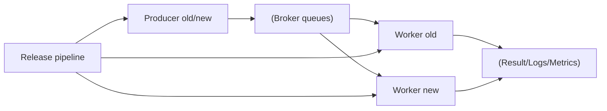
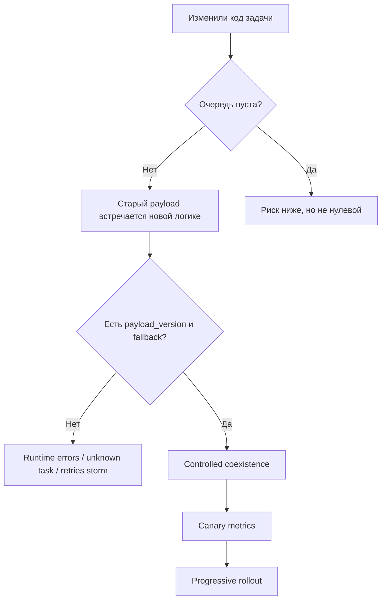

[← Назад к индексу части](index.md)
[↑ К глобальному плану](../../mastery_plan.md)

## Сквозная модель миграции в Celery

### Где рождаются риски несовместимости

**Интуиция.**  
Миграция Celery похожа на ремонт моста без остановки движения: машины (сообщения) уже едут, и нельзя просто "снять старую часть и поставить новую".

**Формулировка.**  
Безопасная миграция — это управляемый период сосуществования старых и новых producer/worker/payload, где правила совместимости заложены явно, а качество перехода подтверждается измерениями.

**Картинка в голове.**  
"Контракт задачи" — это язык. Во время миграции часть участников говорит на старом диалекте, часть — на новом. Нужен переводчик (версионирование + fallback), иначе получится шум вместо разговора.

#### Проверь себя: сквозная модель

1. Почему пустая очередь перед релизом снижает риск, но не гарантирует безопасность?

Ответ

Потому что после релиза в системе все равно может остаться смешанный пул worker-ов и producer-ов, а также delayed/ETA-задачи, созданные до релиза.

2. Какой минимальный набор контроля нужен в переходном окне?

Ответ

Явный payload version, мониторинг ошибок десериализации/unknown task, canary-метрики успеха, и заранее проверенный rollback-путь.

---
