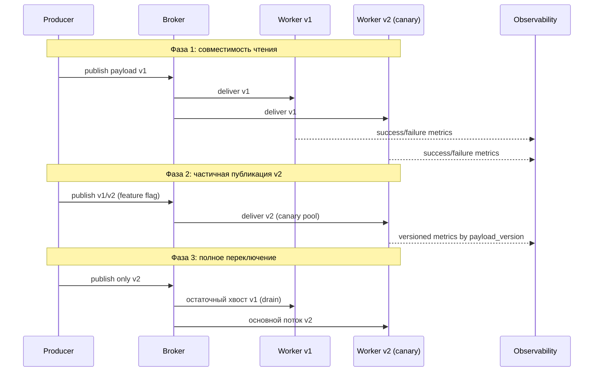
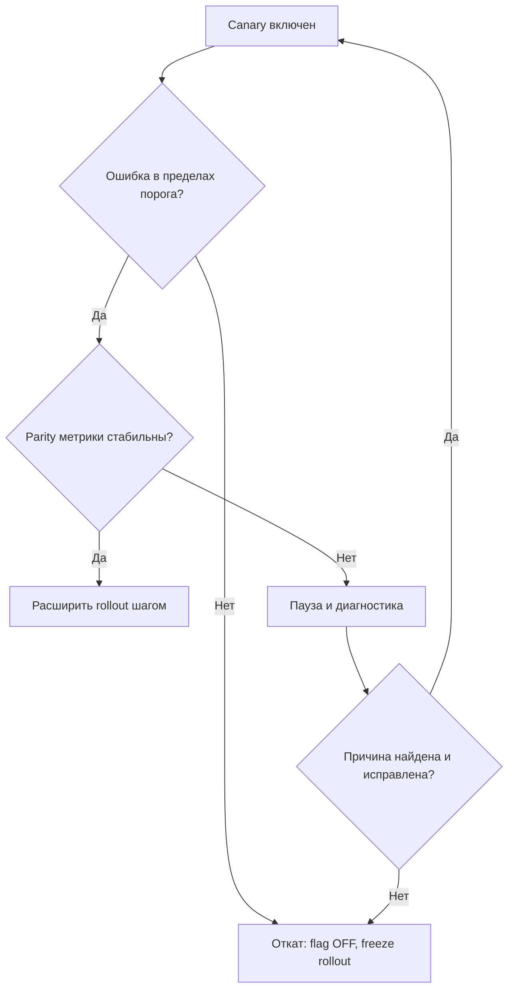

[← Назад к индексу части](index.md)
[↑ К глобальному плану](../celery_mastery_plan.md)

## 30.2 Миграция сообщений и задач

### Цель раздела

Освоить стратегию изменения payload и task-контрактов в условиях непустой очереди, чтобы новая версия могла жить рядом со старой без потери сообщений и без лавины ошибок.

### В этом разделе главное

- Очередь в релиз — почти всегда непуста: это норма, а не исключение.
- Формат сообщений должен эволюционировать управляемо через версионирование и fallback.
- Rollout и rollback должны учитывать уже опубликованные сообщения.

### Термины раздела

| Термин | Определение |
|---|---|
| **Schema versioning** | Явная версия структуры payload. |
| **Canary workers** | Небольшая группа worker-ов новой версии для ранней проверки. |
| **Feature flag** | Переключатель, управляющий публикацией нового поведения/формата. |
| **Drain strategy** | Подход "дожать" старую очередь перед окончательным переключением. |

### Теория и правила

1. **Payload должен быть самодостаточным и версионируемым.**  
   Даже если producer и worker лежат в одном репозитории, в проде они могут быть на разных ревизиях.

2. **Схема "сначала читать старое и новое, потом писать только новое".**  
   Это классический безопасный путь эволюции контракта.

3. **Feature flag на producer стороне — главный рычаг управления.**  
   Если новая схема ломает canary, флаг возвращается без полного отката платформы.

4. **Canary по worker-пулу обязателен для чувствительных изменений.**  
   На малом проценте ловим проблемы десериализации, аргументов и обработки edge-cases.

5. **Rollback-план не может игнорировать сообщения "нового формата", уже лежащие в очереди.**

### Пошагово: безопасная эволюция payload

1. Введи поле `payload_version` (или эквивалент) в сериализуемом сообщении.
2. На worker добавь обработку минимум двух версий (текущей и предыдущей).
3. Включи публикацию нового формата через feature flag на ограниченный процент.
4. Отправь новую версию на canary worker-пул.
5. Сверь метрики success/failure/retry/latency против baseline.
6. Расширяй rollout поэтапно.
7. Когда старый формат "вымыт" из очередей и delayed-задач, удаляй legacy-ветку.

### Простыми словами

Ты как будто меняешь форму банковского перевода, пока система работает. Нельзя в один момент сказать: "С завтрашнего дня только новая форма", если часть отделений еще читает старую.

### Картинка в голове

```text
Время ---->

Producer:  v1 v1 v1 | v1+v2 | v2 v2 v2
Worker:    read v1  | read v1+v2 | read v2
Queue:     [mixed payload window] ---> [only v2]
```

### Как запомнить

**Правило 3R:** `Read Old+New -> Rollout Gradually -> Retire Old`.

### Визуальный жизненный цикл миграции контракта



#### Проверь себя: жизненный цикл контракта

1. Почему в фазе "publish only v2" старые worker могут еще оставаться в контуре?

<details><summary>Ответ</summary>

Потому что в очередях и delayed-пуле может оставаться хвост v1. Старые worker/адаптеры нужны, чтобы корректно обработать этот хвост и не потерять задачи.

</details>

2. Что даёт версионная метрика в observability в фазе partial rollout?

<details><summary>Ответ</summary>

Она показывает, какая версия payload генерирует ошибки и где именно несовместимость. Без этой разбивки сложно понять, что ломается: новая логика, старая ветка или инфраструктура.

</details>

### Примеры

#### Пример 1. Версионирование payload в задаче

```python
from celery import shared_task


@shared_task(name="billing.charge_customer")
def charge_customer(payload: dict) -> None:
    version = payload.get("payload_version", 1)

    if version == 1:
        customer_id = payload["customer_id"]
        amount = payload["amount"]
        currency = payload.get("currency", "USD")
    elif version == 2:
        customer_id = payload["customer"]["id"]
        amount = payload["money"]["amount"]
        currency = payload["money"]["currency"]
    else:
        raise ValueError(f"Unsupported payload_version={version}")

    # далее бизнес-логика, желательно идемпотентная
    process_charge(customer_id=customer_id, amount=amount, currency=currency)
```

#### Пример 2. Feature flag на producer

```python
def build_charge_payload(order, use_v2: bool) -> dict:
    if use_v2:
        return {
            "payload_version": 2,
            "customer": {"id": order.customer_id},
            "money": {"amount": order.total_amount, "currency": order.currency},
            "request_id": order.request_id,
        }
    return {
        "payload_version": 1,
        "customer_id": order.customer_id,
        "amount": order.total_amount,
        "currency": order.currency,
        "request_id": order.request_id,
    }
```

#### Пример 3. Canary rollout (псевдо-runbook)

```text
1) Deploy worker v2 to 10% pool
2) Enable producer flag for 5% traffic
3) Observe 30-60 min:
   - task_success_rate
   - task_failure_by_exception
   - retry_rate
   - p95 runtime
4) If stable -> 25% / 50% / 100%
5) If unstable -> disable flag, keep consumers backward-compatible
```

#### Пример 4. Blue/green через отдельные очереди и vhost

```text
Старый контур (blue):
- broker vhost: /celery-blue
- queues: blue.default, blue.priority
- workers: worker-blue-*

Новый контур (green):
- broker vhost: /celery-green
- queues: green.default, green.priority
- workers: worker-green-*

Переход:
1) producer начинает dual-publish в blue+green (ограниченный поток)
2) green обрабатывает canary-долю
3) после parity producer пишет только в green
4) blue держим read-only до дренажа и rollback-window
```

#### Пример 5. Rollback-runbook при несовместимом payload

```text
Триггеры rollback:
- рост failure_rate > порога 10 минут подряд
- всплеск TypeError/KeyError по payload_version=2
- unknown task/unsupported version > N событий

Действия:
1) OFF feature flag публикации v2 (немедленно)
2) оставляем worker dual-compatible включенным
3) останавливаем масштабирование rollout
4) собираем выборку проблемных payload в quarantine-хранилище
5) фиксируем баг и повторяем canary на 5%
```

### Практика / реальные сценарии

- **Переход с плоского JSON на вложенную схему**: старая и новая версии читаются параллельно до полного дренажа.
- **Добавление обязательного поля**: сначала вводится как optional с default, только потом становится required.
- **Добавление нового типа задачи**: сначала флаг + отдельная очередь + canary workers.
- **Миграция с zero-downtime требованием**: используем blue/green с отдельными vhost/queue namespace, чтобы легко отделить старый и новый поток.
- **Сложный откат после частичного релиза**: producer сразу откатывается по флагу, worker остается dual-compatible до безопасного завершения rollback-window.

### Типичные ошибки

- менять payload "в лоб", без версии;
- удалять поддержку старой схемы сразу после деплоя;
- делать rollback кода без плана на уже опубликованные новые сообщения;
- считать, что retries "как-нибудь выровняют" несовместимость.

### Что будет, если...

- **...не версионировать payload:** ошибки десериализации и поломка бизнес-потока с отложенным эффектом.
- **...включить новый формат на 100% сразу:** массовая авария вместо контролируемого инцидента.
- **...не мониторить canary отдельно:** проблема растворится в общей метрике и проявится поздно.
- **...не иметь явных rollback-триггеров:** откат затянется, а потери задач/дубли будут расти, пока команда спорит "пора ли откатываться".
- **...начать миграцию без readiness-check:** даже небольшое отклонение быстро перерастет в организационный хаос и затяжной инцидент.

### Decision diagram: продолжать rollout или откатываться



#### Проверь себя: decision diagram

1. Почему в диаграмме есть ветка "Пауза и диагностика", а не только "дальше" или "rollback"?

<details><summary>Ответ</summary>

Потому что часть проблем устраняется без полного отката: например, неверный порог, локальная конфигурация canary-пула, ошибка в адаптере. Пауза снижает риск и сохраняет управляемость.

</details>

2. Что будет, если игнорировать stop-loss и "доталкивать" rollout несмотря на метрики?

<details><summary>Ответ</summary>

Увеличится blast radius: проблема из ограниченного canary превратится в системную деградацию всего потока задач, после чего откат станет более болезненным.

</details>

### Проверь себя

1. Почему "поддержка двух версий" на период миграции дешевле, чем "один раз смело переключиться"?

<details><summary>Ответ</summary>

Потому что двухверсийный период контролирует риск и позволяет откатиться флагом. Резкое переключение создает бинарный исход: или повезло, или авария на всем потоке.

</details>

2. Что должно отключаться первым при проблеме canary: worker или producer flag?

<details><summary>Ответ</summary>

Обычно producer flag: прекращаем публикацию нового формата, сохраняя способность системы обрабатывать уже опубликованные сообщения.

</details>

3. Почему payload migration нельзя отделять от observability?

<details><summary>Ответ</summary>

Потому что без метрик/логов по версиям payload вы не увидите, где и почему ломается совместимость. Миграция превращается в догадки.

</details>

### Запомните

- Непустая очередь во время релиза — нормальная реальность.
- Версия payload + feature flag + canary = базовый набор безопасности.
- Rollback должен учитывать "новые сообщения, уже в очереди".
- Blue/green лучше проектировать как "два контура очередей", а не как "два образа с одной и той же очередью".

---
