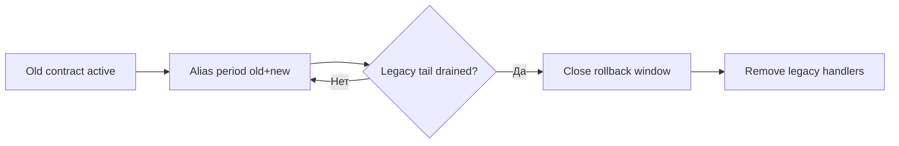

[← Назад к индексу части](index.md)
[↑ К глобальному плану](../../mastery_plan.md)

## 30.3 Обратная совместимость

### Цель раздела

Научиться изменять имена задач и аргументы так, чтобы старые сообщения не "взрывали" новый код, а новый код не ломался при откате к предыдущей версии.

### В этом разделе главное

- Переименование task name без alias-перехода почти гарантирует `Received unregistered task`.
- Эволюция аргументов должна идти через optional/default и адаптеры.
- В окне rollback нужно учитывать отложенные и застрявшие сообщения старого/нового формата.

### Термины раздела

| Термин | Определение |
|---|---|
| **Task name stability** | Стабильность строкового имени задачи как внешнего контракта. |
| **Alias period** | Период, когда старое и новое имя задачи обслуживаются одновременно. |
| **Argument adapter** | Прослойка, приводящая старые аргументы к новой внутренней модели. |
| **Rollback window** | Время, в которое возможен откат без потери совместимости. |

### Теория и правила

1. **Имя задачи (`name=`) — внешний API.**  
   Его нельзя менять без миграционного периода.

2. **Менять сигнатуру функции можно, если контракт сообщений остается поддерживаемым.**  
   Внутри задачи допустим адаптер аргументов.

3. **Default values и optional поля — основной инструмент мягкой эволюции.**

4. **Rollback-safe дизайн:**  
   новая версия должна хотя бы временно сохранять способность понимать старый поток.

5. **Никогда не удаляй старый обработчик до дренажа очередей и истечения ETA-задач.**

### Пошагово: rename и аргументы без аварии

1. Зафиксируй старое и новое имя задачи.
2. На переходный период зарегистрируй alias (или отдельную "прокси"-задачу).
3. Обнови producer: публикуй новое имя под флагом.
4. Поддержи старую и новую форму аргументов в worker.
5. Наблюдай метрики вызовов по старому имени.
6. После нулевого хвоста старого имени убери alias.

### Отдельно: rollback period и "зависшие" задачи

Это ключевой подпункт `30.3`, который часто недооценивают.

**Что считается "зависшими" задачами в контексте миграции:**

- ETA/countdown-задачи, запланированные до релиза и исполняющиеся после него;
- retried-задачи со старым payload, возвращающиеся в очередь спустя минуты/часы;
- задачи в backlog, которые долго ждали ресурса или приоритета;
- orphaned сообщения после частичных сбоев worker/broker во время rollout.

**Практическое правило:**  
Rollback-window закрывается не по времени календаря, а по факту очистки "длинного хвоста" старых сообщений.

#### Мини-алгоритм проверки готовности к закрытию rollback-window

1. Проверить отсутствие старых task name в очередях и логах.
2. Проверить, что delayed/ETA-пулы не содержат старый контракт.
3. Проверить, что retry-контур не реинжектит старый payload.
4. Проверить нулевой хвост ошибок `unknown task`/`TypeError` по legacy-схеме.
5. Только после этого удалять alias/legacy-adapter.

#### Быстрый decision table по rollback-window

| Сигнал | Что это значит | Решение |
|---|---|---|
| Есть старые имена задач в логах | producer/планировщик еще публикует legacy | не закрывать окно, искать источник |
| Есть ETA старого контракта | отложенный хвост еще жив | держать dual-compatible worker |
| Ошибки unknown task = 0, хвост старого контракта = 0 | миграция стабилизирована | можно планировать удаление legacy |
| Ошибки падают, но не ноль | деградация уменьшается, риск остается | продлить окно наблюдения |

#### Проверь себя: rollback window и хвосты

1. Почему "ошибок стало меньше" не равно "окно отката можно закрывать"?

<details><summary>Ответ</summary>

Потому что остаточный хвост старых ETA/retry задач может проявиться позже. Закрывать окно безопасно только при подтвержденном нулевом хвосте и стабильных метриках в согласованный период.

</details>

2. Какой практический индикатор говорит, что источник legacy-публикации ещё не устранён?

<details><summary>Ответ</summary>

Появление новых сообщений со старым task name/payload_version после момента, когда producer должен был переключиться на новый контракт.

</details>

### Простыми словами

Если имя задачи — это номер телефона, нельзя просто сменить номер и отключить старый в тот же день. Часть людей (producer-ов) еще звонит по старому.

### Картинка в голове

```text
Фаза 1: old_name only
Фаза 2: old_name + new_name (alias period)
Фаза 3: new_name only
```



### Как запомнить

**RNDA:** `Register alias -> Normalize args -> Deploy gradually -> Archive old path`.

### Примеры

#### Пример 1. Alias при переименовании задачи

```python
from celery import shared_task


@shared_task(name="reports.generate_v2")
def generate_report_v2(report_id: str, fmt: str = "pdf") -> None:
    create_report(report_id=report_id, output_format=fmt)


@shared_task(name="reports.generate")
def generate_report_legacy(report_id: str, format: str = "pdf") -> None:
    # alias-адаптер старого контракта
    generate_report_v2.delay(report_id=report_id, fmt=format)
```

#### Пример 2. Адаптер аргументов при расширении контракта

```python
@shared_task(name="mail.send_invoice")
def send_invoice(payload: dict) -> None:
    # backward-compatible parsing
    email = payload.get("email") or payload.get("recipient", {}).get("email")
    locale = payload.get("locale", "ru")
    invoice_id = payload["invoice_id"]
    send_mail(email=email, locale=locale, invoice_id=invoice_id)
```

#### Пример 3. Контроль rollback-window

```text
- T0: deploy worker that supports old+new
- T1: switch producer to new contract (flag on)
- T2: monitor old contract consumption to zero
- T3: close rollback window
- T4: remove legacy contract
```

### Практика / реальные сценарии

- **Переименование namespace задач** (`legacy.*` -> `billing.*`): делается через alias-период + мониторинг хвоста.
- **Смена обязательных аргументов**: сначала default/optional + adapter, потом постепенное ужесточение.
- **Откат после неудачного релиза**: producer откатывается немедленно, worker оставляем dual-compatible до дренажа.
- **Длинные ETA-задачи (сутки+)**: rollback-window задаем по максимальному ETA + буфер, а не по стандартному времени релиза.
- **Retry storm после частичного апгрейда**: удерживаем dual-compatibility и гасим источник старой публикации до стабилизации.

### Типичные ошибки

- менять имя задачи и сразу удалять старое;
- делать новый обязательный аргумент без default;
- считать, что delayed задачи "сами исчезнут";
- завершать миграцию по "ощущению", а не по метрике хвоста старого контракта.

### Что будет, если...

- **...убрать alias слишком рано:** потеря задач или лавина unknown task.
- **...не учитывать ETA/countdown задачи:** ошибка проявится через часы/дни после релиза.
- **...не планировать rollback-window:** откат превращается в новую аварию.
- **...закрыть rollback-window до дренажа retry/ETA-хвоста:** через время вернутся "старые" сообщения и сломают уже очищенный new-only код.

### Проверь себя

1. Почему task name нужно воспринимать как публичный контракт, а не "деталь реализации"?

<details><summary>Ответ</summary>

Потому что в очередь уходит строковое имя задачи, и consumer ищет обработчик по нему. Изменение имени без совместимости ломает выполнение уже опубликованных сообщений.

</details>

2. Что безопаснее: сразу удалить старый аргумент или держать адаптер некоторое время?

<details><summary>Ответ</summary>

Держать адаптер в переходный период. Это предотвращает падения на старых сообщениях и упрощает rollback.

</details>

3. Когда реально можно убрать legacy-path?

<details><summary>Ответ</summary>

Когда подтверждено, что старый формат/имя больше не встречается: очередь и delayed-пул очищены, метрики и логи показывают нулевой хвост в согласованное окно наблюдения.

</details>

### Запомните

- Имя задачи — контракт.
- Переименование всегда требует alias-периода.
- Совместимость аргументов подтверждается метриками, не интуицией.
- Rollback-window закрывают по факту дренажа legacy-хвоста, а не "по расписанию релиза".

---
