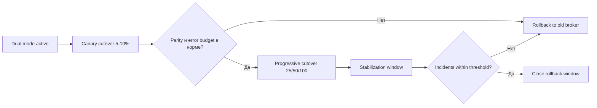
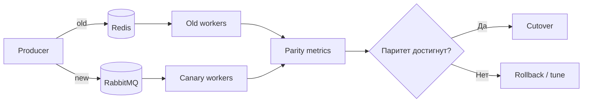

[← Назад к индексу части](index.md)
[↑ К глобальному плану](../mastery_plan.md)

## 30.4 Миграция брокера

### Цель раздела

Разобрать, как переносить Celery между брокерами (например, Redis и RabbitMQ) без потери управляемости и с валидацией, что новая транспортная семантика действительно соответствует ожиданиям.

### В этом разделе главное

- Смена брокера меняет не только адрес подключения, но и фактическую delivery semantics.
- Нужен переходный период с dual-подходом и измерением parity.
- Успех миграции определяется метриками и операционными drill, а не "подключилось и работает".

### Термины раздела

| Термин | Определение |
|---|---|
| **Transport semantics drift** | Изменение поведения доставки при смене брокера. |
| **Dual-publish** | Временная публикация в два брокера одновременно. |
| **Shadow consume** | Пассивное чтение/сверка потока на новом брокере без влияния на бизнес. |
| **Cutover** | Точка переключения основного продакшн-контур на новый брокер. |

### Теория и правила

1. **Redis и RabbitMQ неэквивалентны по поведению "из коробки".**  
   Даже при одинаковом Celery-коде вы получите разные operational-профили.

2. **Нельзя одновременно радикально менять payload и broker без веской причины.**

3. **Dual-write/read — миграционный инструмент, а не постоянная архитектура.**

4. **Parity проверяется по наборам метрик:**
   - delivery success/failure;
   - retry rate;
   - end-to-end latency (`publish -> start`, `start -> done`);
   - duplicates rate;
   - backlog depth и скорость дренажа.

5. **Cutover должен быть обратимым.**  
   План отката обязателен до переключения.

### Пошагово: Redis -> RabbitMQ (пример)

1. Подними новый RabbitMQ-контур параллельно текущему Redis.
2. Проверяй подключение и базовые операции на staging с production-like нагрузкой.
3. Включи dual-publish для части задач.
4. На новом контуре запускай shadow-consume/canary-consume.
5. Сверяй parity-метрики на согласованном окне наблюдения.
6. Переключи часть реального трафика (canary cutover).
7. При стабильности выполни полный cutover.
8. Держи rollback путь активным до конца окна стабилизации.

### Визуальный план cutover с обратимой точкой



#### Проверь себя: cutover и точка возврата

1. Почему важна явная "обратимая точка" на диаграмме, а не устная договоренность "если что откатим"?

<details><summary>Ответ</summary>

Явная точка возврата превращает откат в управляемую процедуру с критериями. Без нее команда часто теряет время на спор, когда инцидент уже развивается.

</details>

2. Что означает "стабилизационное окно" после 100% cutover?

<details><summary>Ответ</summary>

Это период наблюдения, когда новый контур уже основной, но старый еще доступен для возврата. Цель — убедиться, что нет отложенных сбоев в хвостах latency, retries и delayed задачах.

</details>

### Простыми словами

Смена брокера — это как смена типа дороги под уже идущим грузопотоком: не достаточно убедиться, что грузовик "может ехать". Важно, как он едет в пробке, аварии и ночью.

### Картинка в голове



### Как запомнить

**MPC:** `Mirror -> Parity -> Cutover`.

### Отдельно про dual-write / dual-read (где чаще всего путаются)

**Интуиция.**  
Dual-write/read нужен как "временный мост". Он помогает сравнить два мира, но если оставить его навсегда, система становится сложной, дорогой и трудно диагностируемой.

**Точная формулировка.**

- **Dual-write**: producer публикует одну и ту же задачу в два брокерных контура.
- **Dual-read**: два пула worker-ов (или shadow consumer) читают свои контуры, а результаты сверяются по ключам корреляции.
- **Цель**: доказать parity до окончательного cutover.
- **Анти-цель**: держать dual-режим как постоянный production-state.

**Практическое правило.**  
Dual-режим должен иметь заранее оговоренный срок жизни и критерий выхода: "выполнены метрики parity + завершено окно стабилизации".

#### Проверь себя: dual-write/read

1. Почему dual-write "на постоянку" часто ухудшает надежность, хотя интуитивно кажется более безопасным?

<details><summary>Ответ</summary>

Потому что добавляет два источника отказа, повышает риск рассинхрона и усложняет отладку инцидентов. Временный мост становится постоянным техническим долгом.

</details>

2. Чем dual-read отличается от "просто два worker-пула в проде"?

<details><summary>Ответ</summary>

Dual-read в миграции привязан к цели сравнения parity и имеет критерии завершения. Два постоянных пула без этой цели — просто другая архитектура, не миграционный инструмент.

</details>

### Примеры

#### Пример 1. Разделение URL для staged migration

```python
# settings.py
CELERY_BROKER_URL = os.getenv("CELERY_PRIMARY_BROKER_URL")
CELERY_BROKER_URL_CANDIDATE = os.getenv("CELERY_CANDIDATE_BROKER_URL")
```

#### Пример 2. Псевдо dual-publish на критичную задачу

```python
def publish_invoice_task(payload: dict, dual_publish: bool = False) -> None:
    app_primary.send_task("billing.process_invoice", args=[payload])
    if dual_publish:
        app_candidate.send_task("billing.process_invoice", args=[payload])
```

#### Пример 3. Таблица parity-метрик

| Метрика | Старый брокер | Новый брокер | Порог |
|---|---:|---:|---:|
| Success rate | 99.92% | 99.90% | >= 99.8% |
| Retry rate | 2.1% | 2.4% | <= +0.5 п.п. |
| p95 runtime | 420 ms | 450 ms | <= +15% |
| Duplicate events | 0.08% | 0.10% | <= +0.05 п.п. |
| Queue lag p95 | 8 s | 9 s | <= +20% |

#### Пример 4. Shadow consume с корреляцией результатов

```text
Ключ сравнения:
- task_id
- business_id (например order_id)
- итоговый статус (SUCCESS/FAILURE)
- код ошибки (если есть)
- latency buckets

Подход:
1) green-consumer исполняет "теневую" обработку без side effects
2) результаты пишет в shadow store
3) nightly job сравнивает old vs new по business_id/task_id
4) расхождения > порога блокируют расширение rollout
```

#### Пример 5. Матрица рисков при миграции "в обе стороны"

| Направление | Что обычно выигрываем | Главные риски | Что проверить до cutover |
|---|---|---|---|
| **Redis -> RabbitMQ** | богаче маршрутизация, AMQP-паттерны, гибче топология очередей | новая операционная сложность, иная семантика ack/requeue, потребность в тюнинге prefetch | parity по latency/retry, корректность routing key/exchange, runbook по reconnect |
| **RabbitMQ -> Redis** | проще эксплуатация для части команд, ниже порог входа, быстрый start | потеря части AMQP-возможностей, изменение поведения при сбоях, риск неверных ожиданий по приоритетам/ordering | ограничения транспорта, нагрузочные тесты хвостов, план по idempotency/duplicates |

### Практика / реальные сценарии

- **Redis -> RabbitMQ для лучшей маршрутизации и AMQP-паттернов**: нужна перекалибровка prefetch/acks.
- **RabbitMQ -> managed queue**: проверяем ограничения control/event функций и latency.
- **Переезд по требованиям безопасности/комплаенса**: cutover привязываем к окну контроля доступа и аудит-логов.
- **Двухрегионный перенос брокера**: сначала локальный dual, затем межрегиональный cutover, иначе трудно разделить сетевые и транспортные эффекты.
- **Жесткий SLA на фоновые платежи**: shadow consume и строгие пороги parity до полного переключения.

### Типичные ошибки

- сравнивать только средние задержки, игнорируя p95/p99;
- не учитывать, что поведение retries может измениться;
- выключить старый брокер сразу после cutover без окна стабилизации;
- не документировать критерии "паритет достигнут".

### Что будет, если...

- **...не делать parity validation:** миграция может "формально пройти", но SLA деградирует через рост хвостов.
- **...не иметь rollback:** любой spike на новом брокере превращается в длительный инцидент.
- **...не подготовить runbook cutover:** ручные хаотичные действия увеличат потери задач.
- **...оставить dual-write надолго:** удвоится операционная сложность, появятся рассинхроны и рост затрат на инфраструктуру и наблюдаемость.

### Проверь себя

1. Почему подключение к новому брокеру и успешный тест одной задачи ничего не доказывают?

<details><summary>Ответ</summary>

Потому что это проверяет только happy path. Реальные риски проявляются на нагрузке, повторной доставке, сетевой деградации и в хвостах latency.

</details>

2. Зачем dual-publish нужен даже если "очень уверены" в новом брокере?

<details><summary>Ответ</summary>

Он дает сравнимые данные и безопасный мост между контурами. Уверенность без данных в распределенной системе ненадежна.

</details>

3. Как понять, что cutover реально можно завершать?

<details><summary>Ответ</summary>

Когда parity-метрики в целевом окне стабильно в допуске, нет роста инцидентов, а rollback путь проверен и при необходимости отрабатывает.

</details>

### Запомните

- Смена брокера = смена семантики, а не только URL.
- Переход делается через Mirror/Parity/Cutover.
- Решение о полном переходе принимается по данным, а не по ощущению.
- Dual-write/read — временный мост, который нужно явно закрыть после стабилизации.

---
