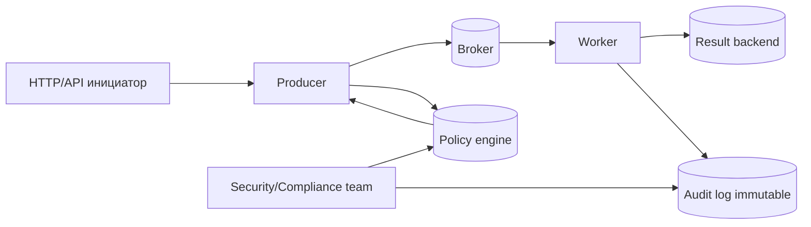

[← Назад к индексу части](index.md)
[↑ К глобальному плану](../mastery_plan.md)

## Сквозная модель compliance-потока



Простая интерпретация:

- producer перед публикацией проходит "рамку политики": какие поля можно отправлять, какие нужно токенизировать;
- worker выполняет задачу, но аудит пишет не в тот же слой, что технические результаты Celery;
- compliance-команда работает с политиками и аудитом как с отдельным контуром управления, а не как с "побочным логом".

ASCII-образ для запоминания:

```text
[Клиент] -> [Producer + policy check] -> [Broker] -> [Worker]
                                   \-> [Audit immutable]
Worker -> [Result backend (TTL)]   \-> [Business events correlation]
```

#### Проверь себя: сквозная модель

1. Почему audit в схеме отделен от result backend?

<details><summary>Ответ</summary>

Потому что у них разные цели: result backend — оперативный технический слой с TTL, audit — доказательный слой с требованиями неизменяемости и другой моделью хранения.

</details>

2. В каком узле логично проверять policy до отправки задачи и почему?

<details><summary>Ответ</summary>

На стороне producer, до публикации сообщения в broker. Так запрещенные данные не попадают в очередь и не начинают распространяться по системе.

</details>

---
