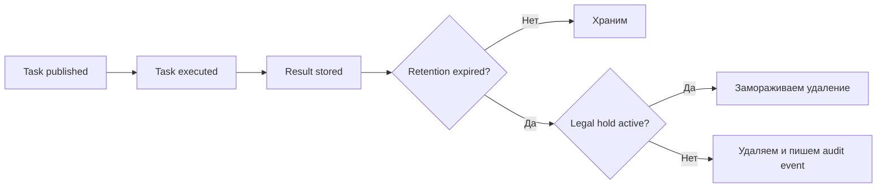

[← Назад к индексу части](index.md)
[↑ К глобальному плану](../celery_mastery_plan.md)

## 31.2 Retention и удаление

### Цель раздела

Построить управляемый жизненный цикл данных Celery: сколько храним результаты и логи, когда удаляем, когда обязаны временно не удалять (legal hold), как обрабатывать запросы на удаление.

### В этом разделе главное

- Retention — это не "почистим когда закончится диск", а формальная политика.
- `purge` решает операционную задачу, но может нарушить юридические обязательства.
- Удаление должно быть согласовано между broker, result backend, логами и аудитом.

### Термины

| Термин | Суть |
|---|---|
| **TTL** | Время жизни записи/результата до автоматического удаления. |
| **Purge** | Быстрая очистка очереди от ожидающих сообщений. |
| **Right to erasure** | Право субъекта данных на удаление персональных данных (в допустимых рамках). |
| **Retention class** | Категория данных с фиксированным сроком хранения. |

### Теория и правила

1. У каждой категории данных должен быть срок хранения и владелец политики.
2. Хранение "на всякий случай" запрещено: это увеличивает юридический и инцидентный риск.
3. Для юридически значимых данных нужен режим legal hold.
4. Удаление должно быть трассируемым (кто/когда/почему удалил).
5. Для Celery важно разделять:
   - сообщения в broker;
   - статусы и результаты в backend;
   - операционные логи;
   - неизменяемый аудит.
6. Технические TTL должны соответствовать корпоративной политике, а не задаваться "на глаз".
7. Нельзя путать "удаление из очереди" и "удаление персональных данных": это разные процессы и разные следы в системе.

### Пошагово

1. Определи классы данных и retention-матрицу.
2. Настрой TTL/expiry в result backend и политиках хранения логов.
3. Зафиксируй регламент `purge`: кто имеет право, когда допустимо, как оформляется.
4. Введи механизм legal hold (флаг, отдельный реестр, исключения из очистки).
5. Настрой процедуру удаления по запросу субъекта данных.
6. Протестируй сценарий: удаление запроса + наличие связанного расследования (legal hold).

### Простыми словами

Retention — как правила архива: часть документов хранится неделю, часть год, часть до завершения проверки. Без этого архив превращается в свалку, где одновременно дорого хранить и сложно юридически защищаться.

### Картинка в голове

```text
Создали данные -> Использовали -> Архивировали/удалили по сроку
                        \-> Legal hold? -> временно не удаляем
```

И более формально как жизненный цикл:



### Как запомнить

**"Не бессрочно, а по классу; не вручную, а по процессу; не без следа, а с аудитом."**

### Примеры

Пример базовой retention-матрицы:

| Тип данных | Где хранится | Срок | Исключения |
|---|---|---|---|
| Технический статус задачи | Result backend | 7-30 дней | incident/legal hold |
| Бизнес-аудит события | Immutable audit log | 1-3 года (по политике) | не удаляется вне процедуры |
| Трассировочные debug-логи | Log storage | 7-14 дней | продление при расследовании |
| Payload-ссылка (token) | Broker message | до исполнения + TTL очереди | повторные доставки |

Пример Celery-настроек для controlled retention:

```python
app.conf.update(
    task_ignore_result=True,          # по умолчанию не сохраняем payload в result backend
    task_store_errors_even_if_ignored=True,  # ошибки сохраняем для диагностики
    result_expires=86400,             # 24 часа TTL для результатов (под политику компании)
)
```

Важно: `result_expires` должен вытекать из утвержденной политики хранения, а не из "удобно для дебага".

### Практика / реальные сценарии

- **Финтех:** результаты Celery короткоживущие, а аудит операций долговременный в WORM-совместимом хранилище.
- **SaaS с GDPR:** запрос "удалить пользователя" запускает фоновый процесс удаления данных в зависимых сервисах с журналом выполнения.
- **Incident response:** при расследовании утечки включается legal hold на связанный период и набор данных.

### Типичные ошибки

- удалять только result backend и забывать про логи/кэши/резервные копии;
- применять `purge` как "универсальную кнопку очистки";
- не документировать основания для исключений из удаления;
- держать разные retention-политики в разных командах без единого owner.

### Что будет если...

- **Если retention не задан:** данные копятся бесконтрольно, растет стоимость и риск.
- **Если удаление агрессивное:** теряются доказательства для расследований и аудита.
- **Если нет legal hold:** можно случайно уничтожить данные, которые обязаны сохраняться.
- **Если `task_ignore_result=False` без необходимости:** result backend быстро превращается в долгоживущий склад лишних данных.

### Проверь себя

1. Почему удаление "только в Celery" не закрывает задачу комплаенса?

<details><summary>Ответ</summary>

Потому что данные дублируются в логах, внешних хранилищах, audit-системах, бэкапах и интеграциях. Нужен сквозной жизненный цикл, а не точечная очистка.

</details>

2. В чем практический конфликт между "правом на удаление" и legal hold?

<details><summary>Ответ</summary>

Право на удаление требует минимизировать и удалять данные, а legal hold может временно обязать сохранить часть записей для расследования/спора. Нужна формальная процедура разрешения конфликта.

</details>

### Запомните

Retention и удаление — это бизнес-процесс с техподдержкой, а не только настройка TTL в Celery.

---
