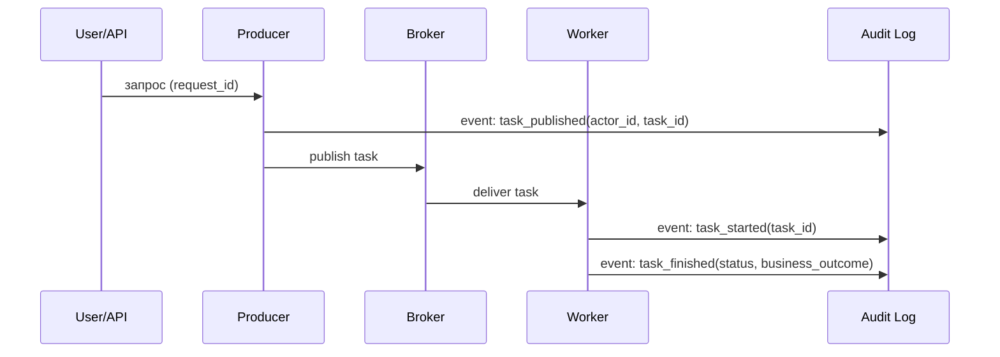

[← Назад к индексу части](index.md)
[↑ К глобальному плану](../../mastery_plan.md)

## 31.3 Аудит и подотчётность

### Цель раздела

Построить цепочку доказуемости: кто инициировал задачу, как она исполнялась, какие решения приняты, и как это связать с бизнес-событием.

### В этом разделе главное

- Celery events и result status полезны, но не заменяют полноценный аудит.
- Аудит должен быть неизменяемым и отделенным от технических логов.
- Корреляционные идентификаторы (request_id, task_id, actor_id, tenant_id) — основа расследуемости.

### Термины

| Термин | Суть |
|---|---|
| **Actor** | Тот, кто инициировал действие: пользователь, сервис, джоба. |
| **Correlation ID** | Идентификатор для склейки событий между системами. |
| **Audit event** | Структурированная запись о значимом действии. |
| **Chain of custody** | Непрерывная и проверяемая история изменений/доступа к данным. |

### Теория и правила

1. Всегда фиксируй инициатора задачи (`user_id` или `service_account`).
2. Отделяй технический статус (`SUCCESS/FAILURE`) от бизнес-результата.
3. Пиши аудит в append-only систему.
4. Стандартизируй схему audit event.
5. Делай сквозную корреляцию между HTTP, Celery, БД и внешними API.
6. В audit event храни "решение", а не только "факт исполнения": например, `business_outcome=approved/rejected`.
7. Для сервисных и системных задач задавай отдельные типы акторов (`service`, `scheduler`, `ops`), чтобы не было анонимных запусков.

### Пошагово

1. Определи обязательные поля audit event.
2. На уровне producer добавь заполнение `actor_id`, `request_id`, `source_service`.
3. На уровне worker логируй start/end/failure в audit pipeline.
4. Синхронизируй аудит с бизнес-событием (например, "платеж проведен/отклонен").
5. Проверь сценарий расследования: от жалобы клиента до полного трека событий.

### Простыми словами

Аудит — это "черный ящик" самолета для фоновых задач. Когда что-то пошло не так, вы должны восстановить картину без догадок.

### Картинка в голове



### Как запомнить

**"Нет actor_id и correlation_id -> нет расследования, есть только гипотезы."**

### Примеры

Пример структурированного audit event:

```json
{
  "event_type": "task_finished",
  "task_name": "billing.capture_payment",
  "task_id": "f2d7...",
  "request_id": "req-18b2",
  "actor_id": "user:98231",
  "tenant_id": "tenant-a",
  "status": "SUCCESS",
  "business_outcome": "payment_captured",
  "timestamp": "2026-04-21T10:15:42Z"
}
```

### Практика / реальные сценарии

- **Регуляторный аудит:** нужно доказать, кто запустил массовое списание и какие записи обработаны.
- **Внутреннее расследование:** найдено расхождение в биллинге; корреляция позволяет быстро локализовать цепочку.
- **SOC/SIEM-интеграция:** события неуспеха и аномалий уходят в централизованный security-мониторинг.

Минимальный чек-лист качества аудита:

- каждое значимое событие имеет `task_id`, `actor_id`, `request_id`, `timestamp`;
- по `task_id` можно дойти до бизнес-события и обратно;
- аудит хранится отдельно от кешируемых/очищаемых технических результатов;
- у операций удаления/исключений есть отдельный audit trail.

### Типичные ошибки

- писать аудит в тот же mutable datastore, который чистится как технический кэш;
- не фиксировать actor_id для сервисных задач;
- хранить audit event в неструктурированном тексте логов;
- полагаться только на `AsyncResult` как источник истины для расследований.

### Что будет если...

- **Если нет корреляции:** расследование инцидента превращается в ручной поиск по сотням логов.
- **Если audit mutable:** нельзя доказать, что запись не была изменена задним числом.
- **Если не фиксировать source_service:** сложно определить границу ответственности между командами.

### Проверь себя

1. Почему результат задачи в Celery не равен полноценной подотчетности?

<details><summary>Ответ</summary>

Потому что результат отражает технический исход выполнения, но не всегда содержит контекст инициатора, бизнес-решение, цепочку связанных событий и неизменяемость записи.

</details>

2. Какие поля критичны для минимально полезного audit event?

<details><summary>Ответ</summary>

`event_type`, `task_id`, `task_name`, `actor_id`, `request_id`, `timestamp`, `status`, и при необходимости `business_outcome`/`tenant_id`.

</details>

### Запомните

Подотчетность в Celery достигается не "само собой", а проектированием отдельного audit-контура с неизменяемыми структурированными событиями.

---
