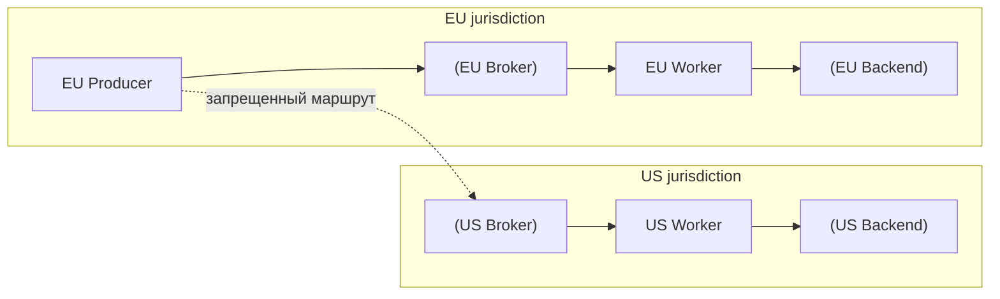

[← Назад к индексу части](index.md)
[↑ К глобальному плану](../../mastery_plan.md)

## 31.4 Резидентность и юрисдикции

### Цель раздела

Понять, как география инфраструктуры Celery влияет на соблюдение требований по хранению и передаче данных между странами/регионами.

### В этом разделе главное

- Важен не только код, но и физическое расположение broker/result backend.
- Cross-border messaging может нарушить внутренние и регуляторные политики.
- Архитектура multi-region должна учитывать не только latency, но и правовые границы.

### Термины

| Термин | Суть |
|---|---|
| **Data residency** | Где данные физически хранятся и обрабатываются. |
| **Cross-border transfer** | Передача данных между юрисдикциями. |
| **Regional isolation** | Разделение контуров по регионам для соблюдения политик. |
| **Sovereign cloud** | Облако с ограничениями/гарантиями для конкретной юрисдикции. |

### Теория и правила

1. Зафиксируй регион каждого слоя: producer, broker, worker, backend, audit.
2. Для чувствительных данных предпочитай regional isolation.
3. Проверяй managed-сервисы: "логически в регионе" не всегда значит "физически только там".
4. Явно документируй разрешенные трансграничные потоки.
5. При DR/backup учитывай, где лежат реплики и снапшоты.

### Пошагово

1. Построй карту размещения компонентов Celery.
2. Разметь потоки данных между регионами.
3. Для запрещенных потоков введи блокирующие правила в архитектуре.
4. Проведи tabletop-упражнение: failover региона и соблюдение резидентности.
5. Зафиксируй decision log по допустимым cross-border сценариям.

### Простыми словами

Даже если приложение "европейское", вы можете случайно отправить задачу в очередь другого региона и тем самым нарушить политику. География инфраструктуры — это часть функционального поведения системы.

### Картинка в голове

```text
EU Producer -> EU Broker -> EU Worker -> EU Backend   (допустимо)
EU Producer -> US Broker -> US Worker -> US Backend   (может быть запрещено)
```

Mermaid-вариант с явной границей юрисдикций:



### Как запомнить

**"Где живет очередь, там живут и данные из этой очереди."**

### Примеры

- Разделить Celery-кластеры по регионам: `celery-eu`, `celery-us`, с отдельными broker/backend.
- Маршрутизация задач по `tenant_region`.
- Блокировка публикации задачи, если регион токена и регион очереди не совпадают.

Псевдоправило роутинга:

```python
def choose_queue(tenant_region: str) -> str:
    mapping = {
        "eu": "celery.eu.tasks",
        "us": "celery.us.tasks",
    }
    if tenant_region not in mapping:
        raise ValueError("Unknown or forbidden tenant region")
    return mapping[tenant_region]
```

### Практика / реальные сценарии

- **Глобальный SaaS:** разные регионы для клиентов из ЕС и США; запрет кросс-регионных задач с PII.
- **Failover-план:** аварийный перенос допустим только для обезличенных технических задач.
- **Vendor risk review:** проверка, где managed broker хранит реплики и бэкапы.

### Типичные ошибки

- считать регион Kubernetes-кластера достаточным доказательством резидентности;
- не проверять регион result backend и audit storage;
- смешивать multi-region балансировку и compliance-требования без явных правил.

### Что будет если...

- **Если игнорировать юрисдикцию:** нарушение договора/закона и блокировка релиза.
- **Если failover не продуман:** в аварии команда нарушит policy ради восстановления.
- **Если нет сегментации по региону:** сложно доказать контролируемость трансграничных потоков.

### Проверь себя

1. Почему резидентность не сводится к выбору "правильного региона в облаке"?

<details><summary>Ответ</summary>

Потому что важно расположение всех зависимых слоев: очередей, backend, логов, бэкапов, реплик, observability и сторонних сервисов, а также фактические маршруты передачи данных.

</details>

2. Какое минимальное архитектурное решение обычно снижает cross-border риск в Celery?

<details><summary>Ответ</summary>

Региональная изоляция контуров Celery (отдельные broker/worker/backend на регион) плюс маршрутизация задач по региональной принадлежности данных/тенанта.

</details>

### Запомните

Резидентность — это свойство полной цепочки обработки данных, а не только выбранного дата-центра для одного сервиса.

---
