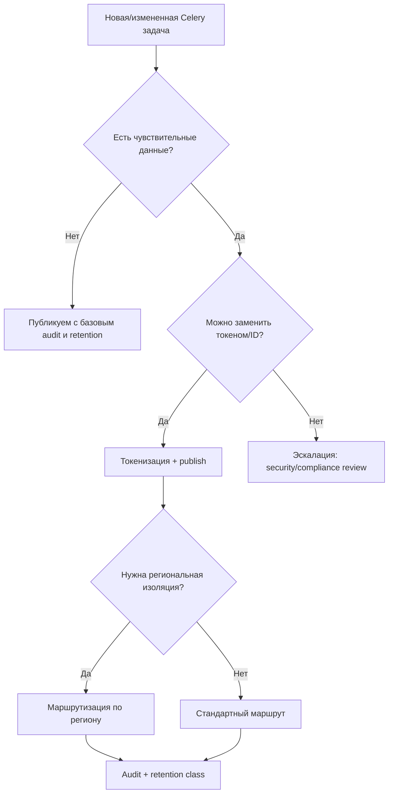

[← Назад к индексу части](index.md)
[↑ К глобальному плану](../../mastery_plan.md)

## Практическая карта требований (GDPR/PCI/PHI) для Celery

Эта таблица не заменяет юридическую экспертизу, но помогает инженеру быстро понять, какие технические решения обычно требуются в Celery-контуре.

| Режим данных | Что чаще всего запрещено в payload | Что обычно обязательно | Где чаще ломается |
|---|---|---|---|
| **PII / GDPR-контур** | сырые ФИО, email, телефоны, документы без необходимости | минимизация данных, процесс удаления, корреляция аудита | забывают копии в логах и бэкапах |
| **PCI-контур** | PAN/CVV/секреты платежных реквизитов | токенизация, сегментация контура, строгие доступы | отправка карточных полей в debug payload |
| **PHI/медицинские данные** | диагнозы/карты пациента в открытом виде | ограничение доступа, детальный аудит, региональные ограничения | смешение tenant-ов и отсутствие traceability |
| **Служебные данные low-risk** | избыточные технические дампы с секретами | контролируемый retention и sanitize ошибок | "временные" исключения остаются навсегда |

Как этим пользоваться на практике:

1. Для каждой Celery-задачи определить режим данных.
2. Проверить payload against policy (что запрещено/что обязательно).
3. Зафиксировать в карточке задачи: owner, retention-класс, требования к аудиту и региональности.

#### Проверь себя: практическая карта требований

1. Почему у режимов PII/PCI/PHI разные "типовые точки поломки"?

Ответ

Потому что риски и ограничения различаются по природе данных: для PCI критична передача реквизитов, для PII часто ломается удаление и следы в логах, для PHI — доступ и трассируемость в медицинском контуре.

2. Что полезнее при старте: спорить о терминах или сначала присвоить каждой задаче data class?

Ответ

Сначала присвоить data class. Это быстро переводит обсуждение в практику: какие поля разрешены, какие проверки включать и какой retention применять.

### Быстрый decision tree для публикации задачи

#### Проверь себя: decision tree

1. В какой точке дерева обязательно нужна эскалация в security/compliance?

Ответ

Когда чувствительные данные нельзя заменить токеном/ID и требуется исключение из стандартной политики. Это решение должно быть осознанным и документированным.

2. Почему узел "нужна региональная изоляция?" стоит после токенизации, а не вместо неё?

Ответ

Потому что это разные уровни защиты: токенизация снижает чувствительность данных, а региональная изоляция управляет юрисдикцией. Обычно нужны оба слоя.

---
