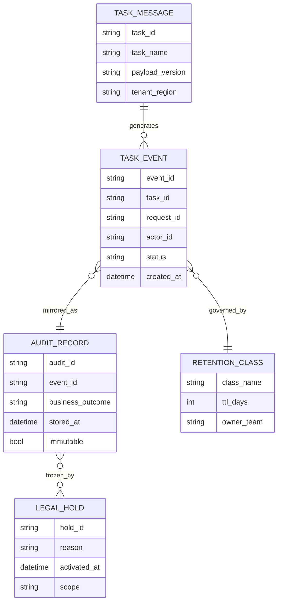

[← Назад к индексу части](index.md)
[↑ К глобальному плану](../../mastery_plan.md)

## ER-модель для аудита и retention

Эта схема нужна, чтобы визуально отделить "операционные" и "доказательные" сущности и понять, как legal hold влияет на удаление.

Как читать схему:

1. `TASK_MESSAGE` и `TASK_EVENT` отражают operational-поток Celery.
2. `AUDIT_RECORD` отделен, потому что его требования к неизменяемости и срокам иные.
3. `RETENTION_CLASS` управляет удалением по правилам.
4. `LEGAL_HOLD` может временно "замораживать" удаление даже при истекшем TTL.

#### Проверь себя: ER-модель

1. Почему `LEGAL_HOLD` логически связан с `AUDIT_RECORD`, а не только с `TASK_MESSAGE`?

Ответ

Потому что legal hold обычно касается доказательной и расследовательной информации: нужно сохранять не только сообщение, но и контекст принятых решений и событий.

2. Что потеряет модель, если убрать `RETENTION_CLASS` как отдельную сущность?

Ответ

Исчезнет явная управляемость сроками хранения по категориям; удаление станет неформальным и зависимым от ручных решений.

---
