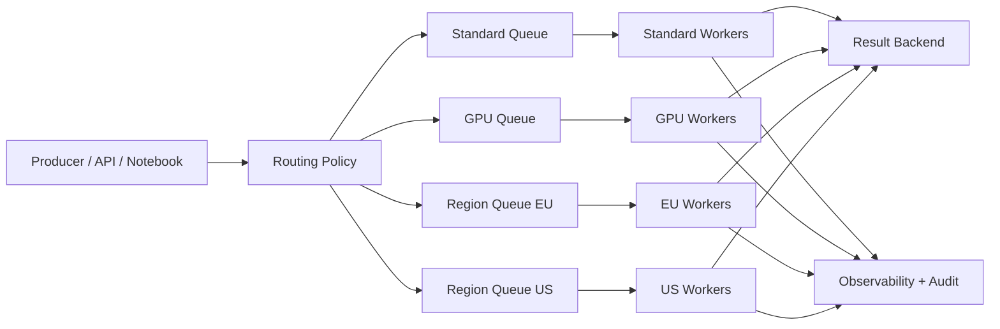

[← Назад к индексу части](index.md)
[↑ К глобальному плану](../mastery_plan.md)

## Сквозная модель нишевого Celery-контура

**Простыми словами:** у нас не "один общий Celery", а семейство специализированных контуров исполнения. Маршрутизация решает, куда попадет задача, а политика эксплуатации определяет, как каждый контур живет, масштабируется и деградирует.

**Картинка в голове:** представь аэропорт с разными терминалами: внутренние рейсы, международные, грузовые, VIP. Если отправить все в один терминал, система захлебнется. Так же и с Celery-нагрузкой.

#### Проверь себя: сквозная модель

1. В чем главная ошибка при чтении этой схемы как "просто списка очередей"?

Ответ

Схема показывает не только очереди, но и принцип разделения контуров по типу риска/ресурса. Если читать ее как список, теряется управленческая логика: почему где-то нужна изоляция, а где-то общая инфраструктура.

2. Как эта модель помогает при инциденте?

Ответ

Она позволяет быстро локализовать проблему: это ошибка маршрутизации, исполнения или наблюдаемости. Благодаря этому действия становятся точечными, а не "перезапускаем все подряд".

---
