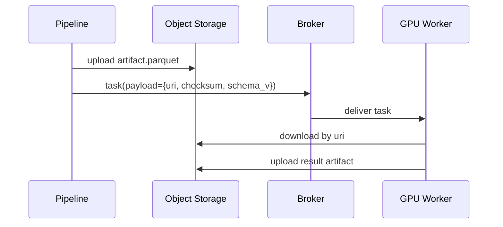

[← Назад к индексу части](index.md)
[↑ К глобальному плану](../celery_mastery_plan.md)

## 32.1 ML/GPU и тяжелые биндинги

### Цель раздела

Понять, как проектировать Celery для задач, где критичны GPU, большие бинарные зависимости и длительная инициализация моделей, чтобы тяжелый workload не "съедал" весь кластер.

### В этом разделе главное

- GPU-задачи требуют отдельной модели маршрутизации и планирования конкуренции.
- Главные риски: VRAM exhaustion, cold start, конфликт версий CUDA/cuDNN, нестабильность форка с тяжелыми библиотеками.
- Надо проектировать не просто retry, а ресурсно-осознанный execution policy.

### Термины

| Термин | Определение |
|---|---|
| **Cold start** | Первый запуск worker-а/модели с высокой задержкой из-за загрузки артефактов. |
| **Warm pool** | Набор процессов, где модель уже загружена в память/VRAM. |
| **GPU affinity** | Привязка задачи к конкретному GPU/классу GPU. |
| **Model artifact** | Файл/набор файлов модели и токенизаторов, требующих загрузки. |

### Теория и правила

1. **Изоляция по ресурсам важнее универсальности.**  
   GPU-задачи лучше выносить в отдельные очереди и worker-ы (`queue=gpu.inference`, `queue=gpu.training`), чтобы стандартные CPU-задачи не страдали от длинной блокировки.

2. **Concurrency на GPU не равна CPU concurrency.**  
   Для многих inference сценариев безопаснее 1-2 конкурентных процесса на device, чем "больше процессов ради throughput".

3. **Пул и модель процесса должны проверяться на совместимость.**  
   Некоторые ML-библиотеки плохо ведут себя после `fork`. Нужно валидировать поведение в целевой среде, часто используя предзагрузку и осторожный lifecycle.

4. **Payload должен быть легким.**  
   Не передавай большие бинарные данные в сообщение. Передавай ссылку на объект в хранилище + метаданные валидации.

5. **Retry зависит от типа ошибки.**  
   `OutOfMemory` и `model not found` — разные классы проблем. Один тип требует throttling/requeue, другой — операционного вмешательства.

### Пошагово: базовый паттерн GPU-контура

1. Раздели задачи на классы (`inference`, `batch-scoring`, `training`).
2. Создай отдельные очереди и worker-пулы для каждого класса.
3. Ограничь concurrency по device и задай prefetch умеренно.
4. Введи health-check модели на старте worker-а.
5. Добавь circuit breaker: при росте OOM снижай параллелизм/перекидывай на fallback.
6. Наблюдай latency/VRAM/error-rate раздельно по типам GPU.

### Простыми словами

GPU — это не "ускоренный CPU", а дефицитный и дорогой ресурс. Если десять задач одновременно захотят 12 GB VRAM на одной карте с 24 GB, вы получите хаос и ретраи. Поэтому важнее управлять очередью доступа к GPU, чем просто "добавить worker-ов".

### Как запомнить

**GPU в Celery = отдельная очередь + контролируемая конкуренция + легкий payload + осмысленный retry.**

### Пример конфигурационного фрагмента

```python
from celery import Celery
from kombu import Queue

app = Celery("ml_tasks")

app.conf.task_queues = (
    Queue("cpu.default"),
    Queue("gpu.inference"),
    Queue("gpu.training"),
)

app.conf.task_routes = {
    "tasks.infer_*": {"queue": "gpu.inference"},
    "tasks.train_*": {"queue": "gpu.training"},
}

app.conf.worker_prefetch_multiplier = 1
app.conf.task_acks_late = True
```

### Shared memory и обмен большими данными

**Интуиция:** если каждый шаг pipeline сериализует десятки мегабайт через broker, очередь начинает быть "грузовиком для бетона", хотя по смыслу ей лучше быть "диспетчерской".  
**Формулировка:** broker в Celery должен переносить команды и метаданные, а не bulk-данные.

Практический паттерн:

1. этап data pipeline кладет артефакт в object storage;
2. в задачу отправляется только ссылка (`uri`), версия формата и контрольная сумма;
3. GPU worker подтягивает данные локально, пишет результат обратно в storage;
4. следующая задача получает ссылку, а не бинарный blob.



#### Проверь себя: shared memory и payload

1. Почему передача бинарного blob через broker ухудшает систему даже при "быстром" брокере?

<details><summary>Ответ</summary>

Потому что брокер начинает тратить ресурсы не на диспетчеризацию, а на перенос тяжелых данных: растет память, I/O и задержки подтверждений. Это ухудшает fairness для всех задач.

</details>

2. Что даёт пара `uri + checksum + schema_v` с точки зрения надежности?

<details><summary>Ответ</summary>

Она отделяет транспорт команды от транспортировки данных, позволяет валидировать целостность и совместимость формата, и упрощает повторный запуск задачи без повторной публикации гигантского payload.

</details>

### Диагностика проблем в GPU-контуре

| Симптом | Вероятная причина | Что проверить первым |
|---|---|---|
| Высокий backlog при нормальном CPU | bottleneck по VRAM/device | метрики VRAM, длина `gpu.*` очереди |
| Резкий рост retry | OOM или недоступный артефакт модели | class ошибок, доступность storage |
| Долгий старт задач | cold start моделей | доля времени загрузки модели в профиле |
| Неравномерный throughput | перекос маршрутизации | распределение задач по queue/worker |

#### Проверь себя: диагностика GPU

1. Почему "высокий backlog" не означает автоматически, что мало worker-ов?

<details><summary>Ответ</summary>

Потому что узкое место может быть в VRAM, cold start, недоступности моделей или перекосе роутинга. Простое увеличение числа процессов может только усилить проблему.

</details>

2. Как отличить проблему маршрутизации от проблемы модели?

<details><summary>Ответ</summary>

При проблеме маршрутизации задачи распределяются неравномерно по очередям/worker-ам. При проблеме модели обычно видны специфические ошибки загрузки/инициализации и деградация даже при ровном распределении.

</details>

### Практика / реальные сценарии

- **Сценарий:** OCR+NLP pipeline с GPU inference.  
  **Решение:** декомпозировать pipeline: CPU preprocessing -> GPU inference -> CPU postprocessing. GPU использовать только там, где реально выгодно.

- **Сценарий:** ночной batch scoring на сотни тысяч объектов.  
  **Решение:** chunks + rate limiting + windowed запуск по регионам, чтобы не "снести" shared GPU-пул.

### Типичные ошибки

- запуск GPU и CPU задач в одной очереди;
- отправка больших бинарных payload в брокер;
- одинаковый retry для transient и deterministic ошибок;
- отсутствие отдельного алерта по OOM и GPU saturation.

### Что будет, если...

- **...не разделять очереди?**  
  Легкие задачи начнут ждать тяжелые, общий SLA деградирует.
- **...увеличивать concurrency без контроля VRAM?**  
  Всплеск OOM, зацикленные retries, высокая стоимость без результата.

### Проверь себя

1. Почему для GPU-задач часто полезен `worker_prefetch_multiplier=1`?

<details><summary>Ответ</summary>

Чтобы один worker не захватывал слишком много задач заранее и не создавал несправедливую очередь при ограниченных GPU-ресурсах.

</details>

2. Когда лучше передать в задачу ссылку на объект, а не сам объект?

<details><summary>Ответ</summary>

Почти всегда для больших данных: payload должен быть минимальным и сериализуемым, а данные читаться из объектного/файлового хранилища.

</details>

3. Почему retry без классификации ошибок опасен в ML-контуре?

<details><summary>Ответ</summary>

Потому что часть ошибок не лечится повтором (например, битый артефакт модели), а бесконтрольный retry только усиливает нагрузку и backlog.

</details>

### Запомните

В ML/GPU сценариях Celery становится scheduler-слоем над дефицитными ресурсами. Ключ — проектировать политику ресурсов, а не только API задач.

---
