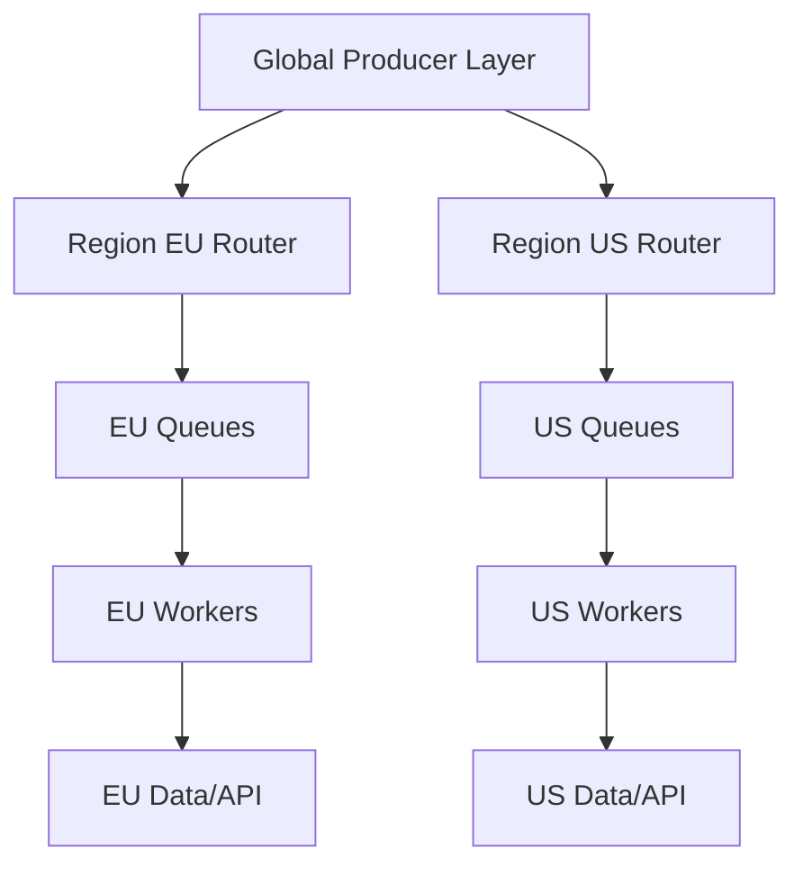

[← Назад к индексу части](index.md)
[↑ К глобальному плану](../celery_mastery_plan.md)

## 32.3 Гео-распределенные worker-ы

### Цель раздела

Разобрать, как строить multi-region Celery-контуры, чтобы балансировать latency, отказоустойчивость, стоимость и регуляторные ограничения.

### В этом разделе главное

- global queue удобна, но часто проигрывает локальности данных;
- межрегиональная сеть ломается не "если", а "когда";
- failover должен быть явно спроектирован, а не "надеяться на брокер".

### Термины

| Термин | Определение |
|---|---|
| **Broker RTT** | Round-trip latency между worker и broker. |
| **Split-brain** | Ситуация, когда части системы считают себя "главными" одновременно из-за сетевого разделения. |
| **Region affinity** | Правило, что задача должна исполняться в "своем" регионе. |

### Теория и правила

1. **Локальность данных важнее симметрии архитектуры.**  
   Если данные и внешние API находятся в регионе EU, выполнение в US почти всегда хуже по latency и cost.

2. **Разделяй control plane и data plane.**  
   Управляющие команды могут быть глобальными, но поток тяжелых задач часто должен оставаться региональным.

3. **Планируй деградацию, а не только happy path.**  
   При network partition реши заранее: что останавливается, что буферизуется, что переключается.

4. **Latency до broker — отдельный фактор стоимости и надежности.**  
   Высокий RTT ухудшает подтверждение доставки, ускоряет накопление backlog и повышает чувствительность к таймаутам.

### Split-brain: как выглядит и как защищаться

```text
Region A видит, что Region B "пропал" -> включает локальный failover
Region B видит, что Region A "пропал" -> включает локальный failover
Оба региона начинают обрабатывать часть одних и тех же бизнес-команд
=> дубли, конфликтные side effects, нарушение инвариантов
```

Механики защиты:

1. явный leader election или централизованный decision point;
2. idempotency key на бизнес-операции;
3. запрет некоторых write-задач вне "primary" региона;
4. компенсационные процедуры для конфликтов после восстановления сети.

#### Проверь себя: split-brain

1. Почему split-brain опаснее обычного network timeout?

<details><summary>Ответ</summary>

Timeout чаще вызывает задержку, а split-brain может привести к конкурирующим "истинам" и конфликтным бизнес-изменениям в двух регионах одновременно.

</details>

2. Зачем нужны компенсационные процедуры, если есть idempotency key?

<details><summary>Ответ</summary>

Idempotency снижает дубли на уровне операции, но не всегда покрывает сложные межшаговые конфликты. Компенсации нужны для восстановления консистентности после редких, но тяжелых расхождений.

</details>

### Runbook: подозрение на split-brain (первые 30 минут)

1. **T+0..5 минут:** заморозить cross-region write-задачи (оставить только безопасные read/diagnostic).
2. **T+5..10 минут:** собрать факты: какие регионы считают себя primary, какие очереди растут, где аномальные дубли.
3. **T+10..20 минут:** выбрать единый временный источник истины (single-writer region), зафиксировать решение в incident-канале.
4. **T+20..30 минут:** включить дедупликацию/компенсацию на конфликтных бизнес-операциях, подготовить план reconciliation после стабилизации сети.

Важно: в split-brain приоритет — остановить некорректные side effects, а не "любой ценой сохранить throughput".

#### Проверь себя: runbook первых 30 минут

1. Почему в runbook сначала заморозка write-операций, а не расследование "кто виноват"?

<details><summary>Ответ</summary>

Потому что при split-brain критично остановить ухудшение данных. Анализ причин важен, но после стабилизации и локализации ущерба.

</details>

2. Что будет, если сразу вручную переключать все контуры без single-writer решения?

<details><summary>Ответ</summary>

Высок риск усилить рассинхронизацию: часть потоков уйдет в один регион, часть — в другой, и конфликтов станет больше. Нужна единая временная модель записи.

</details>

### Визуальная схема топологии



### Пошагово: базовая multi-region стратегия

1. Определи "домашний регион" для каждого типа задач.
2. Введи routing policy по region key.
3. Раздели метрики и алерты по регионам.
4. Опиши failover runbook: trigger, шаги, критерии возврата.
5. Проверяй policy в game day (инженерные учения).

### Сравнение топологий

| Подход | Плюсы | Минусы | Когда применять |
|---|---|---|---|
| Единый глобальный broker | проще централизованный контроль | большой blast radius, latency и split-brain риск | маленькие системы с мягким SLA |
| Региональные broker + федерация | локальность и меньший радиус отказа | выше сложность эксплуатации | зрелый production с multi-region данными |

### Простыми словами

Multi-region — это не "сделать везде одинаково". Это "выполнять ближе к данным и пользователю, но иметь контролируемый план на случай отказа региона".

### Как запомнить

**Региональность = локальность + политика переключения + наблюдаемость по регионам.**

### Практика / реальные сценарии

- **Сценарий:** EU данные нельзя вывозить в US.  
  **Решение:** region-locked queues и запрет cross-region processing на уровне маршрутизации и IAM.

- **Сценарий:** US регион временно недоступен.  
  **Решение:** переключение части read-only задач в EU, а write-критичные операции ставятся в отложенный буфер.

### Типичные ошибки

- общая очередь без region tag;
- одинаковые timeout/retry для intra- и inter-region трафика;
- отсутствие критериев, когда failover отменять.

### Что будет, если...

- **...сделать единый глобальный брокер для всего мира?**  
  Можно упростить управление, но при сбое blast radius становится огромным.
- **...не учитывать data residency?**  
  Технически "работает", юридически может быть недопустимо.

### Проверь себя

1. Почему "переключиться в другой регион" не всегда можно для любой задачи?

<details><summary>Ответ</summary>

Из-за ограничений данных, зависимостей внешних API, latency budget и юридических требований по размещению данных.

</details>

2. Что должно быть в failover runbook минимум?

<details><summary>Ответ</summary>

Сигналы активации, роли ответственных, порядок действий, ограничения переключения, проверка целостности, критерии возврата в нормальный режим.

</details>

3. Почему split-brain опаснее обычной деградации производительности?

<details><summary>Ответ</summary>

Потому что может нарушить консистентность бизнес-операций: не просто "медленно", а "неправильно", с конфликтными записями и двойными побочными эффектами.

</details>

### Запомните

Гео-распределение в Celery — это прежде всего управляемая политика локальности и деградации, а не просто "еще один endpoint брокера".

---
