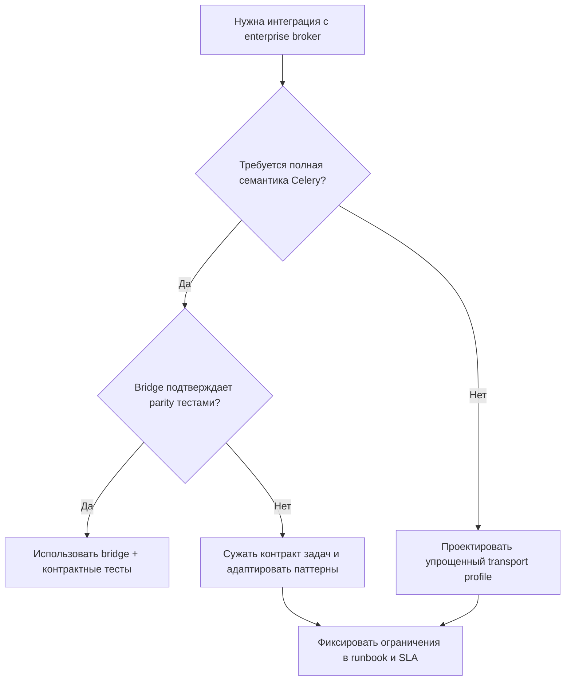

[← Назад к индексу части](index.md)
[↑ К глобальному плану](../celery_mastery_plan.md)

## 32.4 Интеграция с корпоративными брокерами

### Цель раздела

Понять, как интегрировать Celery в enterprise-среды, где брокер и сетевой контур управляются корпоративными политиками, legacy-инфраструктурой и ограничениями протоколов.

### В этом разделе главное

- enterprise-брокеры часто диктуют компромиссы в delivery semantics;
- adapter/bridge слой помогает отделить Celery-домен от инфраструктурной специфики;
- безопасность и аудит должны быть встроены в интеграцию с первого дня.

### Термины

| Термин | Определение |
|---|---|
| **Bridge** | Промежуточный слой/сервис, переводящий сообщения между разными протоколами/брокерами. |
| **Protocol mismatch** | Несовпадение возможностей протоколов (например, headers, priorities, ack-модели). |
| **Contract parity** | Эквивалентность ожидаемого поведения между исходным и целевым транспортом. |

### Теория и правила

1. **Сначала фиксируй контракт, потом подключай транспорт.**  
   Нужны четкие требования к ack/retry/ordering/durability до выбора конкретного интеграционного пути.

2. **Изоляция через адаптеры.**  
   Не размазывай broker-specific логику по бизнес-коду. Делай отдельный integration слой.

3. **Проверяй операционные ограничения заранее.**  
   Прокси, TLS-инспекция, ротация сертификатов, лимиты соединений, сетевые окна обслуживания.

4. **Не все паттерны Celery переносятся один-в-один через bridge.**  
   Особенно внимательно проверяй приоритеты, TTL, routing key, delayed delivery и семантику подтверждений.

### ASCII-схема интеграции

```text
[Business Producer] -> [Celery App] -> [Integration Adapter] -> [Enterprise Broker Layer]
                                                    |
                                                    +-> [Policy/Audit Hooks]
```

### Пошагово: enterprise onboarding checklist

1. Согласуй семантику доставки и отказов с инфраструктурной командой.
2. Определи сетевые требования (порты, сертификаты, auth-механизм).
3. Подготовь стенд с production-like политиками.
4. Проведи нагрузочный и отказоустойчивый прогон.
5. Задокументируй эксплуатационные процедуры (rotation, outage, rollback).

### Где встречаются IBM MQ / ActiveMQ Artemis и что важно помнить

- обычно Celery не подключают напрямую "как к нативному AMQP-кластеру", а используют мосты/адаптеры в enterprise-шине;
- часть расширений RabbitMQ или transport-specific возможностей может быть недоступна;
- успешная интеграция = подтвержденный контракт поведения, а не "соединение установилось".


### Таблица "что часто теряется при мостах"

| Возможность | Риск при bridge | Контроль |
|---|---|---|
| Приоритеты сообщений | приоритеты схлопываются в FIFO | контрактный тест очереди под нагрузкой |
| Delay/ETA | превращается в polling/неточный тайминг | отдельная проверка scheduling semantics |
| Заголовки | частичная потеря metadata | whitelist обязательных headers + валидация |
| Ack/requeue | поведение отличается от ожидаемого | тесты с fault injection |

### Мини-решающее дерево: нужен ли bridge или пересборка контракта



#### Проверь себя: decision tree по bridge

1. Что означает "сужать контракт задач" практически?

<details><summary>Ответ</summary>

Это отказаться от части транспортно-зависимых возможностей (например, сложных приоритетов/метаданных), оставив гарантированно переносимые поля и поведение через мост.

</details>

2. Почему parity-тесты — обязательный узел дерева, а не "опциональная проверка"?

<details><summary>Ответ</summary>

Потому что bridge может быть технически доступен, но семантически несовместим. Без parity-тестов вы не знаете, что реально сохранится из поведения Celery.

</details>

### Граничный случай: "частично работает" после cutover

Симптом: простые задачи проходят, а orchestration-сценарии (`group/chord` с особыми метаданными) начинают вести себя нестабильно.  
Причина: bridge корректно переносит базовые сообщения, но не гарантирует полную parity служебных атрибутов.  
Практический вывод: acceptance-критерии должны включать не только "single task pass", но и workflow-сценарии.

#### Проверь себя: частичный успех после cutover

1. Почему проверка "single task pass" может дать ложную уверенность?

<details><summary>Ответ</summary>

Потому что базовая задача не использует всю сложность orchestration. Проблемы часто всплывают в групповых сценариях, callback-цепочках и обработке метаданных состояния.

</details>

2. Какой минимальный набор сценариев должен быть в acceptance?

<details><summary>Ответ</summary>

Одиночная задача, retry-поведение, group/chord цепочка, перенос обязательных headers, и хотя бы один сценарий отказа с requeue/timeout.

</details>

### Простыми словами

Корпоративный брокер — это не просто "другой URL". Это набор организационных и технических договоренностей. Без них интеграция может быть формально подключена, но операционно неработоспособна.

### Примеры практических ограничений

- принудительная ротация сертификатов раз в 30 дней;
- запрет long-lived соединений без heartbeat;
- централизованный change management: любые топологические изменения только по согласованному окну.

### Типичные ошибки

- игнорировать инфраструктурные SLA и "внедрять в одиночку";
- не тестировать сеть/сертификаты в production-like контуре;
- считать, что поведение staging автоматически равно production.

### Что будет, если...

- **...не выделить адаптерный слой?**  
  Любое изменение брокера потребует массового рефакторинга бизнес-кода.
- **...не встроить аудит в интеграцию?**  
  При инциденте невозможно быстро доказать, что происходило на границе систем.

### Проверь себя

1. Почему adapter pattern особенно полезен в enterprise-интеграции?

<details><summary>Ответ</summary>

Он локализует инфраструктурную специфику и снижает связность между бизнес-логикой задач и транспортными деталями.

</details>

2. Какие два класса рисков надо валидировать до запуска?

<details><summary>Ответ</summary>

Технические (delivery, latency, network, auth) и процессные (change window, ответственность, runbook, аудит).

</details>

3. Почему "подключение к брокеру прошло" ничего не доказывает про production-готовность?

<details><summary>Ответ</summary>

Потому что готовность определяется не фактом TCP/TLS-соединения, а корректностью семантики доставки, отказоустойчивости, безопасности и операционных процедур.

</details>

### Запомните

В enterprise-среде "технически подключили" не равно "готово к эксплуатации". Готовность подтверждается только совместной операционной моделью.

---
