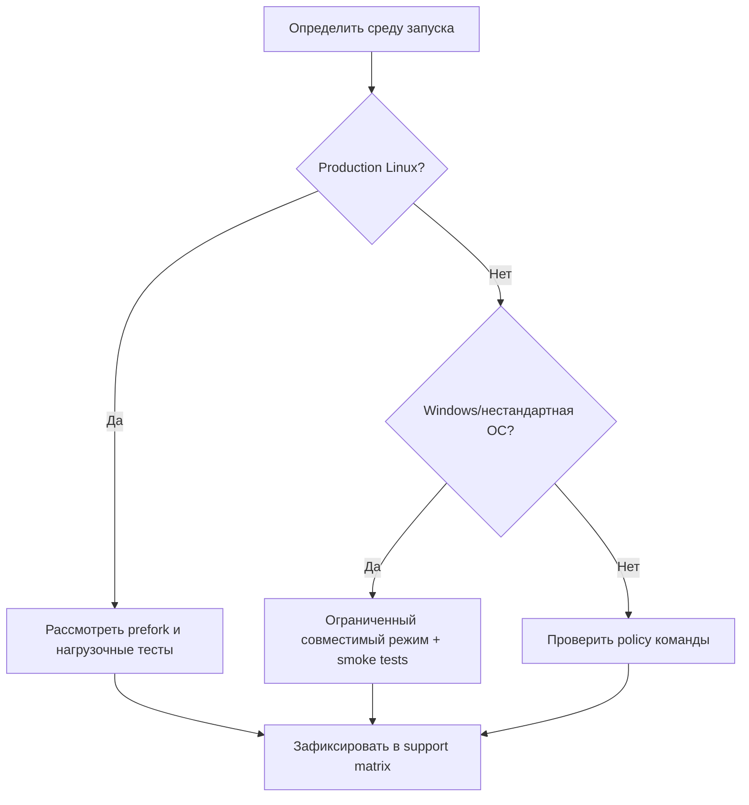

[← Назад к индексу части](index.md)
[↑ К глобальному плану](../../mastery_plan.md)

## 32.5 Windows и нестандартные ОС

### Цель раздела

Разобраться с платформенными ограничениями Celery на Windows и других нестандартных средах, чтобы заранее закладывать platform policy вместо позднего firefighting.

### В этом разделе главное

- поведение multiprocessing и сигналов отличается между ОС;
- платформенный дрейф часто проявляется только под нагрузкой;
- нужна явная матрица "поддерживаем/ограниченно поддерживаем/не поддерживаем".

### Термины

| Термин | Определение |
|---|---|
| **Prefork** | Модель пула, где worker порождает дочерние процессы через `fork` (типично для Unix/Linux). |
| **Spawn model** | Запуск процессов с полной инициализацией интерпретатора без `fork`. |
| **Platform policy** | Формализованные правила: где Celery поддерживается официально и в каком режиме. |

### Теория и правила

1. **Platform parity не возникает сама.**  
   Если ваш production на Linux, а часть команды запускает worker локально на Windows, это разные условия выполнения.

2. **Сигналы и lifecycle-поведение зависят от ОС.**  
   Graceful shutdown, process management и обработка прерываний может работать иначе.

3. **Официально поддерживаемый путь должен быть один.**  
   Обычно для production это Linux-контур (контейнеры/Kubernetes/systemd), а остальные ОС — только для разработки с ограничениями.

4. **На Windows ограничения prefork/fork требуют особого выбора пула.**  
   В практических сценариях чаще используют более совместимые модели исполнения и отдельные ограничения по типам задач.

### Рекомендуемые pool-модели: как выбирать

| Платформа | Обычно предпочтительно | Почему | Ограничения |
|---|---|---|---|
| Linux production | `prefork` для CPU-bound | зрелая модель изоляции процессов | требует аккуратной работы с ресурсами после fork |
| Windows dev/edge | совместимые непроцессные/ограниченные режимы | меньше зависимость от fork-семантики | не всегда подходит для тяжелого parallel CPU |
| Нестандартные ОС | минимальный поддерживаемый режим + smoke tests | важнее предсказуемость, чем максимум throughput | ограниченный функционал и строгие guardrails |

#### Проверь себя: выбор pool-модели

1. Почему "универсальный pool для всех сред" — слабая стратегия?

<details><summary>Ответ</summary>

Потому что среды по-разному реализуют процессную модель, сигналы и поведение библиотек. Унификация скрывает риски до момента production-инцидента.

</details>

2. Что важнее для нестандартной ОС: максимум throughput или предсказуемость?

<details><summary>Ответ</summary>

Предсказуемость и управляемость. Без них невозможно надежно эксплуатировать систему и принимать ответственность за SLA.

</details>

### Визуально: выбор pool-модели по среде



### Анти-паттерн: "одинаковый pool везде"

Интуитивно кажется удобным выбрать "один pool для всех", но на практике это скрывает платформенные различия и приводит к трудным для диагностики сбоям.  
Правильнее: официально зафиксировать production pool-политику и отдельные ограничения для dev/edge окружений.

#### Проверь себя: анти-паттерн pool-политики

1. Какой организационный симптом говорит, что команда попала в этот анти-паттерн?

<details><summary>Ответ</summary>

Когда баги обсуждаются как "у меня локально работает", но нет формально утвержденной матрицы поддержки и никто не знает, какая среда считается эталонной.

</details>

2. Что должно быть первым шагом выхода из анти-паттерна?

<details><summary>Ответ</summary>

Зафиксировать эталонную production-среду и пул, затем документировать ограничения для остальных сред и привязать к ним тестовые обязательства.

</details>

### Практический policy-шаблон

```text
Production: Linux only, pool=<утвержденный>, поддержка 24/7
Development Windows: разрешено для локальной отладки, без SLA и без критичных нагрузок
Нестандартные ОС: только по отдельному RFC, пилот + risk register + owner
```

### Пошагово: platform policy

1. Зафиксируй целевую production платформу.
2. Оформи support matrix по ОС и режимам запуска.
3. Добавь CI smoke-тесты для "разрешенных" dev-платформ.
4. Документируй ограничения и запреты.
5. Для нестандартных ОС создавай отдельный risk register.

### Простыми словами

ОС — это часть архитектуры, а не фон. Если игнорировать платформу, появятся "фантомные" баги: на одном стенде все стабильно, на другом — хаотично.

### Картинка в голове

Платформа как дорожное покрытие: даже идеальный двигатель ведет себя по-разному на асфальте, гравии и льду.

### Практика / реальные сценарии

- **Сценарий:** команда разработки на Windows, production на Linux.  
  **Решение:** локально использовать ограниченный режим и тестовые smoke-checks, а истинную проверку делать в Linux CI/staging.

- **Сценарий:** edge-устройство с нестандартной ОС.  
  **Решение:** отдельный профиль задач, сниженные ожидания по функционалу, explicit fallback-поведение.

### Типичные ошибки

- "если локально работает, значит и в проде";
- отсутствие документированной support matrix;
- смешивание platform-specific хаков с бизнес-логикой задач.

### Что будет, если...

- **...не иметь platform policy?**  
  Поддержка превращается в хаос, а ответственность размывается.
- **...игнорировать lifecycle-особенности ОС?**  
  Зависшие процессы, некорректный shutdown и потеря управляемости при инцидентах.

### Проверь себя

1. Почему support matrix важнее "устной договоренности" команды?

<details><summary>Ответ</summary>

Потому что matrix фиксирует формальные границы ответственности, тестирования и эксплуатационной поддержки. Это снижает хаос при инцидентах.

</details>

2. Что делать, если бизнес требует редкую платформу?

<details><summary>Ответ</summary>

Пилот + risk register + ограниченный scope + отдельный runbook и метрики. Нельзя приравнивать такую платформу к обычному production-пути без доказательств.

</details>

3. Почему важно явно зафиксировать, где prefork используется, а где нет?

<details><summary>Ответ</summary>

Потому что различия в process model напрямую влияют на обработку сигналов, запуск дочерних процессов, поведение библиотек и воспроизводимость ошибок между средами.

</details>

### Запомните

Платформенные различия не "мелкая техническая деталь", а полноценный фактор надежности системы Celery.

---
