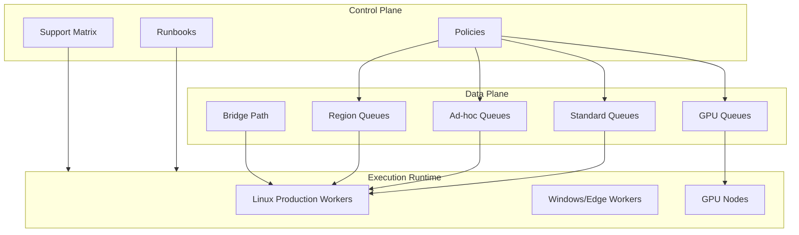

[← Назад к индексу части](index.md)
[↑ К глобальному плану](../mastery_plan.md)

## Матрица принятия решений по части 32

| Вопрос | Если "да" | Если "нет" |
|---|---|---|
| Есть дефицитный GPU-ресурс? | выделить отдельную очередь и policy конкуренции | оставить CPU-контур без усложнения |
| Нужны ad-hoc операции? | заводить `adhoc.*` с guardrails и audit | не смешивать с production pipeline |
| Есть multi-region требования? | региональная маршрутизация + failover runbook | держать единый региональный контур |
| Брокер enterprise-типа через мост? | contract parity тесты и adapter layer | использовать стандартный transport-путь |
| Есть нестандартная ОС? | ограниченный support + risk register | не расширять support без бизнес-основания |

#### Проверь себя: матрица решений

1. Как пользоваться матрицей, если одновременно "да" по нескольким строкам?

Ответ

Приоритизировать по критичности риска: сначала контуры с высоким blast radius (например, multi-region write path), затем менее критичные. Решения должны быть согласованы между собой через общую policy-модель.

2. Почему матрица не заменяет детальные runbook-и?

Ответ

Матрица помогает выбрать направление решения. Runbook описывает конкретные шаги выполнения и эскалации в реальном инциденте.

### Архитектурная карта контуров (единая ментальная модель)

**Как читать эту схему:**  
Control Plane определяет правила и ответственность; Data Plane переносит задачи; Runtime исполняет их в конкретной среде. Большинство инцидентов части 32 — это рассинхронизация между этими тремя слоями.

---
