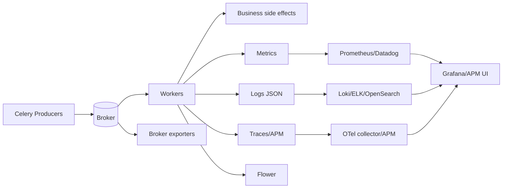

[← Назад к индексу части](index.md)
[↑ К глобальному плану](../mastery_plan.md)

## Сквозная модель observability-слоя

**Простыми словами:** Celery сам исполняет задачи, но "видимость" системы создаётся отдельным слоем наблюдаемости. Если этот слой неполный, команда работает вслепую.

---
