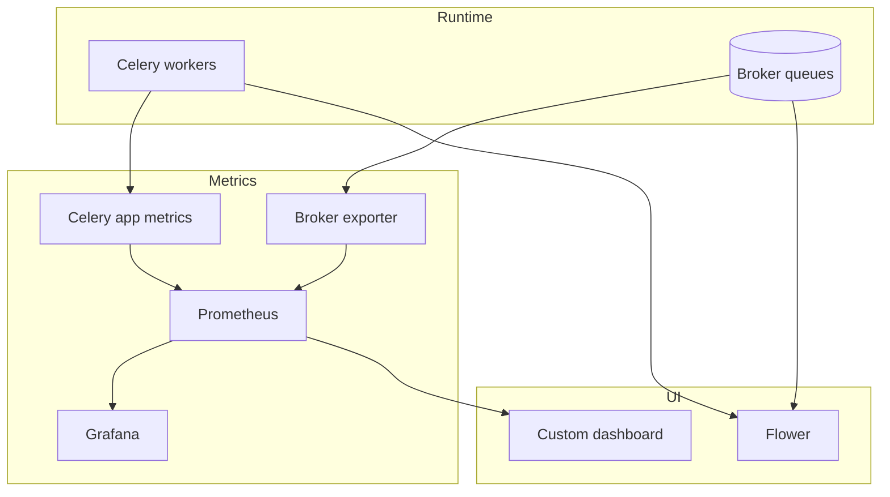

[← Назад к индексу части](index.md)
[↑ К глобальному плану](../celery_mastery_plan.md)

## 33.1 Мониторинг и UI

### Цель раздела

Научиться правильно использовать Flower и альтернативные дашборды, не путая "удобный интерфейс" с полноценной операционной наблюдаемостью.

### Термины

| Термин | Смысл |
|---|---|
| **Flower scope** | Что Flower показывает хорошо: статус worker-ов, задачи, базовые команды контроля. |
| **Operational dashboard** | Дашборд, где видны SLO, lag очередей, ошибка по типам задач, насыщение пулов. |
| **Control plane** | Команды управления (`inspect`, `control`), влияющие на worker-ы. |

### Теория и правила

- Flower удобен как "операторская панель", но не заменяет метрики/логи/APM.
- Доступ к Flower в production нужно ограничивать: auth, TLS, сетевые политики, audit.
- Если у команды строгие требования безопасности, лучше вынести управление в контролируемые скрипты/панели с RBAC.
- Кастомные дашборды на основе `inspect` + метрик полезны там, где нужно показать доменные KPI.

### Простыми словами

Flower — как "пульт диспетчера": видно, что происходит прямо сейчас, можно быстро заглянуть в очереди и worker-ы.  
Но диспетчерский пульт не хранит всю историю болезни системы. История, тренды и экономические метрики живут в Prometheus/Grafana/APM/лог-стеке.

### Сравнение подходов к UI-наблюдаемости

| Подход | Сильные стороны | Ограничения | Когда выбирать |
|---|---|---|---|
| **Flower** | быстрый старт, визуальный контроль задач/worker-ов, удобен для on-call | ограниченная аналитика, отдельные риски безопасности | малые/средние кластеры, оперативный мониторинг |
| **Кастомная панель на `inspect` + metrics** | можно показать domain KPI и собственные алерты | дороже поддержка, нужно проектировать API/кэш | зрелая платформа и требования бизнеса |
| **Только Grafana/APM** | хорошая история и SLO-анализ | слабая интерактивность управления worker-ами | строгая безопасность, централизованный observability |

### Связь с Prometheus/Grafana: generic exporter vs celery-specific

| Категория | Что снимает | Что не снимает |
|---|---|---|
| **Generic Redis/RabbitMQ exporters** | queue depth, ready/unacked, throughput брокера, connection health | runtime конкретной задачи, retry-профиль, бизнес-ошибки |
| **Celery-specific metrics** | task runtime, task fail/success, retries, latency по `task_name` | инфраструктурное состояние узла и детали брокера низкого уровня |

Ключевое правило: **используются оба слоя**.  
Если смотреть только generic exporter, ты видишь "очередь есть/нет", но не понимаешь качество выполнения бизнес-задач.

### Mermaid: границы ответственности UI и метрик



### Пошагово

1. Определи, какие вопросы должен отвечать UI (например: "почему растет backlog?").
2. Включи Flower для оперативного обзора worker-ов.
3. Добавь auth/TLS и ограничь доступ до внутренних подсетей/VPN.
4. Построй отдельные дашборды в Grafana/APM для SLO и долгосрочных трендов.
5. Задокументируй: кто и когда имеет право выполнять control-команды.

### Мини-пример кастомного inspect-подхода

Когда Flower недостаточно, часто делают легкий read-only слой:

```bash
celery -A myapp inspect active
celery -A myapp inspect stats
celery -A myapp inspect active_queues
```

Эти данные можно периодически собирать в сервис-адаптер и визуализировать в внутреннем dashboard (без выдачи прямого control-доступа всем пользователям).

#### Проверь себя: inspect-подход

1. Почему inspect-дашборд часто делают read-only?

<details><summary>Ответ</summary>

Чтобы снизить риск случайных или несанкционированных управляющих действий. Наблюдение должно быть доступно шире, чем управление.

</details>

2. Какой главный компромисс у inspect-подхода по сравнению с готовым UI?

<details><summary>Ответ</summary>

Гибкость выше, но поддержку и корректность сбора данных нужно обеспечивать самостоятельно.

</details>

### Пример запуска Flower

```bash
celery -A myapp flower --port=5555 --basic_auth="${FLOWER_USER}:${FLOWER_PASS}"
```

### Security baseline для Flower в production

Минимально безопасный профиль:

1. доступ только из внутреннего сегмента сети (VPN/private subnet);
2. обязательная аутентификация, лучше через SSO/reverse proxy;
3. TLS termination и запрет plaintext-доступа;
4. раздельные роли: read-only для большинства, control-доступ только для on-call/platform;
5. аудит действий (кто выполнил `revoke`, `purge`, `shutdown` и почему).

#### Проверь себя: security baseline

1. Почему сетевой периметр и auth должны использоваться вместе, а не по отдельности?

<details><summary>Ответ</summary>

Потому что это «слои защиты»: сеть ограничивает поверхность, а auth управляет идентификацией и правами. Один слой без другого оставляет критичные пробелы.

</details>

2. Как аудит действий в Flower помогает после инцидента?

<details><summary>Ответ</summary>

Он восстанавливает хронологию: кто, когда и зачем выполнил управляющую команду. Это важно для расследования и предотвращения повторов.

</details>

### Что будет, если...

- ...оставить Flower только с basic auth и без сетевой изоляции?  
  При утечке пароля или brute-force атаке злоумышленник получает control-плоскость Celery.

- ...не разделить read-only и control-доступ?  
  Любая ошибка оператора может превратиться в массовую остановку очередей.

### Типичные ошибки

- публиковать Flower без аутентификации;
- считать Flower единственным источником правды;
- давать всем инженерам право на destructive-команды без аудита.
- пытаться решать через UI то, что должно быть policy в CI/CD (например, случайные ручные `purge`).

### Проверь себя

1. Почему Flower не должен быть единственным источником observability?

<details><summary>Ответ</summary>

Он хорошо показывает "сейчас", но плохо закрывает долгосрочную аналитику, стоимость, ретроспективу инцидентов и доменные SLO. Для этого нужны метрики, логи и трейсы.

</details>

2. Что обязательно сделать перед открытием Flower в production?

<details><summary>Ответ</summary>

Ограничить доступ (auth + TLS + сеть), определить роли пользователей и журналировать операции управления.

</details>

---
