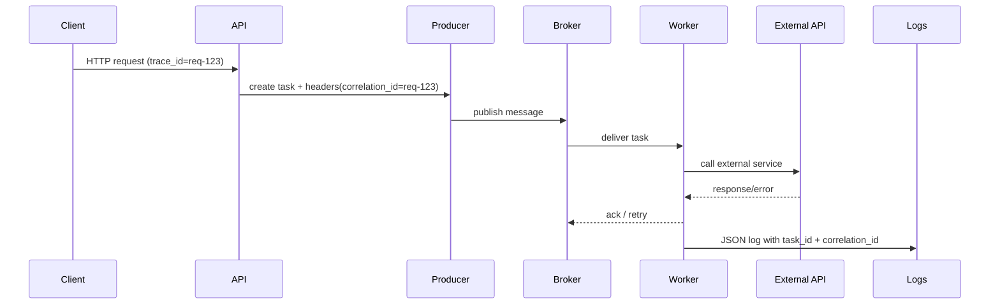

[← Назад к индексу части](index.md)
[↑ К глобальному плану](../../mastery_plan.md)

## 33.3 Логи и трейсы

### Цель раздела

Сделать так, чтобы любой инцидент по Celery можно было расследовать по цепочке: кто отправил задачу, где она исполнялась, почему упала или ретраилась.

### Теория и правила

- Используй structured JSON logging: проще фильтрация, агрегирование и корреляция.
- В каждый лог добавляй минимум: `task_name`, `task_id`, `correlation_id`, `queue`, `retry_count`, `worker`.
- Для Sentry/ошибочных агрегаторов фильтруй шумные ожидаемые ретраи.
- Для трассировки связывай HTTP/producer trace и worker trace через заголовки/контекст.

### Sequence-диаграмма корреляции HTTP -> Celery -> внешнее API



### Sentry: фильтрация шумных retry

Практика:

- оставляй в error-канале только финальные отказы после исчерпания retry;
- transient/временные ошибки отправляй в warning/info или в отдельный проект/канал;
- используй fingerprint по `task_name + error_class`, чтобы не плодить "уникальные" инциденты.

### Trace context propagation: что передавать через headers

Минимальный набор для сквозной корреляции:

- `traceparent` / `tracestate` (если используешь W3C trace context);
- `correlation_id` (внутренний ID запроса/операции);
- domain metadata без PII (например, `tenant_key`, `operation_type`).

Пример publish с безопасным набором заголовков:

```python
task.apply_async(
    args=[payload_id],
    headers={
        "correlation_id": correlation_id,
        "operation_type": "billing_charge",
        # traceparent добавляется instrumentation-слоем
    },
)
```

Важно: не передавай в headers секреты, токены доступа и персональные данные.

#### Проверь себя: propagation

1. Почему `correlation_id` и `traceparent` лучше передавать вместе?

<details><summary>Ответ</summary>

`traceparent` обеспечивает стандартную трассировку, а `correlation_id` — удобную доменную привязку для логов и ручной диагностики.

</details>

2. Что будет, если передавать в headers PII/секреты?

<details><summary>Ответ</summary>

Повышается риск утечки чувствительных данных через брокер, логи и observability-системы, что ведет к security/compliance инцидентам.

</details>

### Как запомнить

`Метрика говорит "где болит", лог говорит "что произошло", трейс говорит "как дошли до сбоя".`  
Без любой из трех частей диагностика становится медленнее и субъективнее.

### Пример формата лога

```json
{
  "level": "ERROR",
  "message": "Task failed",
  "task_name": "billing.charge",
  "task_id": "8f8d...",
  "correlation_id": "req-123",
  "queue": "payments",
  "retry_count": 2,
  "worker": "celery@node-a",
  "error_class": "TimeoutError"
}
```

### Практика / реальные сценарии

- В ELK/Loki строим дашборд "failed tasks by task_name + error_class".
- В OpenSearch добавляем фильтр по `correlation_id`, чтобы связать HTTP-запрос и асинхронную обработку.
- В Sentry настраиваем sampling и правила suppression для transient-ошибок.

### ASCII-схема triage по логам/трейсам

```text
Инцидент по задаче
   |
   +--> Шаг 1: ищем task_id / correlation_id в логах
   |        |
   |        +--> нет корреляции -> исправляем log schema, инцидент "observability gap"
   |
   +--> Шаг 2: смотрим retry_count и error_class
   |        |
   |        +--> transient -> проверяем backoff/лимиты/внешние зависимости
   |        +--> permanent -> эскалация в команду сервиса
   |
   +--> Шаг 3: сверяем трейс с метриками latency/queue lag
            |
            +--> bottleneck в broker/app/infra слое и точечный runbook
```

### Проверь себя

1. Почему plain-text логи хуже в продакшне, чем JSON?

<details><summary>Ответ</summary>

Их сложнее надежно парсить и агрегировать. Любое изменение текста ломает поисковые шаблоны и автоматические правила корреляции.

</details>

2. Как отличить полезный retry от "шумной ошибки" в логах?

<details><summary>Ответ</summary>

Нужны поля `retry_count`, класс ошибки и итоговое состояние задачи. Без этого невозможно понять, это нормальная временная деградация или патологический цикл.

</details>

---
