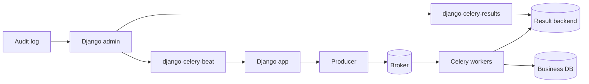

[← Назад к индексу части](index.md)
[↑ К глобальному плану](../celery_mastery_plan.md)

## 33.4 Django-экосистема

### Цель раздела

Понять границы пакетов Django-экосистемы вокруг Celery, чтобы не превращать удобные инструменты в источник технического долга.

### Термины и пакеты

| Инструмент | Назначение | Что важно помнить |
|---|---|---|
| `django-celery-beat` | хранение расписаний beat в БД | изменения расписаний требуют дисциплины доступа и аудита |
| `django-celery-results` | хранение результатов задач в Django ORM | может быстро раздувать БД при большом объеме задач |
| `django-health-check` | endpoint/проверки здоровья | health должен проверять релевантные зависимости, не "для галочки" |

### Теория и правила

- `django-celery-results` полезен в админке и для простых систем, но в high-throughput может стать узким местом.
- `django-celery-beat` удобен для операционного управления расписаниями, но требует контроля прав.
- Admin-интеграции часто project-specific: не стоит слепо использовать generic-пакеты без ревизии безопасности.

### Health/readiness для worker-ов (если применимо)

Важно не путать liveness и readiness:

- **liveness**: процесс живой;
- **readiness**: процесс реально готов обрабатывать задачи (есть связь с брокером, нет критичной деградации зависимостей).

Минимальная readiness-проверка для Django-кластера с Celery:

1. `ping` worker-ов с ограничением по времени;
2. проверка соединения с broker;
3. проверка доступа к критичным внешним сервисам (если задача строго зависит от них);
4. контроль задержки heartbeat/event stream.

#### Проверь себя: health vs readiness

1. Почему liveness без readiness дает ложное чувство стабильности?

Ответ

Процесс может быть «жив», но не способен обрабатывать задачи (нет broker-connectivity или критичных зависимостей). Тогда система формально up, но фактически неработоспособна.

2. Какой признак, что readiness-проверка слишком поверхностная?

Ответ

Если она проверяет только факт запуска процесса и не проверяет ключевые зависимости, влияющие на реальное выполнение задач.

### Generic admin package vs custom admin view

| Подход | Когда хорошо | Где риск |
|---|---|---|
| **Generic package** | стандартный сценарий, быстрый запуск | не учитывает уникальные бизнес-политики и роль-модель |
| **Custom admin view** | тонкий контроль прав, скрытие опасных операций, domain-фильтры | выше стоимость разработки и поддержки |

### Визуальная схема границ данных для Django-экосистемы

Ключевая мысль схемы: `django-celery-beat` и `django-celery-results` не должны становиться "центром истины" для всех operational- и бизнес-данных. Это прикладные интеграции, а не замена полноценной observability и data governance.

### Что будет, если...

- ...складировать все результаты задач в PostgreSQL годами?  
  Рост таблиц, деградация запросов, сложная очистка, влияние на бэкапы.

- ...дать редактирование periodic tasks слишком широкому кругу сотрудников?  
  Риск случайной перегрузки системы и неаудируемых изменений бизнес-критичных расписаний.

### Проверь себя

1. Когда `django-celery-results` оправдан, а когда лучше отдельный backend/TTL-стратегия?

Ответ

Оправдан для умеренного объема и потребности в удобной админке. При большой нагрузке и строгих retention-требованиях лучше использовать backend с TTL/архивной стратегией и отдельной аналитикой.

2. Почему Django-admin для Celery нельзя отдавать без role model?

Ответ

Потому что изменения в расписании и управлении задачами напрямую влияют на деньги, SLA и безопасность. Нужны роли, ревью и аудит изменений.

---
