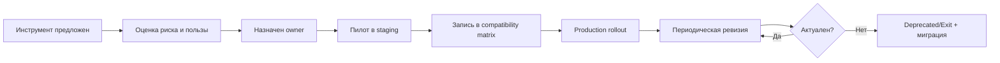

[← Назад к индексу части](index.md)
[↑ К глобальному плану](../mastery_plan.md)

## 33.6 Ограничения каталога

### Цель раздела

Научиться отличать уровни поддержки интеграций и формально вести каталог инструментов как инженерный артефакт.

### В этом разделе главное

- "Пакет существует" не равно "интеграция поддерживается".
- Для каждого инструмента нужно фиксировать статус и owner.
- После каждого апгрейда Celery каталог нужно пересматривать.

### Рекомендуемая модель статусов

| Статус | Что означает |
|---|---|
| **Official/Documented** | Поддерживается официальной документацией и широко используется. |
| **Community stable** | Поддерживается сообществом, приемлемая зрелость, но меньше гарантий. |
| **Best effort** | Ограниченная поддержка, возможны частые breakages, нужен план fallback. |
| **Deprecated/Exit** | Использование нежелательно, есть план миграции. |

### Пример карточки инструмента

| Поле | Пример |
|---|---|
| Имя | `flower` |
| Роль | UI для runtime-обзора |
| Статус поддержки | Community stable |
| Совместимость | Celery `5.3-5.5` (проверено в проекте) |
| Риски | auth/TLS, ограниченный audit trail |
| Владелец | Platform Team |
| Fallback | read-only дашборды + `inspect` runbook |

### Шаблон compatibility matrix (рекомендуемый)

| Tool | Celery | Python | Broker | Статус | Последняя проверка |
|---|---|---|---|---|---|
| flower | 5.4.x | 3.11 | redis 7 / rabbit 3.13 | community stable | 2026-04 |
| prometheus-exporter-X | 5.4.x | 3.11 | redis 7 | best effort | 2026-04 |
| sentry-sdk | 5.3-5.4 | 3.11/3.12 | any | official/documented | 2026-04 |

### Пошаговый процесс актуализации каталога

1. Перед апгрейдом Celery собери список активных интеграций.
2. Для каждого инструмента определи owner и support-level.
3. Прогоните smoke/regression контур observability в staging.
4. Обнови compatibility matrix и runbook fallback.
5. Только после этого открывай production rollout.

### Rollout-план внедрения инструмента (0-30-60-90)

| Период | Что делаем | Критерий выхода |
|---|---|---|
| **0-30 дней** | пилот на одном домене задач, метрики overhead, security review | есть подтверждение пользы и нет критичных рисков |
| **30-60 дней** | расширение на 30-50% task-пула, алерты, runbook | команда on-call умеет диагностировать инциденты через новый инструмент |
| **60-90 дней** | полное внедрение или откат к fallback | принято решение "adopt/hold/exit", обновлена compatibility matrix |

#### Проверь себя: rollout

1. Почему rollout в три фазы безопаснее «включить сразу везде»?

Ответ

Фазовый подход позволяет контролировать риск, измерять overhead и остановиться до массового воздействия при проблемах.

2. Как понять, что на этапе 30-60 нельзя переходить к полному rollout?

Ответ

Если on-call всё еще не умеет уверенно диагностировать инциденты через новый инструмент или метрики/алерты нестабильны.

### Anti-pattern matrix: что чаще всего ломает каталог

| Анти-паттерн | Симптом | Чем заканчивается | Как исправлять |
|---|---|---|---|
| **Tool sprawl** (слишком много инструментов) | дубли дашбордов и конфликтующие алерты | рост OPEX и путаница в инциденте | оставить основной стек + удалить дубли |
| **No owner** | интеграция устарела, но "никто не отвечает" | тихие регрессии после апгрейда | назначить owner и SLA по ревизии |
| **No fallback** | при падении плагина "слепой мониторинг" | высокий MTTR | заранее прописать fallback runbook |
| **Cardinality explosion** | дорогие и медленные запросы observability | budget overrun | метрики-гайдлайн + лимиты в review |
| **UI-only operations** | ручные неповторяемые действия | неаудируемые инциденты | критичные операции через runbook/automation |

#### Проверь себя: anti-patterns

1. Какой anti-pattern чаще всего приводит к «тихому» накоплению техдолга?

Ответ

`No owner`: пока нет явного владельца, проблемы с совместимостью и обновлениями копятся незаметно и проявляются в самый неподходящий момент.

2. Почему `Tool sprawl` опасен даже если каждый инструмент «сам по себе полезен»?

Ответ

Потому что совокупно возникает конфликт источников истины, дубли алертов и рост операционной стоимости.

### Диаграмма жизненного цикла инструмента в каталоге

### Что будет если...

- ...не вести compatibility-матрицу?  
  После апгрейда часть сигналов наблюдаемости пропадет тихо, и команда узнает об этом во время инцидента.

- ...не иметь fallback для best-effort инструмента?  
  Сбой плагина превращается в "слепой" продакшн.

### Проверь себя

1. Зачем указывать owner для каждого интегратора?

Ответ

Чтобы был явный ответственный за апгрейды, валидацию и инциденты. Без owner инструмент "ничей", и технический долг растет.

2. Почему "best effort" не означает "нельзя использовать"?

Ответ

Использовать можно, если риск осознан, есть fallback и план валидации при каждом релизе.

---
