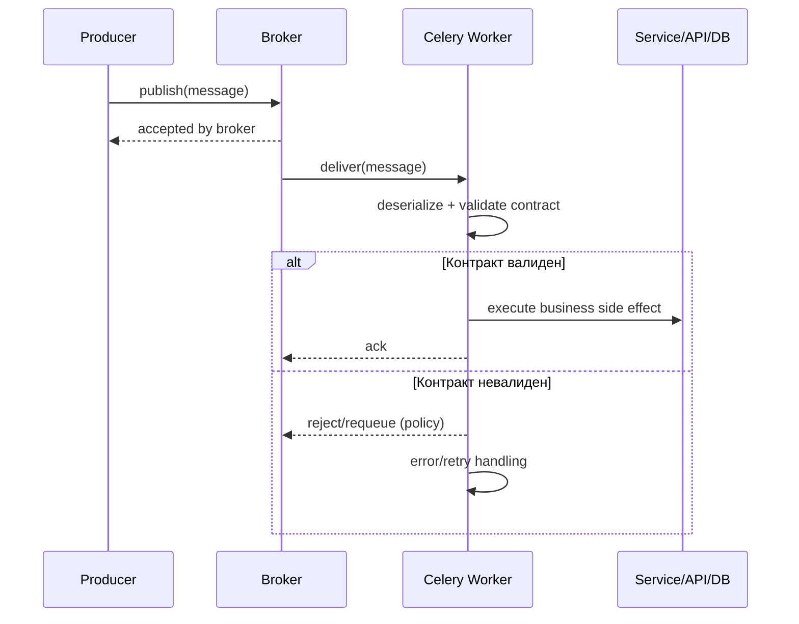

[← Назад к индексу части](index.md)
[↑ К глобальному плану](../mastery_plan.md)

## 34.1 Стандарты и протоколы (ориентиры)

### Цель раздела

Сформировать устойчивую ментальную модель: где Celery следует AMQP-подходам, где использует собственные абстракции, и почему нельзя механически переносить ожидания из JMS/MQTT/STOMP.

### В этом разделе главное

- Celery — это task framework поверх message transport, а не универсальный протокол.
- AMQP описывает язык доставки сообщений, Celery — язык выполнения Python-задач.
- Путаница уровней приводит к ошибкам архитектуры и диагностики.

### Термины

| Термин | Значение |
|---|---|
| **Protocol semantics** | Гарантии и правила поведения протокола (routing, ack, durability). |
| **Envelope** | Обертка сообщения: headers, metadata, body. |
| **Interoperability** | Способность разных систем корректно обмениваться сообщениями. |

### Теория и правила

1. **AMQP 0-9-1 и RabbitMQ**  
   RabbitMQ реализует AMQP-модель (exchange, queue, binding, routing key). Celery через Kombu использует эти механизмы, но предоставляет более высокий API (task, retry, eta, result).

2. **JMS, MQTT, STOMP: почему не "одно и то же"**  
   - JMS: Java-экосистема и API-абстракция, тесно связанная с Java-контейнерами и enterprise-шиной.  
   - MQTT: легковесный pub/sub для IoT, другой профиль доставки и сессий.  
   - STOMP: текстовый протокол поверх брокеров, удобен для простых интеграций, но не равен AMQP по модели.

#### Практическое сравнение AMQP/JMS/MQTT/STOMP для Celery-инженера

| Протокол/модель | Где обычно встречается | Сильная сторона | Риск неверной интерпретации в Celery-контуре |
|---|---|---|---|
| **AMQP 0-9-1** | RabbitMQ в backend-системах | богаче routing/queue semantics | ожидание "из коробки exactly-once" |
| **JMS** | Java enterprise middleware | единый Java API-контракт | перенос JVM-практик без учета Python/Celery-особенностей |
| **MQTT** | IoT/edge устройства | легковесная доставка | попытка использовать IoT-паттерны как замену task-оркестрации |
| **STOMP** | простые broker-клиенты, websocket bridge | простота протокола | недооценка ограничений в надежности и workflow-семантике |

Смысл таблицы: Celery может жить рядом с разными message-мирами, но его гарантийная модель и эксплуатационные практики нужно формировать именно в терминах Celery + выбранного брокера, а не "универсального messaging".

3. **Task message Celery vs generic message**  
   Celery ожидает конкретную структуру payload/headers. Сообщение "формально в очереди" еще не означает, что worker сможет и должен его исполнять.

#### Где именно проходит граница "стандарт vs фреймворк"

| Уровень | Что стандартизовано | Что зависит от Celery |
|---|---|---|
| Транспорт | exchange/queue/routing/ack (в рамках AMQP-модели) | как task сериализуется и интерпретируется worker-ом |
| Формат сообщения | envelope и поля доставки | внутренние поля task-контекста (`task`, `id`, retries, headers) |
| Обработка ошибок | базовые механизмы reject/requeue | retry-логика, backoff, классификация исключений |
| Оркестрация | отсутствует как "task workflow" в протоколе | `chain/group/chord`, callback-и и семантика canvas |

#### Частая путаница: "если брокер принял сообщение, значит контракт соблюден"

Это неверно. Брокер подтверждает лишь транспортный факт (сообщение сохранено/доставлено), но не подтверждает:
- валидность бизнес-структуры payload;
- совместимость версий producer/consumer;
- безопасность десериализации;
- идемпотентность побочного эффекта.



### Пошагово: как избежать путаницы протокольных уровней

1. Для каждой интеграции выпиши: какой протокол на транспорте и какая бизнес-семантика задачи.
2. Зафиксируй, кто "владелец" схемы сообщения: Celery task contract или внешний контракт.
3. Проверь, кто подтверждает доставку (`ack`) и на каком шаге.
4. Отдельно опиши обработку несовместимых сообщений (reject/DLQ/policy).
5. Добавь в runbook таблицу "симптом -> протокольный слой -> владелец решения".

### Простыми словами

AMQP — это правила дорожного движения. Celery — это служба доставки, которая по этим дорогам возит посылки определенного формата. Если на дорогу выехал "чужой" формат посылки, движение само по себе не гарантирует, что получатель сможет ее обработать.

### Картинка в голове

```text
[Протокол] = как едет грузовик по трассе
[Celery task] = что внутри контейнера и как его открыть на складе
```

### Как запомнить

**Протокол отвечает за "как доставить", Celery отвечает за "что выполнить".**

### Примеры

```python
# Пример: контракт задачи лучше фиксировать явно
@app.task(name="billing.capture_payment", bind=True, autoretry_for=(TimeoutError,))
def capture_payment(self, payment_id: str, amount_minor: int, currency: str) -> dict:
    # payment_id вместо "сырого" объекта платежа
    return {"status": "accepted", "payment_id": payment_id}
```

```json
{
  "task": "billing.capture_payment",
  "id": "4c1337f9-4f4c-4d8b-a2a6-6ef4a6d9f702",
  "args": ["pay_98231", 1200, "RUB"],
  "kwargs": {},
  "headers": {
    "x-contract-version": "v2",
    "x-correlation-id": "req-7d4f"
  }
}
```

Здесь важно: `x-contract-version` позволяет безопасно эволюционировать payload при параллельном существовании старых и новых producer-ов.

### Практика / реальные сценарии

- Интеграция с внешней системой шлет JSON в ту же очередь, где живут task message Celery -> worker падает на десериализации.
- Команда думает, что "как в JMS" можно безопасно менять поля без версионирования -> растут ошибки несовместимости в проде.

### Типичные ошибки

- считать, что любой брокерный consumer автоматически совместим с Celery worker;
- смешивать application-схему payload и transport headers без контракта;
- не документировать версию сообщения.

### Что будет если...

- ...не различать уровни?  
  Инциденты будут диагностироваться слишком долго: симптомы в broker-метриках, причина — в контракте задачи.

- ...смешивать стандарты без явной границы контрактов?  
  Появятся "серые зоны" ответственности: платформа винит приложение, приложение винит брокер, а MTTR системно растет.

### Проверь себя

1. Почему "сообщение доставлено" не равно "задача корректно выполнена"?
2. В чем практический риск путаницы AMQP и Celery API?

<details><summary>Ответ</summary>

1) Доставка подтверждает транспортный шаг, но не гарантирует бизнес-успех выполнения кода.  
2) Команда строит неверные ожидания по совместимости, retries и ошибкам, из-за чего растут инциденты.

</details>

### Запомните

Celery и AMQP связаны, но не взаимозаменяемы. Для стабильной системы нужен явный контракт задачи и явные границы протокольного слоя.

---
