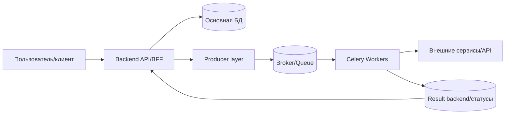
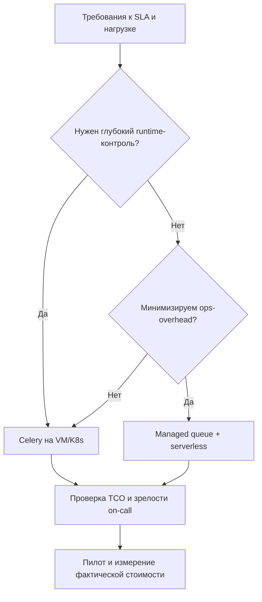

[← Назад к индексу части](index.md)
[↑ К глобальному плану](../mastery_plan.md)

## 34.2 Облачные паттерны рядом с Celery

### Цель раздела

Научиться выбирать между Celery на VM/K8s и managed queue + serverless, исходя из SLA, профиля нагрузки, стоимости и требуемого контроля.

### В этом разделе главное

- Нет "вечно лучшей" платформы: есть контекст и компромиссы.
- Managed stack уменьшает операционную нагрузку, но ограничивает гибкость.
- Celery на своей платформе дает контроль, но требует зрелых процессов.

### Теория и правила

Сравнение по осям:

| Критерий | Celery на VM/K8s | Managed queue + serverless |
|---|---|---|
| Контроль runtime | Высокий | Средний/низкий |
| Операционная сложность | Выше | Ниже |
| Гибкость конфигурации | Высокая | Ограниченная провайдером |
| Прозрачность cost model | Требует учета многих факторов | Часто проще стартово, сложнее при росте |
| Cold start риск | Управляемый (warm pools) | Может быть заметным |
| Vendor lock-in | Ниже | Выше |

#### Архитектурные границы: где Celery в общем контуре продукта



Как читать схему:
- синхронный путь (`клиент -> API -> БД`) отвечает за быстрый ответ пользователю;
- асинхронный путь (`API -> очередь -> worker`) отвечает за тяжелую/отложенную работу;
- `result backend` помогает отслеживать статус, но не заменяет бизнес-источник истины в основной БД.

#### Расширенная сравнительная рамка (что часто забывают)

| Вопрос | Celery на VM/K8s | Managed queue + serverless |
|---|---|---|
| Ограничения времени выполнения | Вы задаете сами | Часто есть жесткие лимиты провайдера |
| Отладка "глубоких" инцидентов | Полный доступ к хостам/процессам | Ограниченный доступ, зависимость от provider tooling |
| Контроль сетевой топологии | Гибкий (VPC, private links, mesh) | Зависит от возможностей managed-сервиса |
| Изоляция tenant-ов | Полностью на вас | Частично упрощена, но не всегда тонко настраивается |
| Переносимость между облаками | Реально достижима | Обычно дороже и сложнее из-за lock-in |

### Пошагово: decision flow

1. Определи требования по latency/throughput и допустимые пики.
2. Зафиксируй требования к кастомизации worker runtime.
3. Сравни доступность навыков команды (платформа, on-call, SRE).
4. Оцени прогноз роста нагрузки на 12 месяцев.
5. Рассчитай пилотную стоимость двух вариантов.
6. Выбери стратегию: основной вариант + fallback-план миграции.

#### Практический шаблон decision memo (1 страница)

```text
1) Контекст и ограничение:
   - Какие бизнес-процессы и SLA покрываем
   - Что нельзя нарушать (например, p95 < 2с для критичных задач)

2) Альтернативы:
   - A: Celery на K8s
   - B: Managed queue + serverless worker

3) Сравнение:
   - latency profile
   - cost profile (base + peak)
   - operational risk
   - security/compliance constraints

4) Решение и срок пересмотра:
   - выбрано ...
   - пересмотр через 2 квартала или при 2x росте нагрузки
```

#### Быстрый break-even анализ (упрощенная формула)

```text
Считаем для периода (например, 1 месяц):

Option A (Celery self-managed):
  Cost_A = Infra_A + FTE_A + Incident_A + Compliance_A

Option B (Managed + serverless):
  Cost_B = Provider_B + DataTransfer_B + Premium_B + LockInRisk_B

Если Cost_A < Cost_B при соблюдении SLA и risk profile -> A
Если Cost_B < Cost_A и команда не теряет критичный контроль -> B
```

Важно: `LockInRisk_B` — это не "абстракция", а реальная будущая стоимость миграции (время команды + переписывание интеграций + переходные инциденты).



### Простыми словами

Celery на своей платформе — как собственный автопарк: больше контроля и вариантов, но нужны механики и диспетчеры. Managed + serverless — как такси-сервис: проще стартовать, но есть ограничения и зависимость от провайдера.

### Примеры

```yaml
# Условный чеклист архитектурного RFC
decision:
  option_a: celery_k8s
  option_b: managed_queue_serverless
criteria:
  - p95_latency_target
  - burst_multiplier
  - runtime_customization_need
  - team_oncall_capacity
  - estimated_monthly_cost
```

### Практика / реальные сценарии

- Продукт с тяжелыми Python-зависимостями и нестандартными библиотеками почти всегда выигрывает от контролируемого Celery-runtime.
- Небольшой сервис с нерегулярными задачами и маленькой командой часто выигрывает от managed-подхода.
- Команда среднего размера часто выбирает гибрид: критичные и долгие задачи в Celery, короткие burst-задачи в managed/serverless.

### Типичные ошибки

- выбирать по "моде в компании", а не по профилю нагрузки;
- игнорировать cold-start и лимиты serverless;
- не иметь exit strategy из выбранной платформы.

### Что будет если...

- ...не учитывать стоимость миграции из managed-платформы заранее?  
  Через 1-2 года можно оказаться в lock-in, где технически есть проблемы, но экономически "выйти" уже слишком дорого.

- ...сравнивать платформы только по средней нагрузке?  
  На пиках (распродажи, отчетные окна, массовые уведомления) выбранная архитектура может резко нарушать SLA и бюджет.

### Что будет если...

- ...не учитывать стоимость миграции из managed-платформы заранее?  
  Через 1-2 года можно оказаться в lock-in, где технически есть проблемы, но экономически "выйти" уже слишком дорого.

- ...сравнивать платформы только по средней нагрузке?  
  На пиках (распродажи, отчетные окна, массовые уведомления) выбранная архитектура может резко нарушать SLA и бюджет.

### Проверь себя

1. Когда managed+serverless может оказаться дороже "своего" Celery?
2. Почему решение нужно подтверждать пилотом, а не только таблицей?

<details><summary>Ответ</summary>

1) При высоком объеме длительных задач, большом I/O и высоком egress/storage; поминутная/поштучная модель может стать дорогой.  
2) Потому что реальные профили нагрузки и overhead отличаются от расчетов, особенно на пиках и при ошибках.

</details>

### Запомните

Выбор платформы — это не идеология, а регулярная проверка гипотезы "наша архитектура все еще оптимальна по надежности и стоимости".

---
