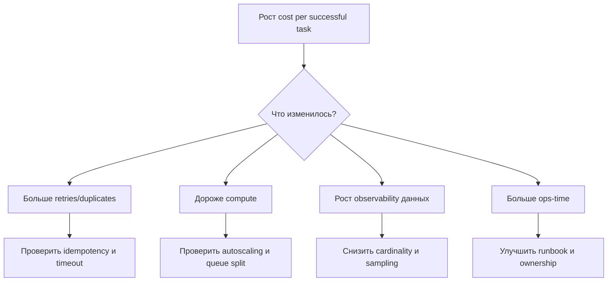

[← Назад к индексу части](index.md)
[↑ К глобальному плану](../../mastery_plan.md)

## 34.3 FinOps и cost drivers

### Цель раздела

Понять, из каких компонент складывается стоимость Celery-контура и как превратить затраты в управляемые инженерные метрики.

### В этом разделе главное

- Стоимость очередей — мультифакторная: compute, broker, storage, observability, ops-time.
- "Цена задачи" нужна для прозрачности и приоритизации оптимизаций.
- FinOps работает только вместе с telemetry и ownership.

### Теория и правила

Базовая модель месячной стоимости:

```text
Total Cost = Broker + Worker Compute + Result Storage + Logs/Metrics/Traces + Platform Ops Time
```

Приближенная цена одной задачи:

```text
Cost per Task = Total Cost / Completed Tasks
```

Уточненная модель (лучше для продакшна):

```text
Cost per Successful Task = Total Cost / Successful Non-Duplicate Tasks
```

Почему это важно: если retries, дубликаты и "пустые" перезапуски высоки, метрика "стоимость задачи" без поправок будет слишком оптимистичной.

#### Детализация cost drivers (обязательно для части 34.3 по плану)

1. **Стоимость брокера**  
   - managed: прямой счет провайдера + network egress + premium за SLA;  
   - self-hosted: VM/диски/backup + дежурства + инженерное время (FTE) на эксплуатацию.

2. **Стоимость worker-инфраструктуры**  
   - CPU/час, RAM, autoscaling overshoot, простаивающие warm-пулы.

3. **Стоимость хранения результатов и логов**  
   - result backend retention;  
   - объем логов/трейсов и cardinality метрик;  
   - архивное хранение и запросы к historical данным.

4. **Скрытая стоимость инцидентов**  
   - on-call время;  
   - impact на бизнес-операции (например, пропущенные уведомления/задержка платежей).

#### Managed vs self-hosted брокер: как сравнивать корректно

```text
Broker TCO (self-hosted) =
  Infra (VM + storage + backup) +
  Engineering FTE (setup + upgrades + incidents) +
  Compliance/Security overhead

Broker TCO (managed) =
  Provider bill +
  Data transfer +
  Premium features (HA/SLA) +
  Integration constraints cost
```

Если у команды нет устойчивой экспертизы по брокерам, FTE-компонента self-hosted обычно недооценивается.

#### Мини-калькуляция "цены задачи" (пример)

```text
Дано за месяц:
- Broker: 900 USD
- Worker compute: 4 200 USD
- Result/log/metrics storage: 1 100 USD
- Ops-time (оценка): 1 300 USD
Итого: 7 500 USD

Completed tasks: 15 000 000
Successful non-duplicate tasks: 12 500 000

Cost per Task = 0.00050 USD
Cost per Successful Task = 0.00060 USD
```

Вывод: расхождение 20% показывает цену дубликатов/ошибок и является практической целью оптимизации.

### Пошагово: как внедрить cost-модель без бюрократии

1. Согласуй список cost drivers (минимум 5: broker, compute, storage, observability, ops-time).
2. Привяжи каждый драйвер к источнику данных (billing + metrics + incident data).
3. Введи еженедельный отчет: throughput, fail-rate, retries, cost per successful task.
4. Зафиксируй пороги "аномального роста" стоимости.
5. На каждую аномалию назначай owner и корректирующее действие.

6. Разделяй корректирующие действия по типу:
   - архитектурные (routing, batching, dedup);
   - эксплуатационные (алерты, autoscaling thresholds);
   - продуктовые (пересмотр частоты фоновых операций).

### Диаграмма причин роста стоимости



### Простыми словами

Стоимость задач похожа на расход топлива у автопарка. Можно считать только "литры в месяц", но это мало полезно. Нужнее "литры на 100 км", а еще лучше — "литры на доставленный заказ". В Celery эквивалент — "стоимость на успешно выполненную задачу".

### Картинка в голове

```text
Задача -> (очередь) -> (worker CPU/RAM) -> (результат/логи) -> (on-call время)
Каждый этап добавляет стоимость.
```

### Примеры

```python
# Псевдокод расчета unit economics
total_cost = broker_cost + worker_cost + result_storage + observability_cost + ops_time_cost
cost_per_success = total_cost / max(successful_non_duplicate_tasks, 1)
```

```text
Пример интерпретации:
- cost_per_success вырос на 27%
- fail_rate стабилен
- retries выросли x2
Вывод: вероятно, проблема не в цене инфраструктуры, а в логике повторов/таймаутов.
```

### Практика / реальные сценарии

- После включения подробного tracing стоимость observability выросла на 40% -> команда ввела sampling и ограничила high-cardinality теги.
- При росте нагрузки cost/task увеличился вместо снижения -> выяснилось, что очередь "забита" дубликатами из-за отсутствия дедупликации на producer-слое.

### Типичные ошибки

- считать только "стоимость кластера", игнорируя время on-call;
- сравнивать месяцы без нормализации на объем успешно выполненной работы;
- не различать стоимость "полезной работы" и стоимость "технического шума".

### Что будет если...

- ...не считать unit economics?  
  Оптимизации будут случайными: команда может "экономить" не там, где реальный перерасход.

### Проверь себя

1. Почему `Cost per Successful Task` полезнее, чем `Cost per Task`?
2. Какие два драйвера чаще всего незаметно растут при scale-up?

<details><summary>Ответ</summary>

1) Потому что исключает иллюзию эффективности за счет дубликатов/неуспешных запусков.  
2) Observability (логи/трейсы/метрики) и ops-time (инциденты, ручные вмешательства).

</details>

### Запомните

FinOps в Celery — это не "урезать бюджет", а держать баланс между надежностью и экономикой через измеримые решения.

---
