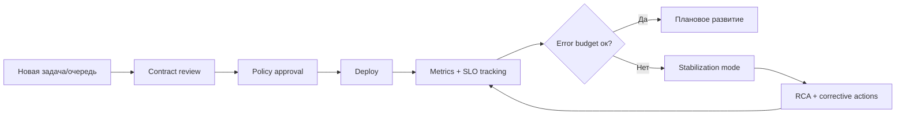

[← Назад к индексу части](index.md)
[↑ К глобальному плану](../mastery_plan.md)

## 34.4 Команда и процессы

### Цель раздела

Построить рабочую операционную модель для Celery: ownership, эскалации, SLA-ориентиры, договоренности по изменениям задач и очередей.

### В этом разделе главное

- Без ownership даже технически хороший Celery-контур быстро деградирует.
- Контракты задач нужно вести как internal API.
- Review/policy по очередям и beat-сценариям снижают риск "случайного хаоса".

### Теория и правила

#### Минимальная operating model

1. **Queue Owner** — отвечает за SLA очереди, алерты и capacity.
2. **Task Contract Owner** — отвечает за схему payload и совместимость.
3. **Platform/SRE Owner** — отвечает за runtime, деплой и наблюдаемость.

#### Error budget для фоновых систем

- фиксируется допустимый уровень деградации (например, доля задач с задержкой выше SLO);
- при выгорании бюджета приоритет смещается с feature work на стабилизацию.

Пример в цифрах:

```text
SLO: 99.5% задач завершаются < 120 сек за 30 дней
Допустимый budget: 0.5% "плохих" задач

Если обработано 10 000 000 задач:
  budget = 50 000 задач
Факт: 67 000 задач > 120 сек
=> budget исчерпан, команда обязана приоритизировать стабилизацию
```

Это убирает спор "кажется, уже плохо" и переводит разговор в измеримый режим.

#### Policy-контроль

- кто может создать новую очередь;
- кто может добавить/изменить beat schedule;
- как согласуется retention для результатов и логов;
- какие обязательные пункты у PR с новой задачей.

#### Контракт задачи как internal API (формализация)

Минимум, который должен быть задокументирован для каждой критичной задачи:

| Поле контракта | Зачем нужно |
|---|---|
| `task_name` + owner | мгновенно понять ответственность |
| schema/version payload | безопасная эволюция producer/consumer |
| retry policy | управляемое поведение при сбоях |
| idempotency strategy | защита от at-least-once дублей |
| timeout/time limit | ограничение зависаний и защита ресурса |
| side effects | список внешних систем и инвариантов |
| observability keys | какие метрики/логи/трейсы обязательны |

#### Эскалация инцидентов (пример уровнями)

```text
L1 (дежурный): фиксирует симптом, применяет runbook, эскалирует при невосстановлении за 15 мин
L2 (владелец очереди): анализирует saturation/lag/retry storm, принимает решение о деградации
L3 (платформа/архитектор): меняет топологию, throttling policy, rollback/release gate
```

#### Кто имеет право создавать очередь / менять beat (policy matrix)

| Действие | Кто может инициировать | Кто обязан согласовать | Что должно остаться в артефактах |
|---|---|---|---|
| Создать новую очередь | команда-владелец домена | platform/SRE + security (при необходимости) | owner, SLA, routing, capacity impact |
| Изменить `beat`-расписание критичной задачи | владелец задачи | product owner + on-call lead | причина, окно изменений, rollback-plan |
| Поднять retry/time limits | владелец задачи | platform/SRE | расчет влияния на очередь и cost |
| Включить новую интеграцию observability | platform/SRE или владелец сервиса | security + cost owner | baseline overhead, fallback-plan |

Эта матрица нужна, чтобы policy не оставалась абстрактной формулировкой из документа.

### Визуальная модель операционного управления



### Пошагово: чеклист для новой задачи/очереди

1. Описать бизнес-цель и SLO.
2. Зафиксировать payload-contract и версионирование.
3. Определить retry-policy и класс ошибок.
4. Назначить owner и escalation path.
5. Добавить метрики, алерты, runbook.
6. Пройти review-checklist и security-проверку.

### Пример review checklist (сокращенный)

- [ ] задача идемпотентна или имеет явную стратегию дедупликации;
- [ ] указаны `time_limit`/`soft_time_limit` и причина выбора;
- [ ] payload не содержит лишних чувствительных данных;
- [ ] есть owner и канал эскалации;
- [ ] есть минимальный runbook "что делать при росте очереди";
- [ ] есть критерий rollback/disable.
- [ ] определена версия контракта и план миграции на следующую версию;
- [ ] есть явная политика на создание новой очереди (а не reuse "общей");
- [ ] проверен blast radius: кого затронет деградация этой задачи.

### Что будет если...

- ...не фиксировать эскалационные уровни?  
  Инцидент будет "прыгать" между командами, а время восстановления вырастет даже при технически простом сбое.

- ...не вести контракт задачи как API?  
  Каждое изменение payload превращается в скрытый риск несовместимости и дорогие регрессии.

### Простыми словами

Процессы — это "правила движения" команды. Без них даже мощная система превращается в перекресток без светофоров: все едут, пока не случится авария.

### Практика / реальные сценарии

- Очередь создана "на время", owner не назначен -> через полгода никто не знает, можно ли ее удалить.
- Добавили beat-задачу без policy -> в пике она конфликтует с дневной нагрузкой и съедает ресурсы критичных очередей.
- Команда подняла retry-лимиты "на всякий случай" -> увеличилась стоимость и latency, но первопричина ошибок осталась нерешенной.

### Типичные ошибки

- считать процессы "лишней бюрократией";
- не отделять ответственность за контракт задачи и за платформу исполнения;
- держать runbook только в головах старших инженеров.

### Картинка в голове

```text
Task Contract (что делаем) -> Queue Ownership (где исполняем) -> On-call (кто спасает при сбое)
Если выпадает любой элемент, система формально работает, но операционно разваливается.
```

### Проверь себя

1. Почему owner у очереди и owner у задачи могут быть разными?
2. Что дает error budget в обсуждении приоритетов?

<details><summary>Ответ</summary>

1) Потому что очередь как инфраструктурный ресурс и задача как бизнес-контракт имеют разные зоны экспертизы и ответственности.  
2) Он формализует риск и предотвращает споры "чиним или фичим": когда бюджет выгорел, стабилизация имеет приоритет.

</details>

### Запомните

Зрелость Celery-контура определяется не только кодом задач, но и качеством инженерных договоренностей.

---
