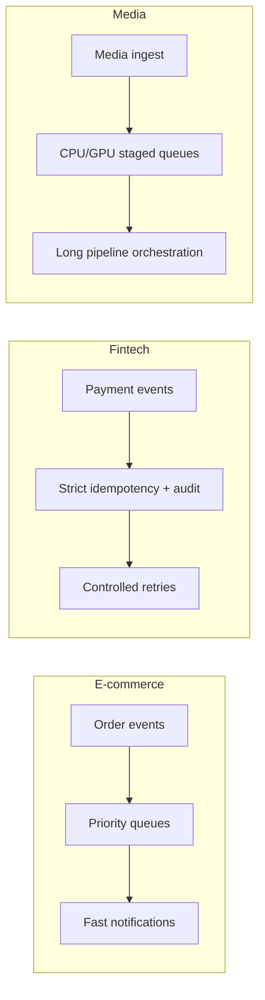

[← Назад к индексу части](index.md)
[↑ К глобальному плану](../mastery_plan.md)

## 34.5 Отраслевые сценарии

### Цель раздела

Показать, как одна и та же технология (Celery) меняет акценты в зависимости от домена: e-commerce, fintech, media.

### В этом разделе главное

- Домен определяет приоритеты: скорость, auditability, длительность pipeline.
- Нельзя переносить настройки "как есть" между индустриями.
- В каждой отрасли свои "критичные отказы" и cost drivers.

### Теория и правила

#### E-commerce

- приоритет: быстрый отклик и устойчивость заказов/уведомлений;
- важны bursts (распродажи), дедупликация и graceful degradation;
- cost-risk: переобработка заказов при дублях.

**Практический контур:**  
`checkout -> payment auth -> order finalize -> inventory reserve -> notifications`.  
Если шаг `inventory reserve` не идемпотентен, повтор задачи может "съесть" остатки дважды.

#### Fintech

- приоритет: идемпотентность, аудит, воспроизводимость;
- retries должны быть строго управляемы и классифицированы;
- cost-risk: дорогие инциденты из-за неверных повторов и конфликтов состояния.

**Практический контур:**  
`payment intent -> anti-fraud -> ledger posting -> settlement notification`.  
Здесь критично разделять "технический retry" и "бизнес-повтор операции" — это не одно и то же.

#### Media

- приоритет: длинные тяжелые пайплайны (транскодинг, пост-обработка);
- важно разделение очередей по профилю ресурса (CPU/GPU/I/O);
- cost-risk: перерасход compute и storage при плохой оркестрации.

**Практический контур:**  
`ingest -> transcode profiles -> thumbnails -> moderation -> CDN publish`.  
Если не ограничить конкурентность GPU-этапов, "узкое место" блокирует весь конвейер.

### Пошагово: адаптация архитектуры под домен

1. Определи "бизнес-критичный failure mode" домена.
2. Свяжи его с техническими механизмами Celery (retries, routing, priorities, DLQ-паттерны брокера).
3. Зафиксируй доменный SLO и error budget.
4. Настрой cost-мониторинг на доменные метрики.
5. Проведи game day по сценарию наиболее вероятного отказа.

### Сравнительная таблица

| Домен | Главный риск | Ключевая защита | Что мониторить первым |
|---|---|---|---|
| E-commerce | дубли заказов/уведомлений | идемпотентные ключи, очереди по приоритету | lag критичных очередей |
| Fintech | некорректные повторы платежей | строгий контракт + audit trail | доля retry по классам ошибок |
| Media | перегрузка compute/storage | пулы по профилю задач + backpressure | runtime, queue depth, cost/GB |

### Визуальная карта трех доменов

### Простыми словами

Celery — как один и тот же инструментальный набор. В e-commerce им "чинят скорость и всплески", в fintech — "точность и подотчетность", в media — "длинные тяжелые конвейеры". Инструмент один, правила применения разные.

### Типичные ошибки

- переносить универсальные таймауты и retries между доменами;
- не учитывать бизнес-цену конкретного типа ошибки;
- измерять только технические метрики без доменных KPI.

### Что будет если...

- ...применить e-commerce retry-policy к fintech?  
  Можно получить неконтролируемые повторы критичных операций и аудитные нарушения.

- ...в media не отделить storage-cost от compute-cost?  
  Оптимизация пойдет не туда: команда снизит CPU, но общий счет продолжит расти из-за хранения промежуточных артефактов.

- ...в e-commerce не разделить очереди на критичные и фоновые?  
  В пике второстепенные задачи (например, массовые уведомления) могут вытеснить критичные шаги checkout-процесса.

### Проверь себя

1. Почему в fintech retry-policy обычно строже, чем в e-commerce?
2. Что произойдет в media-контуре, если не разделить очереди по ресурсному профилю?

Ответ

1) Потому что цена ошибки выше: повтор может затронуть финансовые инварианты и аудит.  
2) Тяжелые задачи вытеснят легкие, вырастет latency, ухудшится предсказуемость и стоимость.

### Запомните

Архитектура Celery всегда доменно-зависима: одинаковые механизмы, разные приоритеты и ограничения.

---
