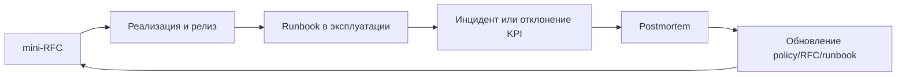

[← Назад к индексу части](index.md)
[↑ К глобальному плану](../../mastery_plan.md)

## Практические шаблоны артефактов

Этот блок нужен как "операционный комплект": чтобы читатель мог не только понимать тему, но и сразу применить ее в команде.

### Шаблон 1: mini-RFC на новую очередь

```text
Название очереди:
Владелец (owner):
Связанные задачи:
Бизнес-цель:
SLO/SLA:
Ожидаемая нагрузка (avg/peak):
Retry policy и ограничения:
Риски (технические/экономические):
План observability:
План rollback/deprecation:
```

#### Проверь себя: mini-RFC

1. Какое поле mini-RFC чаще всего пропускают, из-за чего потом возникают инциденты?
2. Почему в mini-RFC нужно одновременно фиксировать и SLO, и rollback plan?

<details><summary>Ответ</summary>

1) Чаще всего пропускают owner/capacity impact: без них непонятно, кто отвечает и как решение повлияет на соседние очереди.  
2) SLO задает цель, rollback-plan — безопасный выход, если цель нарушается после релиза.

</details>

### Шаблон 2: runbook для on-call

```text
Симптом:
1) Какие метрики смотреть первыми
2) Какие команды/действия безопасны сразу
3) Что нельзя делать (чтобы не расширить blast radius)
4) Критерий эскалации на L2/L3
5) Критерий восстановления
6) Какие данные приложить в postmortem
```

#### Проверь себя: runbook

1. Зачем в runbook явно писать "что нельзя делать"?
2. Почему критерий восстановления должен быть измеримым, а не "вроде стало лучше"?

<details><summary>Ответ</summary>

1) В стрессовой ситуации именно запрет на опасные действия часто спасает от расширения blast radius.  
2) Иначе команда преждевременно закрывает инцидент и получает повторную деградацию.

</details>

### Шаблон 3: postmortem для cost/надежности инцидента

```text
Что произошло:
Какие SLO/KPI пострадали:
Root cause (тех + процесс):
Почему не сработали ранние сигналы:
Сколько стоил инцидент (примерно):
Краткосрочные действия:
Долгосрочные действия:
Ответственные и сроки:
```

#### Проверь себя: postmortem

1. Почему в postmortem нужно фиксировать и техническую, и процессную root cause?
2. Что дает поле "стоимость инцидента", кроме финансовой отчетности?

<details><summary>Ответ</summary>

1) Инциденты почти всегда системные: техническая ошибка усиливается процессным пробелом (ownership, review, runbook).  
2) Позволяет приоритизировать улучшения по реальному impact, а не по громкости обсуждения.

</details>

### Визуальная карта "артефакты -> цикл улучшения"



### Проверь себя

1. Почему одного RFC недостаточно без runbook и postmortem-практики?
2. Какой минимальный артефакт обязателен даже для маленькой команды?

<details><summary>Ответ</summary>

1) RFC описывает дизайн, но не покрывает оперативную реакцию и извлечение уроков после инцидента. Нужен полный цикл: проектирование -> эксплуатация -> улучшение.  
2) Минимум — явный owner + короткий runbook. Иначе даже простые сбои восстанавливаются слишком долго.

</details>

---
