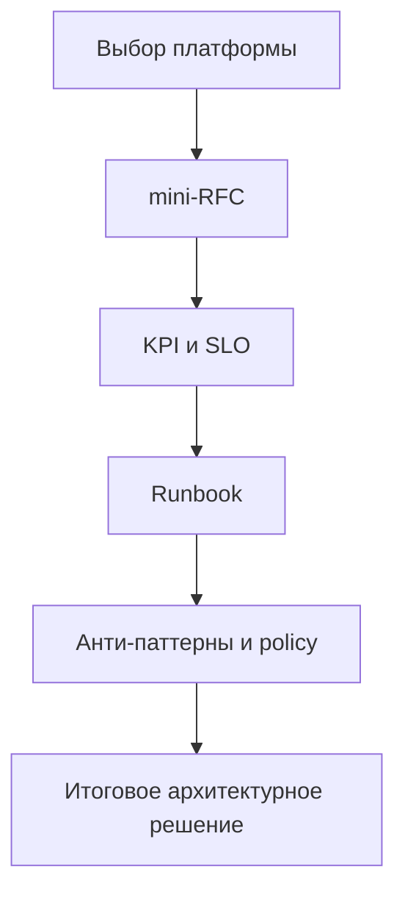

[← Назад к индексу части](index.md)
[↑ К глобальному плану](../../mastery_plan.md)

## Мини-лаба по части 34 (закрепление)

Цель: пройти полный цикл инженерного решения за 30-45 минут — от выбора платформы до процесса эксплуатации.

### Исходный сценарий

У тебя сервис отправки уведомлений:
- 2 млн задач в сутки;
- сильные пики вечером (x4 к среднему);
- часть задач критична (подтверждения операций), часть нет (маркетинговые рассылки);
- команда из 5 backend-инженеров и 1 SRE.

### Шаги мини-лабы

1. Выбери архитектурный вариант:
   - `Celery на K8s`,
   - `managed queue + serverless`,
   - или гибрид.
2. Заполни `mini-RFC` (из раздела шаблонов) на новую критичную очередь.
3. Определи 5 KPI:
   - `success rate`,
   - `p95 completion time`,
   - `queue lag`,
   - `retry ratio`,
   - `cost per successful task`.
4. Составь краткий runbook "рост очереди + деградация downstream API".
5. Сформулируй 3 анти-паттерна, которых команда обязуется избегать.

### Критерии "лаба выполнена"

- есть явный owner и escalation path;
- есть policy для новых очередей и beat-задач;
- есть baseline по стоимости и план ежемесячного пересмотра;
- есть аргументированное решение по платформе с учетом пиков.

#### Проверь себя: критерии мини-лабы

1. Почему наличие KPI без owner не считается завершением лабы?
2. Как понять, что решение по платформе "аргументированное", а не интуитивное?

Ответ

1) KPI без владельца не превращаются в действие: некому реагировать на отклонения и улучшать систему.  
2) Есть сравнение альтернатив по SLA/рискам/cost и зафиксирован срок пересмотра решения.

### Визуальная карта мини-лабы

---
