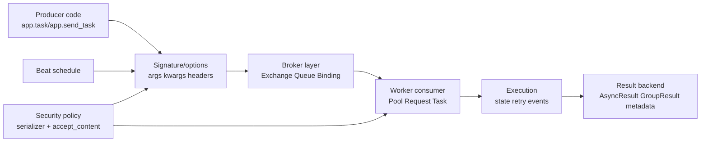

[← Назад к индексу части](index.md)
[↑ К глобальному плану](../mastery_plan.md)

## Сквозная карта микро-сущностей в потоке задачи

Простая интерпретация схемы:

- **слева** мы формируем задание (`Task` + `Signature`);
- **в центре** брокер решает, куда это сообщение попадет;
- **справа** worker исполняет и публикует состояние/результат;
- `beat` периодически генерирует новые вызовы;
- политика безопасности ограничивает допустимые форматы и payload.

#### Проверь себя: сквозная карта

1. Почему политика безопасности в схеме влияет сразу на две точки потока?

Ответ

Формат и допустимость контента проверяются и при публикации, и при приеме/десериализации. Ошибка на любом конце рвет целостность потока.

2. Какой переход в схеме чаще всего объясняет симптом "задача отправлена, но не выполняется"?

Ответ

Переход между broker layer и worker consumer: routing, подписка на очередь, transport-параметры и доступность consumer-ов.

---
