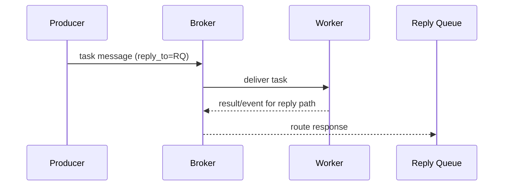

[← Назад к индексу части](index.md)
[↑ К глобальному плану](../mastery_plan.md)

## 35.1 Приложение и задачи

### Цель раздела

Понять базовые микро-сущности прикладного уровня Celery: что такое `app`, `Task`, `Request`, `Signature`, `AsyncResult`, какие у них ключевые поля и как они связаны.

### В этом разделе главное

- `Celery app` — корень конфигурации и реестра задач.
- `Task` — не просто функция, а объект с политиками исполнения.
- `Request` — "паспорт" текущего выполнения.
- `Signature` — переносимое описание вызова задачи.
- Идентификаторы (`task_id`, `root_id`, `parent_id`, `group_id`, `correlation_id`) — основа трассировки.

### Термины

| Термин | Точная формулировка | Простыми словами |
|---|---|---|
| `Celery` / `app` | Экземпляр класса приложения Celery с конфигурацией и task registry | "Ядро" вашего task-рантайма |
| `main` / точка входа | Строковый идентификатор приложения и import-root | "Имя приложения и корневой модуль, откуда стартует регистрация задач" |
| `current_app` | Текущий активный app в контексте выполнения | Глобальная "ссылка по умолчанию" |
| `shared_task` | Декоратор для объявления задач без жесткой привязки к конкретному app | Удобно для reusable модулей |
| `@app.task` | Декоратор, превращающий функцию в Celery Task | Точка объявления поведения задачи |
| `Task` | Класс задачи с lifecycle hooks и политиками | "Контейнер правил" для функции |
| `Request` | Контекст текущего task invocation | Все runtime-данные текущего запуска |
| `Context` | Локальный runtime-контейнер связанного контекста внутри Task | "Служебный каркас текущего исполнения" |
| `AsyncResult` | API для чтения состояния/результата задачи по id | "Пульт проверки статуса" |
| `EagerResult` | Result-объект в eager-режиме (без реального брокера/worker) | "Результат в тестовом синхронном режиме" |
| `ResultSet` / `GroupResult` | Коллекция результатов нескольких задач / специализированная группа | "Управление многими результатами как одним набором" |
| `Signature` / `s()` / `si()` | Иммутабельное/мутабельное описание вызова задачи | "Черновик вызова" для workflow |

### Теория и правила

#### 1) `app` как граница конфигурации

Интуиция: у Celery должен быть "центр управления", где известны:

- список задач;
- параметры брокера и backend;
- default policy (serializer, retry defaults и т.п.).

Формально: `Celery(...)` создает объект приложения, который владеет registry задач и конфигурацией.

Практическое правило:

- в одном сервисе держи **один главный app**;
- `shared_task` используй там, где модуль должен работать с разными app (часто в Django reusable apps).

Отдельно про `main` (точку входа):

- это "имя" вашего app-контекста и import корня;
- от него зависит удобство диагностики (`app.main` видно в ряде мест) и предсказуемость autodiscovery;
- в больших монорепозиториях полезно явно фиксировать один canonical entrypoint, чтобы не получать несколько конкурирующих app-инстансов.

##### Вопросы к подпункту 1

1. Почему в одном сервисе опасно держать несколько конкурирующих `Celery app` без явной необходимости?

<details><summary>Ответ</summary>

Появляется рассинхронизация конфигурации и реестра задач: часть задач регистрируется в одном app, часть — в другом, диагностика становится непредсказуемой, а worker может подняться "не в том" контексте.

</details>

2. Как `main` влияет на эксплуатацию, если "вроде всё работает"?

<details><summary>Ответ</summary>

Даже при рабочем запуске `main` важен для читаемости диагностики и стабильности autodiscovery. Непоследовательный entrypoint часто всплывает уже в инцидентах или после рефакторинга.

</details>

#### 2) `@app.task` и важные параметры декоратора

Мини-словарь параметров из плана:

- `bind=True` — передает `self` (Task instance) первым аргументом;
- `base=...` — кастомный базовый класс задачи;
- `name=...` — явное имя задачи (важно для стабильности контрактов);
- `serializer=...` — serializer конкретной задачи;
- `autoretry_for=(...)` — исключения, при которых retry делается автоматически;
- `retry_backoff=True|N` — экспоненциальный backoff;
- `retry_jitter=True` — случайный разброс, чтобы не было retry-шторма;
- `acks_late=True` — ack после выполнения (важно для надежности и дублей);
- `reject_on_worker_lost=True` — при потере worker сообщение возвращается/переобрабатывается;
- `track_started=True` — фиксировать `STARTED` состояние;
- `ignore_result=True` — не хранить результат;
- `time_limit` / `soft_time_limit` — жесткий/мягкий лимит выполнения;
- `rate_limit="10/m"` — ограничение скорости запуска задач этого типа.

Правило "безопасного старта":

1. Явно задай `name`.
2. Если есть внешние side-effects, продумай идемпотентность до включения `acks_late`.
3. Для сетевых задач добавляй `autoretry_for + backoff + jitter`.
4. Не включай `ignore_result=False` автоматически для всего — это бьет по backend storage.

##### Вопросы к подпункту 2

1. Почему `acks_late=True` нельзя включать "по привычке" без проверки идемпотентности?

<details><summary>Ответ</summary>

Потому что при падении worker задача может быть выполнена повторно. Без идемпотентности это приводит к повторным побочным эффектам (двойные списания, дубли уведомлений).

</details>

2. В каком случае `autoretry_for + backoff + jitter` особенно полезны?

<details><summary>Ответ</summary>

При transient-сбоях внешних зависимостей. Backoff и jitter снижают риск синхронного retry-шторма и уменьшают давление на нестабильный downstream.

</details>

#### 3) `Task`, `Request`, `Context`

Когда `bind=True`, в `self.request` обычно доступны:

- `id` (task_id);
- `root_id`, `parent_id`, `group`;
- `retries`;
- `eta`, `expires`;
- `headers`, `delivery_info`;
- `hostname` worker-а.

Простыми словами: `request` — это "конверт и служебная записка" текущего запуска, а не бизнес-данные.

##### Вопросы к подпункту 3

1. Почему не стоит передавать бизнес-решения через поля `self.request`?

<details><summary>Ответ</summary>

`request` — runtime-контекст доставки/исполнения, а не источник доменной истины. Бизнес-данные должны быть в аргументах задачи или в устойчивом хранилище.

</details>

2. Как `retries` в `self.request` помогает в продакшн-диагностике?

<details><summary>Ответ</summary>

Показывает, на какой попытке задача находится. Это помогает отличить единичный сбой от системной нестабильности и корректно оценить поведение retry-политики.

</details>

#### 4) `Signature` и семейство вызовов

- `task.s(a, b)` — обычная signature (может принимать доп. args в chain);
- `task.si(a, b)` — immutable signature (защищена от "подмешивания" аргументов в композиции);
- `.set(...)` — добавить execution options (queue, countdown, headers и т.д.);
- `.clone(...)` — копия с частичным изменением;
- `link` / `link_error` — callback и errback.

Микрословарь внутренних полей signature:

- `args` — позиционные аргументы вызова задачи;
- `kwargs` — именованные аргументы;
- `options` — служебные execution-параметры (`queue`, `priority`, `eta`, `countdown`, `expires`);
- `immutable=True` — запрет на неявное добавление аргументов сверху (эквивалентно идее `si()` для практики композиции).

Практическая подсказка: если ловите "странные лишние аргументы" в callback-ах, первым делом проверяйте, где signature не была сделана immutable.

##### Вопросы к подпункту 4

1. В чем практическая разница между `s()` и `si()` в цепочках?

<details><summary>Ответ</summary>

`s()` допускает подмешивание аргументов из предыдущих шагов композиции, а `si()` фиксирует сигнатуру и защищает от неявных аргументов.

</details>

2. Когда `options` в signature важнее, чем сами `args/kwargs`?

<details><summary>Ответ</summary>

Когда нужно управлять исполнением: очередь, приоритет, ETA, expires. Ошибка в `options` может сломать доставку/порядок даже при корректных бизнес-аргументах.

</details>

#### 5) Идентификаторы и трассировка

- `task_id` — id конкретной задачи;
- `root_id` — id корневого вызова workflow;
- `parent_id` — родитель в цепочке;
- `group_id` — группа в `group/chord`;
- `correlation_id` — корреляционный id на message-протокольном уровне (может быть унаследован из внешней системы).

Правило: в логировании всегда полезно писать минимум `task_id`, `root_id` и бизнес-ключ (например, `order_id`), чтобы связывать шаги across services.

##### Вопросы к подпункту 5

1. Почему одного `task_id` обычно недостаточно для расследования сложного workflow?

<details><summary>Ответ</summary>

`task_id` описывает один шаг. Для сквозной картины нужен `root_id` (и часто `group_id`), чтобы связать дочерние задачи в единый процесс.

</details>

2. Что дает `correlation_id` в гетерогенной системе (несколько сервисов/протоколов)?

<details><summary>Ответ</summary>

Он связывает событие Celery с внешними каналами/сервисами и помогает делать end-to-end корреляцию за пределами одного worker-кластера.

</details>

#### 6) Заголовки и delivery-поля сообщения

Кроме id-полей, в сообщении полезно понимать:

- `headers` — произвольные метаданные (tenant, trace tags, version hints);
- `reply_to` — адрес обратного канала/ответа (актуально для request/reply паттернов);
- `delivery_mode` — режим доставки (обычно persistent/transient семантика);
- `priority` — приоритет обработки (работает в рамках возможностей конкретного брокера).

Практический принцип: в `headers` передаем только компактные управленческие метаданные, а не большие бизнес-объекты.

Мини-таблица "когда какое поле особенно полезно":

| Поле | Когда применять | На что смотреть в эксплуатации |
|---|---|---|
| `headers` | multi-tenant, trace-корреляция, version hints | не раздувать cardinality и размер сообщения |
| `reply_to` | request/reply паттерны и callback-routing | валидность reply queue и timeout ответа |
| `delivery_mode` | контроль "надежность vs скорость" для сообщений | согласованность с durable-настройками брокера |
| `priority` | смешанные workload (критичные и фоновые задачи) | справедливость, starvation низких приоритетов |

Наглядный мини-сценарий с `reply_to`:



##### Вопросы к подпункту 6

1. Почему опасно хранить крупные бизнес-объекты в `headers`?

<details><summary>Ответ</summary>

Растет размер сообщения, ухудшается производительность и observability-стоимость, а также смешиваются транспортные метаданные и бизнес-смысл.

</details>

2. Как связаны `delivery_mode` и durable-настройки брокера?

<details><summary>Ответ</summary>

Надежная доставка требует согласованности на нескольких уровнях. Если очередь durable, а публикация/режим доставки настроены несогласованно, ожидания по устойчивости могут не выполниться.

</details>

#### 7) `EagerResult` и границы тестового режима

`EagerResult` появляется, когда включен eager-режим (`task_always_eager=True`): задача выполняется синхронно в том же процессе.

Полезно:

- для юнит-тестов бизнес-логики задачи;
- для быстрой локальной отладки.

Ограничение:

- eager-режим не воспроизводит реальные условия брокера, конкурентности и доставки, поэтому для production-поведения нужны интеграционные тесты с настоящим worker/broker.

##### Вопросы к подпункту 7

1. Когда `EagerResult` полезен, несмотря на ограничения?

<details><summary>Ответ</summary>

Для быстрых юнит-проверок бизнес-логики задачи и локальной разработки, когда нужно проверить корректность кода без поднятия полного асинхронного контура.

</details>

2. Какой тип регрессии чаще всего ускользает при ставке только на eager-тесты?

<details><summary>Ответ</summary>

Проблемы доставки, маршрутизации, конкуренции и retry-поведения, которые проявляются только в реальном broker/worker окружении.

</details>

#### 8) Частая путаница в терминах прикладного слоя

| Пара терминов | В чем различие | Практический риск, если перепутать |
|---|---|---|
| `Task` vs `Signature` | `Task` задает поведение, `Signature` — конкретный вызов с аргументами/опциями | неправильная композиция и неожиданные параметры в workflow |
| `AsyncResult` vs `EagerResult` | `AsyncResult` отражает асинхронный реальный путь через брокер/worker, `EagerResult` — локальный синхронный тестовый результат | ложное чувство, что "в проде будет так же" |
| `request.id` vs `root_id` | `id` — конкретный запуск, `root_id` — общий корень цепочки | потеря сквозной трассировки в сложных цепочках |
| `headers` vs `kwargs` | `headers` — служебные метаданные доставки, `kwargs` — бизнес-аргументы задачи | утечки payload в метаданные или смешение транспортной/бизнес-логики |

##### Вопросы к подпункту 8

1. Почему путаница `Task` vs `Signature` особенно опасна в Canvas?

<details><summary>Ответ</summary>

Можно ошибочно проектировать workflow на уровне "шаблона задачи", а не конкретного вызова, что приводит к неверным аргументам и ломает оркестрацию.

</details>

2. Как practically проверить, что команда не путает `headers` и `kwargs`?

<details><summary>Ответ</summary>

Через ревью и контракт payload: бизнес-данные должны быть в `kwargs`/body, а `headers` — только для служебной метаинформации (trace, tenant, version hints).

</details>

### Пошагово: как стабильно объявлять задачу

1. Определи стабильное имя задачи (`name="billing.charge_card"`).
2. Явно опиши retry-policy (`autoretry_for`, backoff, jitter, max retries).
3. Ограничь ресурсы (`time_limit`, `soft_time_limit`, `rate_limit` по необходимости).
4. Реши, нужен ли результат (`ignore_result`).
5. Добавь структурированное логирование с id из `self.request`.
6. Для workflow используй `signature` и не передавай "сырой callable".

### Простыми словами

`Task` — это как "должностная инструкция", `Signature` — как "заполненный бланк заявки", `Request` — как "текущая карточка исполнения", а `AsyncResult` — как "окно статуса по номеру заявки".

### Картинка в голове

```text
[Task template] + [Signature call data] -> [Broker message] -> [Worker executes with Request]
                                                               -> [Result tracked by AsyncResult]
```

### Как запомнить

Формула:

`Task = что делать`  
`Signature = с какими аргументами и опциями`  
`Request = что происходит прямо сейчас`  
`AsyncResult = что уже произошло`

### Примеры

```python
from celery import Celery

app = Celery("billing")

@app.task(
    bind=True,
    name="billing.charge_card",
    autoretry_for=(ConnectionError, TimeoutError),
    retry_backoff=True,
    retry_jitter=True,
    acks_late=True,
    reject_on_worker_lost=True,
    track_started=True,
    time_limit=30,
    soft_time_limit=25,
)
def charge_card(self, payment_id: str) -> dict:
    app.log.get_default_logger().info(
        "charging payment",
        extra={
            "task_id": self.request.id,
            "root_id": self.request.root_id,
            "retries": self.request.retries,
            "payment_id": payment_id,
        },
    )
    return {"payment_id": payment_id, "status": "charged"}
```

```python
# Signature usage
sig = charge_card.s("pay_123").set(queue="payments", priority=7)
result = sig.apply_async(headers={"tenant_id": "acme"})
print(result.id)  # task_id
```

```python
# EagerResult example (только для controlled testing)
app.conf.task_always_eager = True
r = charge_card.delay("pay_999")
print(type(r).__name__)  # EagerResult
print(r.successful(), r.result)
```

### Практика / реальные сценарии

1. **Incident review:** в логах есть ошибка, но без `root_id` непонятно, из какого workflow задача.
2. **Migration:** переименование задачи без стабильного `name` ломает совместимость со старыми producer-ами.
3. **Scale:** массовые retry без jitter создают синхронные пики.

### Типичные ошибки

- смешивать `Task`-параметры и runtime-опции вызова;
- хранить в `headers` большие payload (лучше хранить id и получать данные из хранилища);
- путать `si()` и `s()` в цепочках, получая неожиданные аргументы;
- полагаться только на `task_id`, игнорируя `root_id` при распределенной трассировке.

### Что будет, если...

- **...не задавать `name` явно:** при рефакторинге импортного пути имя задачи меняется, старые сообщения/вызовы ломаются.
- **...использовать `ignore_result=False` везде:** backend растет, latency чтения результатов увеличивается, стоимость хранения растет.
- **...включить `acks_late`, но не сделать задачу идемпотентной:** при падении worker-а возможны дубль-эффекты (двойные списания, повторные письма).

### Проверь себя

1. Когда лучше выбрать `si()` вместо `s()`?

<details><summary>Ответ</summary>

Когда нужно запретить неявное добавление аргументов (например, в chain/chord callback), чтобы сигнатура осталась неизменной.

</details>

2. Зачем одновременно логировать `task_id` и `root_id`?

<details><summary>Ответ</summary>

`task_id` идентифицирует конкретный шаг, а `root_id` связывает все дочерние задачи в единый workflow для end-to-end анализа.

</details>

3. В чем практическая разница между `autoretry_for` и ручным `self.retry(...)`?

<details><summary>Ответ</summary>

`autoretry_for` удобно для типовых transient-ошибок и снижает шаблонный код; `self.retry(...)` дает более тонкий контроль (условия, динамические delay, custom обработка).

</details>

### Запомните

- `Task` — это политика + код, не просто функция.
- `Request` — источник правды о текущем выполнении.
- `Signature` — строительный блок orchestration.
- Идентификаторы — фундамент трассировки и диагностики.

---
