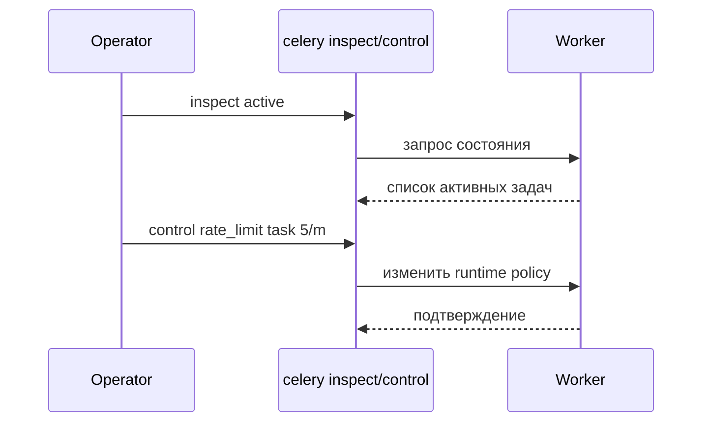

[← Назад к индексу части](index.md)
[↑ К глобальному плану](../celery_mastery_plan.md)

## 35.3 Worker и исполнение

### Цель раздела

Зафиксировать словарь исполнения задач на стороне worker-а: внутренние компоненты, модели пула и команды управления/диагностики.

### В этом разделе главное

- `Worker` — процесс(ы), исполняющие задачи.
- `Pool` определяет конкурентную модель и ограничения.
- `inspect` — чтение состояния, `control` — изменение поведения.
- `Bootstep`, `Timer`, `Hub`, `state` важны для внутренней диагностики.

### Термины

| Термин | Что это | Простыми словами |
|---|---|---|
| `Worker` | Узел исполнения задач Celery | "Исполнитель" |
| `Pool` | Подсистема параллелизма worker-а | Механизм, как много задач выполняется одновременно |
| `prefork` | Мультипроцессный пул | Надежный стандарт для CPU/изоляции |
| `threads` | Потоки внутри процесса | Подходит для I/O, но с ограничениями GIL |
| `gevent/eventlet` | Кооперативная concurrency | Эффективно для I/O при корректной monkey-patching |
| `solo` | Один процесс, одна задача | Удобно для отладки |
| `Bootstep` | Модуль расширения жизненного цикла worker-а | "Плагин шага загрузки" |
| `Timer` | Подсистема таймеров и отложенных событий в worker-е | "Внутренние часы worker-а" |
| `Hub` | Event-loop/координатор I/O событий (особенно в async пулах) | "Диспетчер событий worker-а" |
| `state` | Runtime-состояние worker-а и задач | "Оперативная карта происходящего" |
| `inspect` | API наблюдения состояния worker-ов | Команды "покажи текущее состояние" |
| `control` | API управления worker-ами | Команды "измени поведение сейчас" |

### Теория и правила

#### 1) `inspect` команды из плана

Ключевые имена:

- `active`, `reserved`, `scheduled`;
- `stats`, `registered`, `active_queues`, `conf`;
- `ping`, `revoked`, `report`.

Модель чтения:

- `active` — что исполняется прямо сейчас;
- `reserved` — что уже получено worker-ом, но еще не стартовало;
- `scheduled` — отложенные;
- `stats` — технические счетчики и ресурсы;
- `revoked` — отозванные id.

Практическая шпаргалка по `inspect`:

| Команда | Что показывает | Когда запускать первой |
|---|---|---|
| `ping` | жив ли worker и отвечает ли control-plane | "ничего не работает" и нужно быстро проверить доступность |
| `active` | задачи, исполняющиеся сейчас | высокая latency, подозрение на "зависшие" задачи |
| `reserved` | уже полученные, но не стартовавшие задачи | backlog и нехватка concurrency |
| `scheduled` | ETA/countdown задачи в ожидании | проверка задержек отложенных запусков |
| `active_queues` | какие очереди реально слушает worker | задачи "не берутся" из нужной очереди |
| `registered` | какие task names зарегистрированы | проверка deploy/импорта задач |
| `conf` | часть runtime-конфигурации worker-а | верификация окружения после релиза |
| `stats` | ресурсы, счетчики пула, uptime | профилирование и инциденты производительности |
| `revoked` | список отозванных task id | анализ отмен/операционных вмешательств |
| `report` | агрегированный диагностический отчет | postmortem и передача данных в support/runbook |

##### Вопросы к подпункту 35.3.1

1. В какой последовательности разумно запускать `inspect`, если "всё стоит"?

<details><summary>Ответ</summary>

Сначала `ping` (живость), затем `active/reserved/scheduled` (фаза задержки), потом `active_queues/registered/conf` (корректность подписки и окружения), далее `stats/report`.

</details>

2. Почему `registered` полезен после релиза?

<details><summary>Ответ</summary>

Показывает, что нужные task names действительно загружены worker-ом. Это быстрый способ выявить проблемы импорта/упаковки/entrypoint.

</details>

#### 2) `control` команды из плана

- `shutdown`;
- `pool_restart`, `pool_grow`, `pool_shrink`;
- `rate_limit`, `time_limit`;
- `add_consumer`, `cancel_consumer`;
- `enable_events`, `disable_events`, `heartbeat`.

Важно: `control` — операционный рычаг, но не замена постоянной конфигурации и деплоя.

Практическая шпаргалка по `control`:

| Команда | Что делает | Основной риск |
|---|---|---|
| `shutdown` | останавливает worker | потеря in-flight контекста при неверной процедуре остановки |
| `pool_restart` | перезапускает pool-процессы | кратковременный провал throughput |
| `pool_grow` / `pool_shrink` | меняет размер пула на лету | переаллоцирование ресурсов без capacity-плана |
| `rate_limit` | ограничивает скорость задачи | скрытое наращивание backlog при слишком жестком лимите |
| `time_limit` | меняет лимиты времени задач | ложные таймауты для длинных легитимных задач |
| `add_consumer` / `cancel_consumer` | подписка/отписка от очереди | случайная потеря обработки части трафика |
| `enable_events` / `disable_events` | включает/выключает поток событий | либо слепая зона, либо лишняя observability-нагрузка |
| `heartbeat` | принудительный heartbeat | не решает корневую причину сетевой деградации |

##### Вопросы к подпункту 35.3.2

1. Почему частое использование `pool_restart` может усугубить инцидент?

<details><summary>Ответ</summary>

Дает временный эффект, но добавляет турбулентность по throughput и может нарастить backlog, если корневая причина не устранена.

</details>

2. Когда `add_consumer/cancel_consumer` опасны без change-контекста?

<details><summary>Ответ</summary>

Можно случайно увести обработку из важной очереди или создать дисбаланс нагрузки. Эти команды требуют явного понимания topology и rollback-плана.

</details>

#### 3) Выбор пула

Базовые ориентиры:

- `prefork` — самый предсказуемый default для mixed workload;
- `threads` — чаще для I/O bound, учитывая GIL;
- `gevent/eventlet` — только если команда понимает экосистемные ограничения;
- `solo` — для debugging и узких задач.

Пул `custom`:

- используют редко, когда нужна специализированная модель исполнения;
- требует высокой зрелости команды, потому что усложняет диагностику, совместимость и апгрейды.

##### Вопросы к подпункту 35.3.3

1. Почему `prefork` часто остается безопасным default?

<details><summary>Ответ</summary>

Он обычно предсказуем по поведению и изоляции процессов, особенно для mixed workload, и лучше изучен в продакшн-практике.

</details>

2. Как понять, что выбор пула сделан "по привычке", а не по профилю нагрузки?

<details><summary>Ответ</summary>

Если нет измерений CPU/I-O профиля, latency/throughput целей и ограничений библиотек, выбор обычно интуитивный и рискованный.

</details>

#### 4) `Timer`, `Hub`, `state` в диагностике

- `Timer` отвечает за отложенные события и частично за поведение scheduled-задач внутри worker-а;
- `Hub` критичен для event-driven I/O (особенно при `gevent/eventlet`);
- `state` — источник текущей оперативной информации о задачах и воркере.

Если эти сущности "сломаны" или перегружены, внешне это выглядит как странные задержки, зависания scheduled/ETA-задач или нестабильные heartbeat.

##### Вопросы к подпункту 35.3.4

1. Почему проблемы `Timer/Hub` сложно заметить без целевого наблюдения?

<details><summary>Ответ</summary>

Они проявляются как "размазанные" симптомы: дрейф ETA, случайные задержки, нестабильные heartbeats. Без фокусной проверки это легко принять за сетевой шум.

</details>

2. Что дает разделение `state` и бизнес-метрик в анализе инцидента?

<details><summary>Ответ</summary>

Позволяет отличить техническую деградацию runtime (очереди, пулы, состояния задач) от доменной проблемы в логике самой задачи.

</details>

### Пошагово: оперативная диагностика worker-а

1. `inspect ping` — проверить живость.
2. `inspect active/reserved/scheduled` — понять фазу накопления.
3. `inspect active_queues` — убедиться, что слушаются нужные очереди.
4. `inspect stats` — проверить ресурсы/пулы.
5. `control rate_limit` или `pool_grow` как временная мера.
6. После инцидента закрепить изменения в коде/конфиге, а не оставить "ручной костыль".

### Простыми словами

`inspect` — это рентген, `control` — это хирургия. Рентген нужен всегда, хирургия — только осознанно и с пониманием последствий.

### Картинка в голове



### Как запомнить

- `inspect` = read-only снимок.
- `control` = runtime мутация.
- `pool` = производственный характер worker-а.

### Примеры

```bash
celery -A proj inspect active
celery -A proj inspect reserved
celery -A proj inspect stats
celery -A proj control rate_limit billing.charge_card 20/m
celery -A proj control add_consumer payments -d celery@worker-1
```

### Практика / реальные сценарии

1. **Backlog растет:** `active` заполнен, `reserved` растет, значит узкое место в исполнении/ресурсах.
2. **Задачи "не берутся":** worker не подписан на нужную очередь (`active_queues`).
3. **Шторм ошибок:** временно ограничиваем `rate_limit`, чтобы разгрузить downstream.

### Типичные ошибки

- выполнять `control shutdown` без graceful-плана;
- лечить архитектурную проблему ручным `pool_grow` навсегда;
- игнорировать разницу `reserved` vs `scheduled`;
- выбирать пул "по привычке", а не по профилю нагрузки.

### Что будет, если...

- **...держать `events` всегда включенными без контроля объема:** растет нагрузка и стоимость observability.
- **...массово использовать `pool_restart` под нагрузкой:** можно получить кратковременный провал throughput и дополнительный backlog.
- **...работать с `gevent` без понимания экосистемы библиотек:** получите скрытые блокировки и нестабильность.

### Проверь себя

1. Чем `active` отличается от `reserved` в операционной диагностике?

<details><summary>Ответ</summary>

`active` — уже исполняемые задачи, `reserved` — уже полученные, но ожидающие старта. Рост `reserved` при стабильном `active` часто указывает на нехватку concurrency.

</details>

2. Почему `control` не должен быть единственным механизмом управления системой?

<details><summary>Ответ</summary>

Потому что это временные runtime-изменения. Устойчивое поведение должно фиксироваться в конфигурации, деплое и архитектуре.

</details>

3. В каком случае `solo` полезен в продакшн-подобной отладке?

<details><summary>Ответ</summary>

Когда нужно воспроизвести сложный баг детерминированно, без влияния параллелизма, чтобы локализовать причину.

</details>

### Запомните

- Worker-словарь нужен для быстрой диагностики.
- `inspect` и `control` дополняют, но не заменяют архитектуру.
- Выбор пула — это инженерный компромисс, а не вкусовщина.

---
