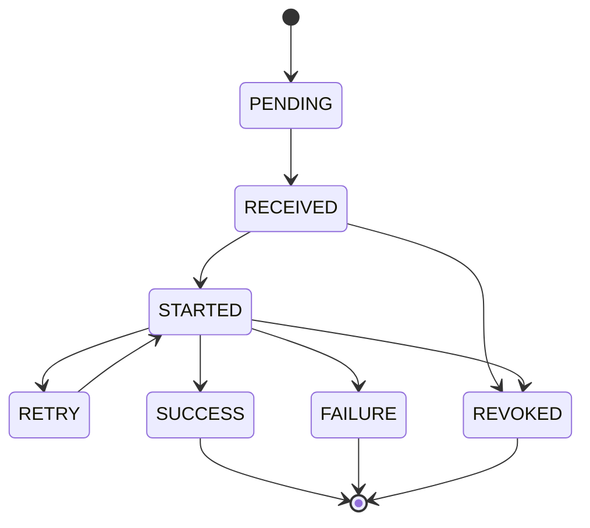

[← Назад к индексу части](index.md)
[↑ К глобальному плану](../celery_mastery_plan.md)

## 35.6 Результаты и бэкенды

### Цель раздела

Собрать микро-сущности result backend: метаданные результата, групповые результаты и практические ограничения хранения.

### В этом разделе главное

- backend хранит не только "return value", но и состояние, traceback, children.
- `result_extended` расширяет метаданные и нагрузку.
- `GroupResult` требует понимания порядка и согласованности.

### Термины

| Термин | Что это | Простыми словами |
|---|---|---|
| `result backend` | Хранилище состояний и результатов задач | "Память о том, что случилось с задачей" |
| `result_extended` | Режим расширенных метаданных результата | Больше информации, выше стоимость |
| `date_done` | Время завершения задачи | Когда задача закончилась |
| `traceback` | Текст стека ошибки | Подробности падения |
| `children` | Дочерние результаты в workflow | Связь задач внутри композиции |
| `ResultSet` | Набор результатов нескольких задач | Коллекция `AsyncResult` |
| `GroupResult` | Специализированный результат для group/chord | Статус группы как единого объекта |

### Теория и правила

#### 1) Когда нужны результаты

Не каждая задача требует долговременного результата.  
Если задача fire-and-forget и бизнесу не нужен ответ, хранение результатов можно минимизировать.

##### Вопросы к подпункту 35.6.1

1. Какой основной критерий решает, хранить результат или нет?

<details><summary>Ответ</summary>

Наличие реальной бизнес- и операционной потребности в последующем чтении результата/статуса этой задачи.

</details>

2. Почему "хранить всё на всякий случай" обычно плохая стратегия?

<details><summary>Ответ</summary>

Рост затрат, замедление backend и усложнение диагностики из-за шумовых данных без полезной ценности.

</details>

#### 2) Метаданные важнее, чем кажется

Поля `date_done`, `traceback`, `children` полезны для:

- incident investigation;
- workflow debugging;
- SLA/SLO анализа времени исполнения.

##### Вопросы к подпункту 35.6.2

1. Зачем `date_done` и `traceback`, если есть общие логи системы?

<details><summary>Ответ</summary>

Они привязаны к конкретной задаче и доступны через result API, что ускоряет адресное расследование и уменьшает поиск по разрозненным логам.

</details>

2. Как `children` помогают в разборе сложного workflow?

<details><summary>Ответ</summary>

Позволяют увидеть структуру дочерних шагов и локализовать, на какой ветке композиции возникла проблема.

</details>

#### 3) Порядок в групповых результатах

При работе с `GroupResult` важно явно понимать:

- где критичен порядок результатов;
- как интерпретировать частичный успех;
- как долго хранить group metadata.

##### Вопросы к подпункту 35.6.3

1. Почему "порядок результатов" в `GroupResult` нужно оговаривать заранее?

<details><summary>Ответ</summary>

Иначе downstream-логика может неверно интерпретировать результаты группы, особенно если ожидает позиционную семантику.

</details>

2. Что произойдет, если не продумать политику partial failures?

<details><summary>Ответ</summary>

Система может остаться в неоднозначном состоянии: часть действий выполнена, а агрегирующий шаг не знает, как корректно завершать или компенсировать процесс.

</details>

#### 4) Мини state-модель задачи (для чтения `AsyncResult`)

Чтобы термины `state`, `ready()`, `successful()`, `traceback` воспринимались как единая модель, полезно держать в голове типичный жизненный цикл:



Применение диаграммы в диагностике:

- задача "зависла в `PENDING`" — смотрим публикацию/маршрутизацию;
- часто прыгает `STARTED -> RETRY` — проверяем downstream и retry policy;
- частые `REVOKED` — анализируем операционные команды/политику остановки.

##### Вопросы к подпункту 35.6.4

1. Если задача долго в `PENDING`, какой слой проверять первым и почему?

<details><summary>Ответ</summary>

Слой доставки/маршрутизации (broker/worker subscription), потому что до исполнения задача могла просто не добраться.

</details>

2. Что означает частый цикл `STARTED -> RETRY -> STARTED`?

<details><summary>Ответ</summary>

Скорее всего нестабильна внешняя зависимость или неверна retry-политика; это сигнал проверять downstream и backoff/jitter конфигурацию.

</details>

### Пошагово: безопасная политика результатов

1. Классифицируй задачи: нужен результат / не нужен.
2. Для "не нужен" включай `ignore_result=True` (там, где это оправдано).
3. Для нужных результатов задай retention/cleanup.
4. Добавь метрики объема backend и времени доступа.
5. Для group/chord зафиксируй правила обработки partial failures.

### Простыми словами

Result backend — это журнал выполнений. Если писать туда все подряд и никогда не чистить, журнал превращается в свалку: дорого, медленно и трудно анализировать.

### Картинка в голове

```text
Task execution -> state transitions -> backend record
                               \-> traceback/children/date_done
```

### Как запомнить

`Result` отвечает на вопрос "чем закончилась задача".  
`Metadata` отвечает на вопрос "почему и в каком контексте".

### Примеры

```python
@app.task(name="reports.generate", ignore_result=False, track_started=True)
def generate_report(report_id: str):
    ...

result = generate_report.delay("rpt_77")
print(result.state)
print(result.ready())
if result.failed():
    print(result.traceback)
```

```python
group_res = GroupResult.restore(group_id)
if group_res and group_res.ready():
    values = group_res.get(timeout=30)
```

### Практика / реальные сценарии

1. **Перегрузка Redis backend:** слишком много задач с result + долгий TTL.
2. **Сложный chord-debug:** без `children` и trace metadata трудно понять, какой шаг сломался.
3. **Аудит выполнения:** `date_done` и state history нужны для отчетности.

### Типичные ошибки

- хранить результаты всех задач "на всякий случай";
- не чистить backend;
- считать, что `SUCCESS` всегда означает "бизнес-успех" (иногда это технический успех с некорректным payload);
- игнорировать обработку частичного успеха в группах.

### Что будет, если...

- **...включить `result_extended` без контроля объема:** storage и latency вырастут, особенно на массовых workload.
- **...не хранить traceback для критичных задач:** расследование ошибок затянется и потеряет точность.

### Проверь себя

1. Почему `ignore_result=True` может быть полезным, а не "потерей информации"?

<details><summary>Ответ</summary>

Потому что для fire-and-forget задач бизнес-ценность результата может быть нулевой, а стоимость хранения и чтения — заметной.

</details>

2. Что проверять при работе с `GroupResult` кроме `ready()`?

<details><summary>Ответ</summary>

Наличие частичных ошибок, порядок и полноту результатов, таймауты ожидания и корректность обработки failed элементов.

</details>

3. Зачем `traceback` в backend, если есть обычные логи?

<details><summary>Ответ</summary>

Он связывает стек ошибки непосредственно с состоянием конкретной задачи и доступен через result API, что ускоряет расследование без поиска по разрозненным логам.

</details>

### Запомните

- Храните только полезные результаты.
- Метаданные — часть операционной диагностики.
- Для групп и chord нужна явная политика частичного успеха.

---
