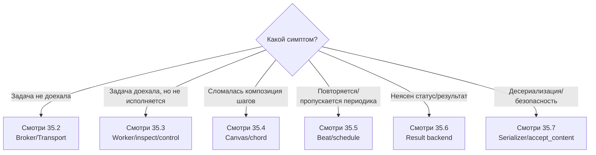

[← Назад к индексу части](index.md)
[↑ К глобальному плану](../celery_mastery_plan.md)

## Справочник по части

| Категория | Что запомнить в первую очередь |
|---|---|
| Приложение и задачи | `Task` + `Request` + `Signature` + id-поля составляют ядро прикладного словаря |
| Брокер и транспорт | `Exchange/Queue/binding` и transport options управляют доставкой, а не бизнес-логикой |
| Worker | `inspect` читает состояние, `control` меняет поведение; это разные классы операций |
| Canvas | `chain/group/chord` отличаются моделью зависимостей и ошибочного поведения |
| Beat | периодика требует single scheduler и идемпотентности |
| Backend | храните только нужные результаты, следите за metadata и retention |
| Сериализация | whitelist (`accept_content`) и безопасные форматы обязательны |

---

### Мини-диаграмма: где искать термин при инциденте

---
