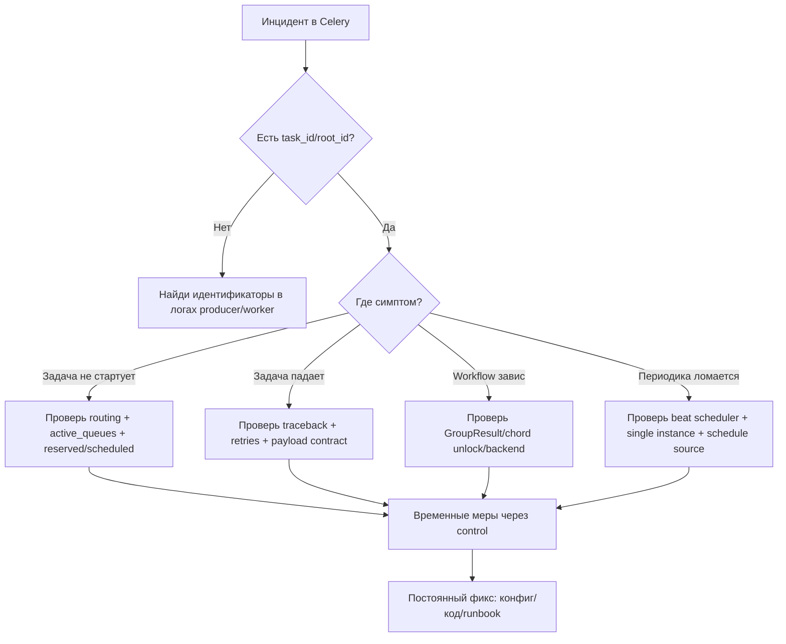

[← Назад к индексу части](index.md)
[↑ К глобальному плану](../../mastery_plan.md)

## Частые сценарии

### Сценарий 1. Новичок в команде не понимает, где искать "идентификатор цепочки"

**Симптом:** в логах много `task_id`, но неясно, какие задачи принадлежат одному бизнес-процессу.  
**Решение:** в логировании стандартизировать `root_id` + `task_id` + бизнес-ключ; объяснить разницу в onboarding-гайде.

### Сценарий 2. Задачи публикуются, но не исполняются

**Симптом:** producer "успешен", но эффекта нет.  
**Пошагово:**

1. `inspect active_queues` — проверяем подписку.
2. Сверяем `task_routes`, queue name, routing key.
3. Проверяем TTL/DLQ и transport ограничения.
4. Проверяем `inspect reserved/scheduled`.

### Сценарий 3. После релиза часть задач начала падать на десериализации

**Симптом:** ошибка распаковки payload/unsupported content type.  
**Решение:** сверить `accept_content`, serializer producer-а, версию контракта payload, rollback/migration plan.

### Сценарий 4. Chord иногда не завершает callback

**Симптом:** header задачи завершились, финальный шаг не стартует.  
**Решение:** проверить backend compatibility, состояния group tasks, таймауты, unlock-механику и partial failures.

---

### Мини-карта диагностики: термин -> где проверять

| Термин/сущность | Где проверять в первую очередь | Что ищем |
|---|---|---|
| `task_id`, `root_id`, `group_id` | structured logs, APM trace attributes, result backend | сквозную связность шагов workflow |
| `Queue` / `routing_key` | `inspect active_queues`, конфиг `task_routes`, broker UI | корректность маршрутизации |
| `reserved` / `scheduled` | `celery inspect reserved/scheduled` | где возникает задержка до старта |
| `registered` | `celery inspect registered` | есть ли нужная задача в реестре worker-а |
| `conf` | `celery inspect conf` | совпадает ли runtime-конфиг с ожиданиями |
| `revoked` | `celery inspect revoked` | не отозваны ли задачи оператором/автоматикой |
| `traceback` | `AsyncResult.traceback`, error logs | первопричину падения |
| `accept_content` / serializer | celery config + producer payload contract | несовместимость форматов и security-риски |
| `beat_schedule` | beat config / DB scheduler records / beat logs | пропуски или дубли периодики |

#### Проверь себя: мини-карта диагностики

1. Почему `inspect conf` и `inspect registered` нельзя считать взаимозаменяемыми?

Ответ

`registered` подтверждает, что задачи загружены в реестр worker-а, а `conf` — что runtime-настройки соответствуют ожиданию. Эти проверки ловят разные классы сбоев.

2. Когда логично смотреть сначала `traceback`, а не routing?

Ответ

Когда задача уже стартует и падает на исполнении. В таком случае слой доставки уже пройден, и первопричина обычно в коде/данных/зависимостях.

---

### Anti-patterns при работе с микро-сущностями

1. **Лечить симптомы только `control`-командами.**  
   Быстро помогает, но без фиксации в конфиге/архитектуре инцидент повторяется.

2. **Считать `SUCCESS` синонимом бизнес-успеха.**  
   Техническое завершение задачи не гарантирует корректный доменный результат.

3. **Передавать "полдоменной модели" в `headers`.**  
   `headers` — для служебной метаинформации, а не для тяжелого payload.

4. **Смешивать `EagerResult`-ожидания с production-поведением.**  
   Eager удобен для юнит-проверок, но не моделирует реальную доставку и конкуренцию.

5. **Слепо повышать `priority` критичным задачам без политики fairness.**  
   Можно "заморозить" низкоприоритетные очереди и накопить технический долг.

6. **Включать широкие `accept_content` "на всякий случай".**  
   Это расширяет поверхность атак и усложняет контроль контрактов.

#### Проверь себя: anti-patterns

1. Как понять, что временная runtime-мера превратилась в anti-pattern?

Ответ

Если команда повторяет одно и то же ручное действие при каждом похожем инциденте и не переводит его в постоянный фикс (конфиг/код/runbook).

2. Почему статус `SUCCESS` нельзя автоматически считать бизнес-успехом?

Ответ

Потому что это технический результат выполнения задачи. Бизнес-логика может завершиться некорректно из-за внешнего состояния или неверных данных, даже при `SUCCESS`.

---

### On-call чеклист по терминам (быстрый запуск диагностики)

Используй этот блок, когда инцидент уже идет и нужно быстро выбрать правильный слой.

1. **Сначала зафиксируй идентификаторы:** `task_id`, `root_id`, при необходимости `group_id`.
2. **Проверь жизнеспособность worker-контура:** `inspect ping`, затем `active`, `reserved`, `scheduled`.
3. **Проверь маршрутизацию:** `active_queues`, `task_routes`, `routing_key`, broker-side bindings.
4. **Проверь реестр и конфиг:** `inspect registered`, `inspect conf`.
5. **Проверь отмены и ручные вмешательства:** `inspect revoked`, history `control`-команд.
6. **Проверь backend-состояния:** `state`, `traceback`, `children`, групповые результаты.
7. **Проверь формат данных:** `task_serializer`, `result_serializer`, `accept_content`, версию payload-контракта.
8. **После стабилизации инцидента:** переведи временные `control`-действия в постоянные изменения кода/конфига/runbook.

#### Проверь себя: on-call чеклист

1. Почему чеклист начинается с идентификаторов, а не с изменения runtime-поведения?

Ответ

Без `task_id/root_id/group_id` трудно локализовать проблему и легко вмешаться в неверный поток задач. Идентификаторы задают точку точной диагностики.

2. Что дает обязательный пост-инцидентный шаг "перевести в постоянный фикс"?

Ответ

Он убирает повторяемость инцидента: временное ручное действие закрепляется в инженерно воспроизводимом решении.

---

### Decision-flow: с чего начать разбор инцидента

#### Проверь себя: decision-flow

1. Почему периодика вынесена в отдельную ветку, а не в "задача не стартует"?

Ответ

У периодики отдельный класс причин: scheduler source, single-beat инвариант, дрейф расписания, состояние beat storage. Это другой диагностический контур.

2. Как схема защищает от бесконечного "операционного тушения"?

Ответ

Финальный шаг flow требует перейти от временной меры к постоянному изменению в коде/конфигурации/runbook.

---
