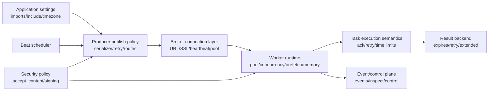

[← Назад к индексу части](index.md)
[↑ К глобальному плану](../../mastery_plan.md)

## Сквозная карта влияния конфигурации

**Простая интерпретация схемы:**

- настройки "в начале" (app/discovery) влияют на то, какие задачи вообще доступны worker-у;
- транспортные параметры формируют, дойдет ли сообщение и как система переживет разрывы;
- worker-параметры определяют latency, fairness и устойчивость к утечкам/падениям;
- result/backend/event слой влияет на наблюдаемость, обратную связь клиенту и восстановление после инцидентов;
- безопасность работает поперек всего потока, а не только в одном модуле.

#### Проверь себя: сквозная карта

1. Почему нельзя отдельно "оптимизировать только worker", игнорируя task/broker policy?

Ответ

Потому что worker исполняет то, что диктуют publish- и delivery-правила. Если publish/retry/ack настроены плохо, быстрый worker может просто быстрее производить дубли, таймауты и перегрузку backend.

2. Где чаще всего возникает ложное чувство "все настроено", хотя риск остается высоким?

Ответ

Когда проверили только успешный happy-path: задача публикуется и выполняется. Но не протестировали reconnect, потерю соединения, redelivery, rollback после частичного побочного эффекта, рост очереди и перегрев result backend.

---
