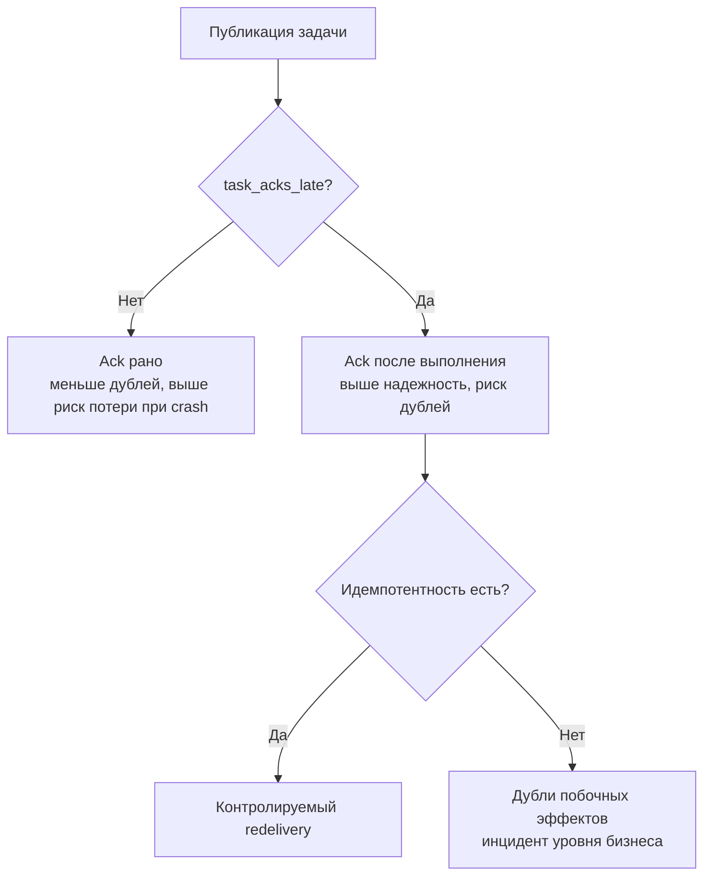

[← Назад к индексу части](index.md)
[↑ К глобальному плану](../celery_mastery_plan.md)

## 36.3 Задачи: дефолты и политика

### Цель раздела

Собрать единую модель task-level настроек: сериализация, доставка, ретраи, лимиты и маршрутизация.

### В этом разделе главное

- это самая "опасная" категория: здесь легко незаметно поменять delivery semantics;
- `task_*` опции нужно рассматривать пакетами, а не по одной;
- policy задач должна зависеть от типа workload, а не быть одинаковой для всех.

### Термины

| Термин | Формально | Простыми словами |
|---|---|---|
| `task_serializer` / `accept_content` | Формат и whitelist допустимого payload | На каком языке сообщения "говорят" и что разрешено |
| `task_acks_late` | Подтверждение после выполнения задачи | Ack только когда работа реально сделана |
| `task_reject_on_worker_lost` | Переотдача задачи при потере worker процесса | Не терять задачу при падении процесса |
| `task_time_limit` / `task_soft_time_limit` | Жесткий/мягкий лимит времени выполнения | Ограничитель "не зависать вечно" |
| `task_publish_retry` | Повтор публикации при сбоях publish | Не терять задачу при кратком сбое отправки |
| `task_routes` / `task_queues` | Правила маршрутизации задач по очередям | Куда какая задача должна попадать |

### Теория и правила

1. **Сериализация и безопасность связаны напрямую.**  
   Для большинства систем базовый безопасный профиль: `task_serializer="json"` + ограниченный `accept_content`.
2. **`acks_late` требует идемпотентности.**  
   Это не "галочка надежности", а смена контракта: задача может выполниться повторно после падения worker.
3. **Лимиты времени должны соответствовать реальному workload.**  
   Слишком короткие лимиты генерируют ложные ошибки и storm retry; слишком длинные — скрывают зависания.
4. **Publish retry и execute retry — разные уровни.**  
   Один защищает отправку сообщения, второй — повтор исполнения задачи.
5. **Маршрутизация — это архитектура ресурсов.**  
   Очереди отражают классы задач, SLA и изоляцию рисков.

### Пошагово

1. Раздели задачи на классы (критичные, batch, интеграционные, короткие/длинные).
2. Для каждого класса зафиксируй policy: serializer, ack, retries, time limits, queue.
3. Настрой `task_routes` и `task_queues` под эти классы.
4. Добавь контроль в код-ревью: новые задачи должны явно "вписываться" в policy.
5. Прогони fault-injection тесты: timeout, worker loss, broker reconnect.

### Простыми словами

Task-policy — это "договор с будущим инцидентом". Когда все хорошо, кажется, что договор не нужен. Когда что-то падает, именно он определяет, будет controlled recovery или хаос.

### Картинка в голове

Это сортировочный центр: хрупкие посылки, тяжелые коробки и срочные документы не отправляют одинаково. Для каждой категории — свой контейнер, маршрут и SLA.

### Как запомнить

**Serializer + Ack + Retry + Limits + Routing = поведение задачи в реальности.**

### Примеры

```python
# Безопасный базовый профиль
task_serializer = "json"
result_serializer = "json"
accept_content = ["json"]
task_compression = "gzip"

task_protocol = 2
task_acks_late = True
task_reject_on_worker_lost = True
task_ignore_result = False
task_track_started = True

task_time_limit = 300
task_soft_time_limit = 270
task_default_rate_limit = "50/m"

task_publish_retry = True
task_publish_retry_policy = {
    "max_retries": 5,
    "interval_start": 0,
    "interval_step": 0.5,
    "interval_max": 5,
}
```

```python
from kombu import Exchange, Queue

task_default_queue = "default"
task_default_exchange = "tasks"
task_default_exchange_type = "direct"
task_default_routing_key = "tasks.default"
task_create_missing_queues = False

task_queues = (
    Queue("critical", Exchange("tasks"), routing_key="tasks.critical"),
    Queue("default", Exchange("tasks"), routing_key="tasks.default"),
    Queue("bulk", Exchange("tasks"), routing_key="tasks.bulk"),
)

task_routes = {
    "billing.tasks.charge_card": {"queue": "critical", "routing_key": "tasks.critical"},
    "media.tasks.generate_preview": {"queue": "bulk", "routing_key": "tasks.bulk"},
}
```

### Практика / реальные сценарии

- **Критичные платежи:** `acks_late=True`, строгая идемпотентность, отдельная очередь и небольшая concurrency.
- **Bulk processing:** отдельная очередь с lower priority и более мягкими SLA.
- **Интеграции с внешними API:** отдельный rate limit + retry/backoff политика.

### Типичные ошибки

- включить `acks_late`, но не сделать идемпотентность на уровне БД/API;
- смешать высокоприоритетные и bulk-задачи в одной очереди;
- использовать `task_always_eager=True` в production-конфиге по ошибке окружения.

### Что будет, если...

- **...разрешить `pickle` без строгого trust boundary:** рост риска RCE через небезопасный payload.
- **...не ограничить time limits:** зависшие задачи съедят worker-пул и сорвут SLA.

### Проверь себя

1. Почему `task_publish_retry` не заменяет `autoretry_for` внутри задач?
2. Что именно меняется в контракте при `task_acks_late=True`?
3. Как связаны `task_routes` и capacity planning?

<details><summary>Ответ</summary>

1) Publish retry защищает этап отправки сообщения в брокер; `autoretry_for` управляет повтором уже начатого исполнения.  
2) Ack переносится после выполнения, поэтому при падении worker возможна повторная доставка и нужно проектировать идемпотентность.  
3) Маршрутизация распределяет нагрузку по очередям/worker-пулам, а значит напрямую влияет на утилизацию и конкуренцию за ресурсы.

</details>

### Запомните

Task-policy — центр управления семантикой. Ее нельзя настраивать "по интуиции", только через явные сценарии и тесты отказов.

### Комбинации опций, которые чаще всего конфликтуют

| Комбинация | Риск | Как стабилизировать |
|---|---|---|
| `task_acks_late=True` + неидемпотентный код | дубли побочных эффектов | идемпотентный ключ, UPSERT/уникальные ограничения, outbox |
| `task_time_limit` слишком низкий + агрессивный retry | retry storm и ложные падения | поднять лимит, ввести backoff/jitter, разделить retryable/non-retryable |
| высокий `task_default_rate_limit` + слабый downstream API | каскад 429/5xx | rate limit по классу задач, circuit breaker, очереди по типам интеграций |
| `task_create_missing_queues=True` в большом проекте | "случайные" очереди и трудноуправляемый routing | явное описание `task_queues`, CI-проверка route map |
| `accept_content` слишком широкий | surface area для небезопасных payload | JSON-only baseline, review всех отклонений |



---
