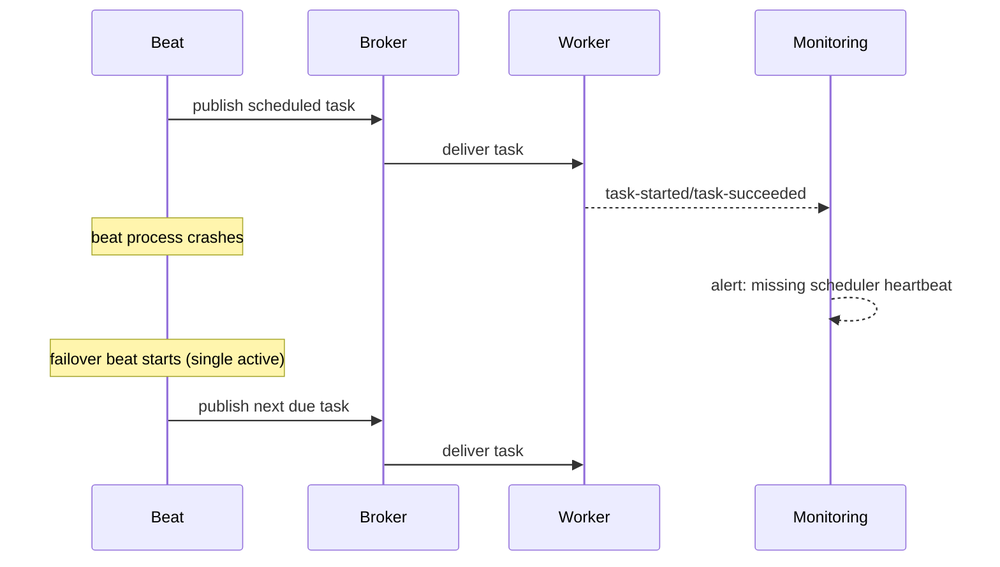

[← Назад к индексу части](index.md)
[↑ К глобальному плану](../../mastery_plan.md)

## 36.5 Beat и периодика

### Цель раздела

Разобраться, как настроить стабильный scheduling без дублей и временных аномалий.

### В этом разделе главное

- `beat_schedule` и `beat_scheduler` задают источник и механизм расписаний;
- `beat_schedule_filename`, `beat_sync_every`, `beat_max_loop_interval` влияют на устойчивость и точность;
- single-scheduler principle остается ключевым независимо от платформы.

### Термины

| Термин | Формально | Простыми словами |
|---|---|---|
| `beat_schedule` | Словарь задач и расписаний | Таблица "что и когда запускать" |
| `beat_scheduler` | Класс scheduler-реализации | Движок, который читает расписание |
| `beat_schedule_filename` | Файл состояния scheduler | Локальная память о следующем запуске |
| `beat_sync_every` | Частота синхронизации состояния | Как часто фиксировать прогресс |
| `beat_max_loop_interval` | Верхняя граница цикла scheduler | Максимальная "пауза" между проверками |

### Теория и правила

1. **Один активный beat для одного набора расписаний.**  
   Иначе дубли почти неизбежны.
2. **Хранилище расписания влияет на recovery.**  
   Файловый scheduler прост, БД-сcheduler удобен для динамики, но требует дисциплины.
3. **Deadline-настройки (`beat_cron_starting_deadline` и т.п.) полезны для контроля догоняющих запусков после простоя.**

### Пошагово

1. Выбери scheduler и хранилище расписания.
2. Закрепи стратегию HA: active-passive для beat.
3. Протестируй поведение при рестарте и временном простое.
4. Проверь временные зоны и календарные особенности.
5. Добавь метрики "scheduled vs actually started".

### Простыми словами

Beat — это "будильник команды". Если у тебя два будильника на одно событие, ты почти гарантированно получишь два одинаковых запуска.

### Картинка в голове

Секретарь рассылает поручения по расписанию. Если секретарей двое и нет координации, письмо уходит дважды.

### Как запомнить

**Beat любит одиночество: один scheduler на один контекст расписаний.**

### Примеры

```python
beat_scheduler = "celery.beat:PersistentScheduler"
beat_schedule_filename = "/var/lib/celery/celerybeat-schedule"
beat_sync_every = 1
beat_max_loop_interval = 10

beat_schedule = {
    "reconcile-every-5-min": {
        "task": "billing.tasks.reconcile_pending",
        "schedule": 300.0,
        "options": {"queue": "critical"},
    }
}
```

### Практика / реальные сценарии

- **K8s:** выделенный deployment beat с leader election на уровне платформы.
- **Django-celery-beat:** расписания в БД + governance на изменения через админку.
- **Региональные расписания:** UTC в системе, локальное время только в бизнес-слое.

### Типичные ошибки

- запуск нескольких beat в одной среде "для надежности";
- хранить schedule-файл на эфемерном диске без понимания последствий рестарта;
- игнорировать влияние DST на cron-выражения.

### Что будет, если...

- **...не контролировать дубли beat:** периодические задачи (рассылки, списания) выполнятся повторно.
- **...не проверять после downtime:** scheduler может попытаться догнать пропущенные окна не так, как ожидает бизнес.

### Проверь себя

1. Почему "два beat для отказоустойчивости" — опасная идея без координации?
2. Как влияет `beat_max_loop_interval` на точность запуска?
3. Когда удобнее перейти на DB-based scheduler?

<details><summary>Ответ</summary>

1) Потому что оба экземпляра могут сгенерировать одни и те же задачи.  
2) Чем больше интервал, тем грубее проверка расписаний и выше джиттер старта.  
3) Когда расписания должны динамически редактироваться и централизованно храниться, но при этом нужен контроль прав и аудит изменений.

</details>

### Запомните

Периодика надежна только при дисциплине scheduler-а, времени и state storage.

### Sequence Diagram: сбой beat и восстановление



#### Проверь себя: восстановление beat

1. Какой принцип предотвращает дубли при failover scheduler?
2. Почему heartbeat-мониторинг beat критичен?

<details><summary>Ответ</summary>

1) Один активный scheduler на один набор расписаний.  
2) Без него проблема обнаруживается только по бизнес-симптомам, когда ущерб уже есть.

</details>

---
