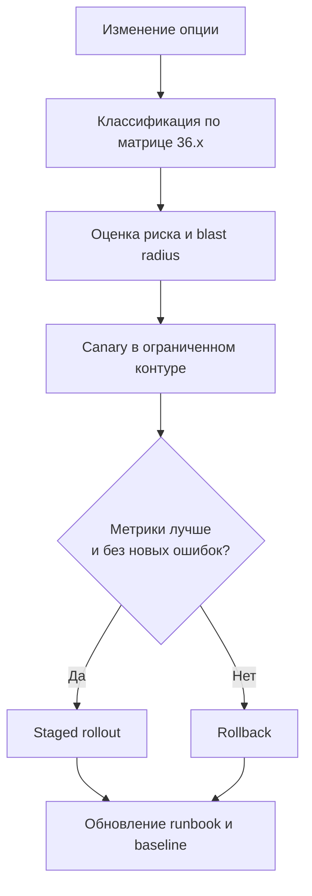

[← Назад к индексу части](index.md)
[↑ К глобальному плану](../../mastery_plan.md)

## Алгоритм безопасного изменения конфигурации (production playbook)

### Цель

Дать повторяемый процесс изменения `celeryconfig` без инцидентов "мы поменяли одну опцию и всё внезапно сломалось".

### Пошаговый протокол

1. **Сформулируй гипотезу изменения**  
   Что именно хочешь улучшить: latency, throughput, cost, reliability, observability.
2. **Привяжи изменение к категории матрицы**  
   Например: worker/runtime, task policy, broker connectivity.
3. **Определи blast radius**  
   Какие очереди, какие типы задач, какие SLA затронутся.
4. **Подготовь canary-план**  
   Один worker/одна очередь/ограниченный процент задач.
5. **Зафиксируй контрольные метрики до изменения**  
   Queue lag, success/failure ratio, retry rate, task duration p95/p99, memory/CPU.
6. **Внеси изменение и наблюдай фиксированное окно времени**  
   Не делай несколько изменений одновременно.
7. **Сравни результат с baseline и критериями успеха**  
   Изменение считается успешным только при улучшении без нового риска.
8. **Сделай staged rollout**  
   Расширяй охват постепенно по узлам/очередям.
9. **Подготовь откат заранее**  
   rollback должен быть автоматизируемым, не "ручным творчеством".
10. **Обнови реестр конфигурации и runbook**  
    Чтобы новое состояние стало частью командной памяти.

### Mermaid-схема жизненного цикла изменения

### Запомните

Конфигурацию Celery нужно менять так же дисциплинированно, как схему БД или сетевой policy: через гипотезу, метрики, canary и откат.

---
