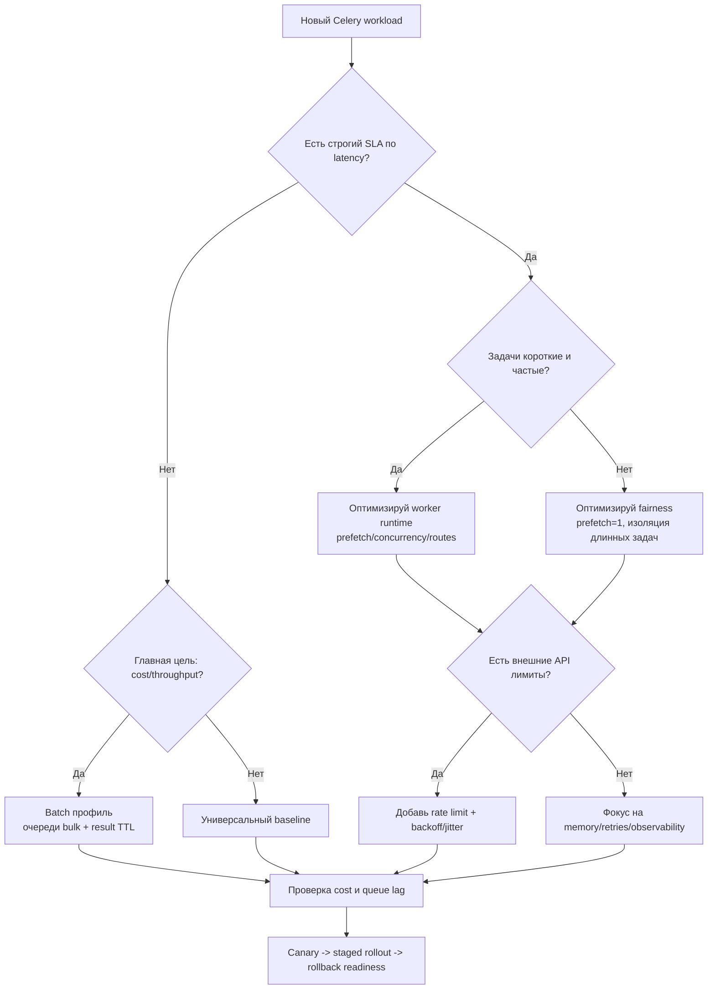

[← Назад к индексу части](index.md)
[↑ К глобальному плану](../celery_mastery_plan.md)

## Decision flow: как выбрать направление настройки

#### Проверь себя: decision flow

1. Почему дерево завершается canary/rollback readiness, а не “выбран профиль”?
2. Где в decision flow чаще всего появляется ошибка новичков?

Ответ

1) Выбор профиля — гипотеза, которая подтверждается только метриками в безопасном rollout.  
2) На ветке throughput: забывают про fairness/idempotency и получают скрытую деградацию.

---
