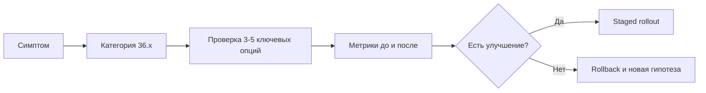

[← Назад к индексу части](index.md)
[↑ К глобальному плану](../mastery_plan.md)

## Диагностическая карта: симптом -> где смотреть в конфиге -> что делать

Этот блок нужен для реальной on-call работы: когда времени мало, важно быстро сузить пространство поиска.

| Симптом | Наиболее вероятные категории | Ключевые опции для проверки | Первый безопасный шаг |
|---|---|---|---|
| Задачи долго висят в очереди | Worker runtime + routing + broker | `worker_concurrency`, `worker_prefetch_multiplier`, `task_routes`, `task_queues`, `broker_pool_limit` | снизить prefetch/изолировать длинные задачи в отдельную очередь |
| Повторные выполнения после рестартов | Task policy + transport options | `task_acks_late`, `task_reject_on_worker_lost`, `task_time_limit`, `visibility_timeout` | проверить идемпотентность и согласовать лимиты времени с timeout видимости |
| Резкий рост RETRY/FAILURE | Task policy + connectivity | `task_default_retry_delay`, `task_max_retries`, `task_publish_retry_policy`, `broker_connection_retry*` | уменьшить агрессивность retry и разделить временные/бизнес-ошибки |
| `PENDING` при фактически выполненных задачах | Result backend + events | `result_backend`, `result_backend_always_retry`, `result_expires`, `worker_send_task_events` | проверить доступность backend и TTL/очистку результатов |
| Дубли периодических задач | Beat + topology | `beat_scheduler`, `beat_schedule_filename`, HA-схема beat | убедиться, что активен один scheduler на один набор расписаний |
| Высокая стоимость observability | Events/monitoring | `worker_send_task_events`, `task_send_sent_event`, `event_queue_ttl`, `event_queue_expires` | оставить только SLO-критичные события и ограничить TTL |
| Инциденты безопасности payload | Security + serialization | `accept_content`, `task_serializer`, `security_*`, SSL keys | сузить whitelist до JSON и проверить trust boundary |
| После апгрейда часть параметров игнорируется | Rare/deprecated + release lifecycle | deprecated keys, `enable_remote_control`, transport/backend-specific flags | включить migration review и удалить устаревшие ключи staged-способом |

### Мини-runbook для аварийного triage (10-15 минут)

1. Зафиксируй симптом в одном предложении (без гипотез).
2. Выбери 1-2 строки из таблицы выше (не больше).
3. Проверь метрики до логов: queue lag, retry rate, broker reconnect, backend latency.
4. Сними `inspect` snapshot и сравни с baseline.
5. Прими минимальное обратимое действие (canary/одна очередь/один worker).
6. Если улучшения нет — откат и переход к соседней гипотезе.

#### Проверь себя: аварийный triage

1. Почему triage ограничивает число параллельных гипотез?
2. Что делает действие “минимальным и обратимым” в on-call?

Ответ

1) Чтобы не смешивать причины и сохранить измеримость эффекта каждого шага.  
2) Возможность быстро вернуть предыдущее состояние без затрагивания других очередей/пулов.

---
