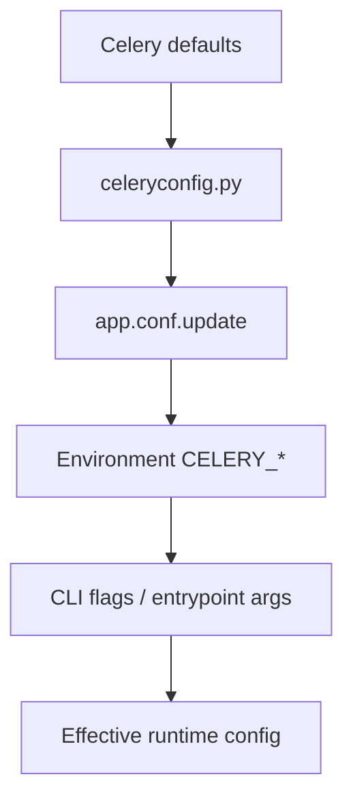

[← Назад к индексу части](index.md)
[↑ К глобальному плану](../mastery_plan.md)

## Источники конфигурации и приоритеты (чтобы не ловить config drift)

Один из самых коварных пробелов в эксплуатации: команда смотрит на `celeryconfig.py`, а фактическое поведение задается переменными окружения или runtime-аргументами.

### Типовая иерархия источников (проверять в вашем стеке)

| Источник | Обычно где задается | Риск |
|---|---|---|
| CLI/entrypoint flags | systemd unit, container command, Helm args | быстро “перебивает” ожидания из файла |
| Переменные окружения `CELERY_*` | Kubernetes env/Secret, `.env`, CI/CD | скрытые override между окружениями |
| Python config module (`celeryconfig.py`) | репозиторий приложения | ложное чувство “истина в коде” |
| Кодовые `app.conf.update(...)` | init модули приложения | сложнее аудировать без инвентаризации |
| Дефолты версии Celery | библиотека/релиз | меняются между версиями, дают неявные регрессии |

### Практические правила

1. Для каждого окружения фиксируй **effective config snapshot** (фактические значения после всех override).
2. В PR проверяй не только diff файла, но и diff env/entrypoint.
3. При инциденте сначала подтверждай effective config, потом строь гипотезы.
4. При апгрейде Celery сравнивай фактические значения с новыми дефолтами.

### Что будет, если этот слой игнорировать

- команда “лечит” не тот источник и не видит эффекта;
- между staging и production накапливается скрытый config drift;
- rollback не срабатывает, потому что откатили файл, но не env/flags.

### Проверь себя: приоритеты

1. Почему один только `git diff celeryconfig.py` не гарантирует понимание реальной конфигурации?
2. Какой артефакт должен появиться после каждого изменения конфигурации в зрелой команде?

Ответ

1) Потому что фактическое поведение может быть изменено env-переменными, entrypoint-аргументами и runtime-кодом.  
2) Effective config snapshot + чек “источник значения” для ключевых параметров (delivery/security/retry/connectivity).

#### Проверь себя: последствия игнорирования приоритетов

1. Почему rollback по файлу может не сработать, даже если diff корректный?
2. Что первым делом проверить при различии поведения staging и production?

Ответ

1) Потому что активные значения могли быть переопределены env/CLI/runtime и файл не является фактическим источником.  
2) Effective config snapshot и источники override для критичных ключей.

---
