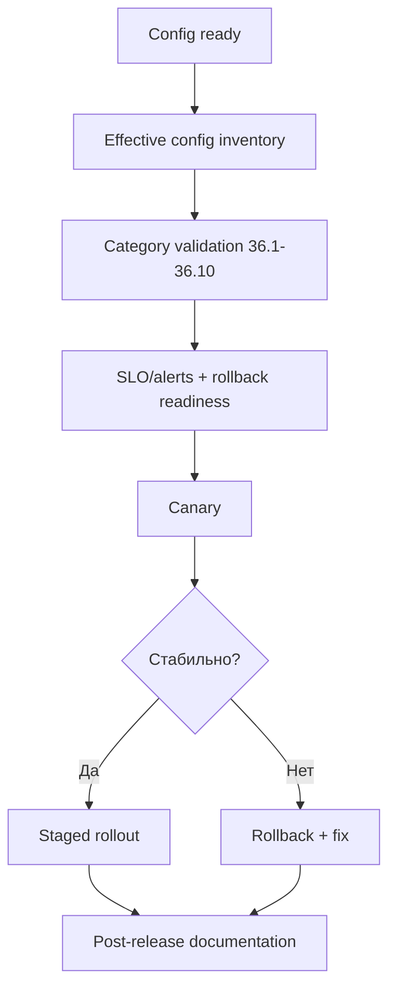

[← Назад к индексу части](index.md)
[↑ К глобальному плану](../mastery_plan.md)

## Pre-release audit чек-лист конфигурации Celery

Этот чек-лист закрывает разрыв между “конфиг написан” и “конфиг можно безопасно выпускать”.

### Шаг 1. Конфигурационная инвентаризация

- собраны все источники конфигурации: файл, env vars, secret manager, chart/compose values;
- зафиксирован итоговый effective config для target окружения;
- отмечены рискованные ключи (delivery/security/retry/connectivity).

### Шаг 2. Техническая валидация по категориям 36.x

- `36.1-36.2`: discovery, timezone, broker URL/retry/SSL проверены smoke-тестом;
- `36.3-36.4`: ack/retry/time limits/routes/prefetch/concurrency проверены на тестовом workload;
- `36.5-36.7`: beat/backend/events проверены на корректность state и observability;
- `36.8-36.10`: security и deprecated/rare ключи прошли policy-review.

### Шаг 3. Эксплуатационная готовность

- определены SLO/SLI для очередей и задач;
- настроены алерты на queue lag, retry spike, broker reconnect, backend latency;
- подготовлен rollback план и критерии отката.

### Шаг 4. Canary и staged rollout

- canary ограничен по blast radius (1 очередь/1 worker pool);
- сравнение baseline до/после проведено по p95/p99 и error/retry rate;
- решение о полном rollout принято только после стабильного окна наблюдения.

### Шаг 5. Пост-релизная фиксация знаний

- runbook и матрица опций обновлены;
- новые исключения из policy задокументированы;
- ответственным назначен срок следующей ревизии конфигурации.

#### Проверь себя: pre-release audit

1. Почему инвентаризация effective config стоит перед функциональными тестами?
2. Как понять, что окно наблюдения после canary действительно достаточное?

Ответ

1) Чтобы валидировать фактическую конфигурацию, а не только ожидаемую из репозитория.  
2) Когда ключевые метрики стабильны и не хуже baseline на типичном и пиковом трафике.

### Запомните

Хорошая конфигурация Celery — это не только корректные значения, но и доказанная эксплуатационная готовность перед релизом.

---
